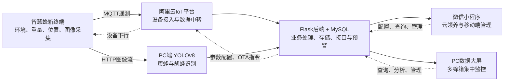
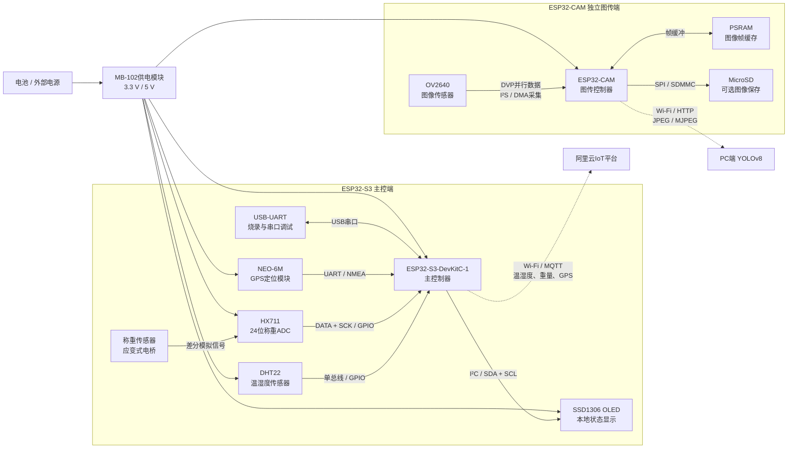
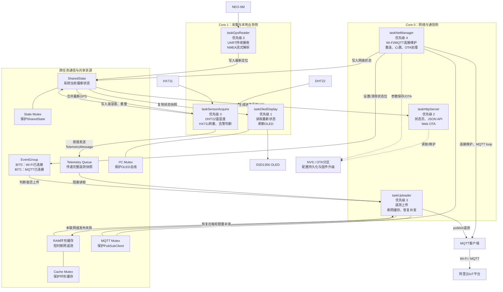
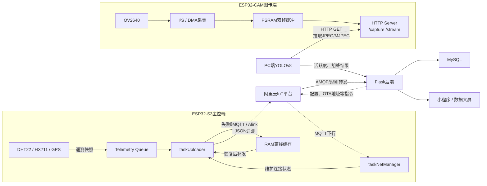
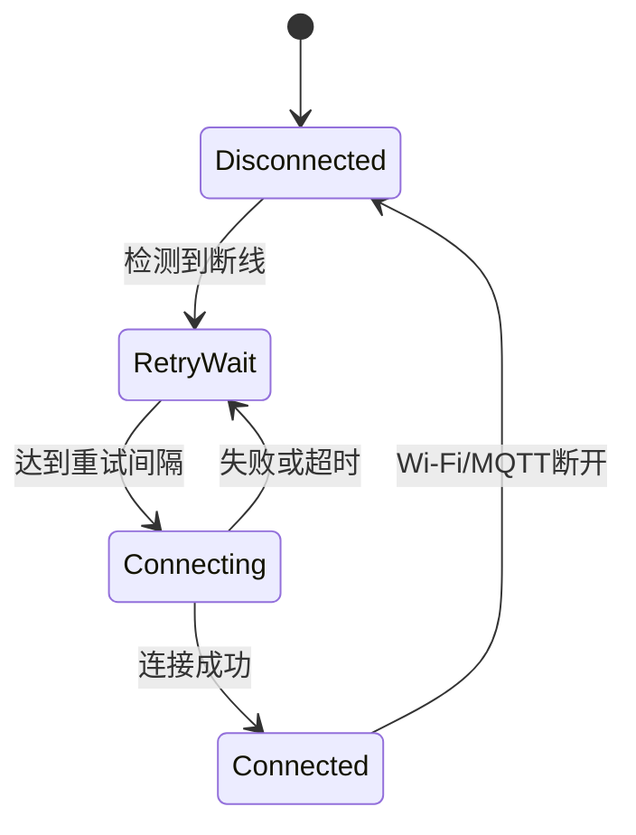

# 基于ESP32-S3+FreeRTOS的智慧蜂箱终端系统--STAR面试梳理

# S1：Situation——项目背景

该项目来源于**全国大学生物联网设计竞赛**。在项目初期，团队前往北京的真实养蜂场开展实地调研，与蜂农进行访谈，并在实际养蜂环境中进行设备实验。

调研发现，传统养蜂主要依赖蜂农定期前往现场巡检，通过人工开箱观察蜂群状态并记录养殖数据。当蜂箱数量较多或分布较分散时，这种管理方式存在几个问题：

- 人工巡检成本较高，难以持续掌握每个蜂箱的状态；
- 频繁开箱会对蜂群的正常活动造成干扰；
- 蜂农难以及时发现箱内温湿度异常、蜂蜜重量变化等情况；
- 野外蜂箱存在被移动或盗取的风险；
- 胡蜂入侵会威胁蜂群，但仅靠人工巡查难以及时发现；
- 蜂场与消费者之间缺少直观的信息连接，消费者难以持续了解所认养蜂箱的状态。

针对这些实际需求，团队决定设计一套智慧蜂箱物联网系统：在减少人工开箱的情况下，对蜂箱的环境、重量、位置和蜂群图像进行采集，通过远程管理端帮助蜂农集中监测蜂箱状态并及时发现异常；同时通过微信小程序实现云领养功能，让用户能够查看所认养蜂箱的相关信息。

#### 面试口述版

> 这个项目来源于全国大学生物联网设计竞赛。项目开始前，我们去北京的真实养蜂场做过实地调研，采访了蜂农，也在实际养蜂环境中开展过设备实验。  
>
> 调研后我们发现，传统养蜂比较依赖人工开箱巡检。当蜂箱数量多、分布比较分散时，蜂农很难持续掌握每个蜂箱的温湿度、重量和蜂群活动情况，而且频繁开箱也会干扰蜂群。另外，蜂农还提出了蜂箱偷盗和胡蜂入侵这两个实际问题。  
>
> 因此，我们希望设计一套智慧蜂箱系统，在不频繁开箱的情况下远程采集和展示蜂箱状态，辅助蜂农进行集中管理和异常预警。同时，我们还通过微信小程序实现了云领养场景，让认养用户能够远程查看蜂箱信息。

---

# T1：Task——系统全景

### ==总述==

项目本质上是一套**面向养蜂场景的物联网智能监测系统**。它主要解决了传统养蜂里几个比较典型的问题：第一是人工巡检效率低，频繁开箱会惊扰蜂群；第二是多蜂箱集中管理困难，蜂农很难实时掌握每个蜂箱的温湿度、重量和活跃度状态；第三是蜂箱存在偷盗风险；四是可以进行胡蜂入侵预警，帮助蜂农及时处理

从系统组成上看，这个项目分为四部分。第一部分是**嵌入式终端**，以 ESP32-S3 为主控，接入 DHT22 温湿度传感器、HX711 称重模块、GPS 模块和 ESP32-CAM 摄像头，完成环境数据、重量、定位和图像信息的采集。第二部分是**物联网数据链路**，设备通过 Wi-Fi 把数据上传到物联网平台，后端再做数据接收、处理和入库。第三部分是**后端服务**，基于 Flask 和数据库实现蜂箱状态管理、告警、订单和用户相关的业务逻辑。第四部分是**前端应用**，包括微信小程序和 PC 数据大屏，用来做蜂箱状态展示、集中预警、趋势分析和云领养交互。图像侧还结合 YOLOv8 做了蜜蜂活跃度统计和胡蜂预警。

我在这个项目里主要负责的是**嵌入式系统这一块**。具体来说，我做了硬件选型和嵌入式端的软件开发，围绕 ESP32-S3 完成了温湿度、称重、GPS 等传感器驱动与数据采集，完成了设备侧 Wi-Fi 联网、MQTT/数据上云链路打通，以及终端和云端之间的数据联调。简单理解，就是我负责把蜂箱里的各类传感器数据稳定采上来、处理好，再可靠地发到云端，让后端和前端能够真正用起来。简历里这部分也写到，我是嵌入式系统负责人，独立完成了嵌入式软件开发工作。



### ==具体细节==

基于前期调研得到的需求，团队需要设计并实现一套完整的“云养蜂”智慧蜂箱系统。系统需要打通**蜂箱现场感知、物联网通信、云端接入、后端处理、AI视觉分析、数据展示和云领养业务**，形成从蜂箱数据采集到用户使用的完整链路。

整个系统可以分为六个部分。

------

### 1. 嵌入式终端：采集蜂箱现场信息

嵌入式终端是整个系统的数据入口，主要由 **ESP32-S3主控端**和 **ESP32-CAM图传端**组成。

#### ESP32-S3主控端

负责采集普通遥测数据：

- DHT22采集蜂箱温湿度；
- HX711和称重传感器采集蜂箱重量；
- NEO-6M GPS获取蜂箱位置；
- OLED显示本地传感器数据和设备状态；
- 通过Wi-Fi连接网络；
- 通过MQTT将遥测数据上传至阿里云物联网平台；
- 接收云端下发的配置或维护指令。

这些数据分别服务于温湿度预警、产蜜进度判断、收获提醒、蜂箱定位和防盗。

#### ESP32-CAM图传端

负责蜂箱出入口的图像采集：

- 拍摄蜂箱出入口的蜜蜂活动；
- 提供JPEG单帧图像或MJPEG视频流；
- 将图像提供给PC端视觉程序处理；
- 与普通遥测链路分开，避免图像数据占用主控的数据采集和通信资源。

嵌入式终端的整体作用可以概括为：

> **把真实蜂箱的物理状态转换成云端能够处理的数据。**

------

### 2. 阿里云IoT平台：完成设备接入与数据中转

阿里云IoT平台位于嵌入式终端和业务后端之间，主要承担设备通信层的任务：

- 管理蜂箱终端的设备身份；
- 完成设备鉴权和连接管理；
- 接收ESP32-S3通过MQTT上传的遥测数据；
- 按设备或主题对数据进行中转和分发；
- 将终端数据转交给后端服务；
- 支持云端向设备下发参数或维护指令。

云平台本身不是最终业务界面，也不是主要的历史数据数据库。它更接近一个**设备接入和消息中转枢纽**。

它的核心作用是：

> **解决大量嵌入式设备如何安全接入网络、上传数据并与业务系统解耦的问题。**

------

### 3. Flask后端与MySQL：处理数据和业务逻辑

后端服务负责将设备数据转化成系统能够使用的业务数据。

#### 数据接收与处理

- 接收阿里云IoT平台转发的设备遥测；
- 解析温度、湿度、重量、GPS等数据；
- 将设备数据与具体蜂场、蜂农和蜂箱绑定；
- 接收并保存AI模块输出的活跃度和胡蜂识别结果；
- 根据阈值或识别结果生成异常信息。

#### 数据持久化

MySQL数据库保存的主要对象包括：

- 蜂场；
- 蜂农；
- 蜂箱；
- 终端设备；
- 蜂箱历史状态；
- 普通用户；
- 蜂蜜与蜂箱领养订单；
- 告警和推荐信息。

#### 业务接口

Flask后端向小程序和数据大屏提供API，例如：

- 查询某位蜂农管理的全部蜂箱；
- 查询单个蜂箱的当前状态；
- 查询历史温湿度、重量和活跃度；
- 查询蜂箱位置和预警信息；
- 管理用户、蜂农、蜂箱和订单；
- 支撑云领养业务；
- 向终端下发配置或升级信息。

后端的作用可以概括为：

> **连接设备数据、AI结果、数据库和前端业务，是整个系统的数据与业务中心。**

------

### 4. PC端YOLOv8：分析蜜蜂活动和胡蜂入侵

图像数据量较大，而且目标检测模型的计算量超过普通ESP32终端的承载能力，因此视觉识别放在PC端运行。

YOLOv8模块主要完成：

- 从ESP32-CAM获取蜂箱出入口图像；
- 检测画面中的蜜蜂和胡蜂；
- 统计画面中的蜜蜂数量；
- 将统计结果转化为蜂群活跃度指标；
- 检测是否出现胡蜂；
- 将活跃度和胡蜂预警结果交给后端保存和展示。

其中：

- **蜜蜂数量及其变化**用于反映蜂群活跃度；
- **活跃度异常下降**可以作为蜂群健康异常的辅助信号；
- **胡蜂检测结果**用于生成虫害预警；
- **活跃度与湿度数据**还可以作为蜜源估计模型的输入。

AI模块的作用可以概括为：

> **把原始图像转化成蜂群活跃度和虫害预警等结构化信息。**

------

### 5. 微信小程序：服务蜂农和云领养用户

小程序面向两类用户：**蜂农**和**普通消费者/认养用户**。

#### 蜂农端功能

- 查看自己管理的蜂箱；
- 查看单个蜂箱的温湿度、重量、活跃度和图像；
- 查看蜂箱异常预警；
- 查看蜂箱位置；
- 通过地图导航到指定蜂箱；
- 查看蜂箱领养和订单情况。

#### 认养用户端功能

- 注册和登录；
- 浏览蜂蜜及可领养蜂箱；
- 选择并领养蜂箱；
- 查看所领养蜂箱的实时状态和图像；
- 查看蜂蜜收获进度；
- 管理蜂蜜或蜂箱订单；
- 参与从认养到收获的养蜂过程。

小程序的作用不只是数据显示，还承担了云领养商业模式：

> **通过展示蜂箱状态和生产过程，提高养蜂透明度，连接消费者与蜂农。**

------

### 6. PC数据大屏：支持多蜂箱集中管理

PC数据大屏主要面向蜂农或蜂场管理人员，更强调全局状态和批量管理。

主要功能包括：

- 集中展示多个蜂箱；
- 在地图上显示蜂箱分布；
- 查看选中蜂箱的实时数据；
- 展示温湿度、重量和活跃度历史曲线；
- 集中轮播多个蜂箱的异常预警；
- 展示蜂箱实时图像；
- 展示产蜜进度；
- 结合活跃度和湿度数据展示蜜源估计结果；
- 为蜂箱放置、迁移和收获计划提供辅助信息。

与小程序相比：

| 前端       | 主要用户           | 主要作用                             |
| ---------- | ------------------ | ------------------------------------ |
| 微信小程序 | 蜂农、认养消费者   | 移动查看、云领养、订单和单蜂箱管理   |
| PC数据大屏 | 蜂农、蜂场管理人员 | 多蜂箱集中监控、趋势分析、地图和预警 |

------

### 系统的两条核心数据链路

#### 遥测数据链路

```
DHT22/HX711/GPS
        ↓
ESP32-S3采集与封装
        ↓ MQTT
阿里云IoT平台
        ↓
Flask后端
        ↓
MySQL数据库
        ↓
微信小程序 / PC数据大屏
```

主要传输温湿度、重量、位置和设备状态等小数据。

#### 图像与AI链路

```
ESP32-CAM采集蜂箱出入口图像
        ↓ HTTP JPEG/MJPEG
PC端YOLOv8识别
        ↓
蜜蜂数量 / 活跃度 / 胡蜂预警
        ↓
Flask后端与MySQL
        ↓
微信小程序 / PC数据大屏
```

主要处理图像、蜜蜂活跃度和胡蜂预警。

---

# T2：个人职责边界

我在团队中担任**嵌入式终端负责人**，负责智慧蜂箱设备端的**软硬件实现**。**硬件方面**，我完成了ESP32-S3、ESP32-CAM及温湿度、称重、GPS、OLED等模块的**选型、接线和实物组装**；**软件方面**，我独立编写ESP32-S3主控端和ESP32-CAM图传端的程序，并负责阿里云IoT平台的设备注册、物模型定义和通信配置。

我的职责包括：

- 参与终端硬件模块选型和接口规划；
- 独立完成嵌入式终端固件开发；
- 接入温湿度、称重、GPS、OLED和摄像头等外设；
- 完成传感器数据采集、本地显示、遥测上云和图像传输；
- 负责设备端的任务调度、通信稳定性、断网处理和远程升级；
- 完成终端与阿里云IoT平台、后端和AI模块的数据接口联调；
- 参与实物搭建和蜂场环境下的终端测试。

后端数据库、Flask业务服务、YOLOv8模型、小程序和PC数据大屏由其他团队成员负责。我需要理解这些模块的数据需求并配合联调，但不将它们描述为自己独立开发的内容。

#### 面试口述版

> 我在项目中主要担任嵌入式终端负责人，负责ESP32-S3主控端和ESP32-CAM图传端，独立完成设备侧固件开发，包括多传感器数据采集、联网通信、数据上云、图像传输以及终端的稳定性和远程维护。后端、YOLOv8、小程序和数据大屏由其他成员负责，我主要与他们确定数据接口并完成端到端联调。

---

# A1：硬件选型与终端搭建

## 1. 设计目标

根据智慧蜂箱的业务需求，我需要搭建一套能够完成以下任务的嵌入式终端：

- 采集蜂箱内部温湿度；
- 测量蜂箱整体重量，辅助判断产蜜和收获进度；
- 获取蜂箱位置，支持地图展示和防盗；
- 采集蜂箱出入口图像，为蜜蜂活跃度统计和胡蜂识别提供输入；
- 在本地显示传感器和网络状态；
- 通过无线网络将数据和图像传递给云端及AI模块。

考虑到项目是竞赛原型，硬件选型重点平衡了：

- 功能完整性；
- 无线联网能力；
- 外设接口数量；
- 开发周期；
- 模块成本；
- 功耗和野外部署能力；
- 后续扩展与维护难度。

## 2. 整体硬件架构

我将终端划分为两个相对独立的节点：

### ESP32-S3主控端

负责低带宽、周期性的遥测和本地业务：

- DHT22温湿度采集；
- HX711称重采集；
- NEO-6M GPS定位；
- OLED本地显示；
- Wi-Fi联网和MQTT数据上报。

### ESP32-CAM图传端

负责高带宽的图像采集和传输：

- 获取蜂箱出入口图像；
- 输出JPEG图像；
- 为PC端YOLOv8提供图像数据。

将图像采集单独放在ESP32-CAM上，主要是因为图像的数据量、缓存占用和网络传输开销远高于普通传感器数据。如果摄像头和全部传感器都集中在同一主控上，图像采集和发送容易占用较多CPU、内存和网络资源，影响普通遥测的稳定性。拆成两个节点后，传感器遥测和图像链路可以分别调试，故障边界也更加清晰。

## 3. 关键器件选型

| 模块         | 选型               | 主要作用                         | 选型理由                                                     |
| ------------ | ------------------ | -------------------------------- | ------------------------------------------------------------ |
| 主控制器     | ESP32-S3-DevKitC-1 | 多传感器采集、数据处理和无线通信 | 集成Wi-Fi，支持双核和FreeRTOS，GPIO及UART、I2C等接口较丰富，开发生态成熟，能够降低联网终端的开发成本 |
| 图像节点     | ESP32-CAM＋OV2640  | 蜂箱出入口图像采集               | 集成摄像头和无线通信能力，体积和成本较低，支持JPEG输出，适合独立承担图像采集和传输 |
| 温湿度传感器 | DHT22              | 蜂箱内部温湿度监测               | 同时测量温度和湿度，数字输出、接线简单，单总线只占用一个数据引脚，测量范围能够覆盖蜂箱环境 |
| 称重模块     | HX711＋称重传感器  | 蜂箱重量和产蜜进度监测           | HX711是面向桥式称重传感器的24位ADC，能够放大并数字化微弱称重信号，成本低且便于与MCU连接 |
| 定位模块     | NEO-6M             | 蜂箱定位、导航和防盗             | 模块成熟、成本较低，通过UART输出标准NMEA数据，容易接入嵌入式系统 |
| 本地显示     | SSD1306 OLED       | 显示传感器和设备状态             | 使用I2C通信，占用引脚少，能够在不连接云端或电脑时查看终端是否正常工作 |
| 供电模块     | MB-102及电池供电   | 为主控和外设提供电源             | 适合竞赛原型快速搭建和分模块供电，便于接线、调试及更换模块   |

## 4. 为什么选择ESP32-S3而不是STM32

项目不仅需要多传感器采集，还需要直接接入Wi-Fi和物联网平台。ESP32-S3本身集成Wi-Fi协议栈，并且具有双核处理器和FreeRTOS运行环境，可以同时承载传感器采集、网络通信和本地显示。

如果使用普通STM32，还需要额外增加Wi-Fi或其他通信模块，并继续处理模块驱动、协议栈集成和模块间通信，硬件连接和软件开发成本都会增加。

因此，这里的选择并不是ESP32-S3普遍优于STM32，而是它对本项目这种**多外设、强联网、成本敏感、开发周期有限的物联网终端**匹配度更高。

## 5. 为什么单独使用ESP32-CAM

摄像头图像和温湿度、重量、GPS等遥测数据有明显不同：

- 普通遥测只有少量数值；
- 一张JPEG图像就可能达到数十KB；
- 连续图传还需要帧缓存和持续网络发送；
- 摄像头初始化和图像缓存对内存、供电稳定性要求更高。

因此，我没有让ESP32-S3主控同时承担全部图像业务，而是增加ESP32-CAM作为独立图传节点。这样能够：

- 隔离图传对主控采集任务的影响；
- 分开调试传感器链路和图像链路；
- 根据视觉需求单独调整分辨率、质量和帧率；
- 摄像头出现故障时不影响温湿度、重量和GPS继续工作；
- 后续可以分别升级主控端和图传端程序。

## 6. 外设接口规划

不同模块按照自身通信特性接入：

| 外设      | 接口                  | 规划原因                              |
| --------- | --------------------- | ------------------------------------- |
| DHT22     | 单总线GPIO            | 只需一根数据线，适合低频温湿度采集    |
| HX711     | DATA＋SCK两线GPIO时序 | HX711采用专用两线时序输出称重数据     |
| NEO-6M    | UART                  | GPS持续输出NMEA数据，串口适合流式接收 |
| OLED      | I2C                   | 占用引脚少，刷新带宽足以满足状态显示  |
| ESP32-CAM | 独立图像节点          | 隔离图像采集、缓存和网络传输开销      |

具体引脚在不同版本中有调整，因此面试主口径应重点说明**接口类型和资源分配原则**，除非面试官追问，不必主动背诵GPIO编号。

## 7. 蜂箱内的模块安装

为了保证采集有效并尽量减少对蜂群的干扰，我根据不同传感器的用途规划安装位置：

- 温湿度传感器安装在能够反映箱内环境的位置；
- ESP32-S3、GPS和控制电路布置在蜂箱上部的独立区域，与蜜蜂主要活动空间隔离；
- 称重传感器和HX711安装在蜂箱底部，用于测量蜂箱整体重量；
- ESP32-CAM布置在蜂箱出入口上方，使摄像范围覆盖蜜蜂着陆板；
- OLED放在便于调试和现场查看的位置；
- 各模块采用可拆卸接线方式，方便单独排查和更换。

摄像头对准出入口着陆板，是因为蜜蜂进出蜂箱时会在着陆板上出现短暂、相对缓慢的爬行过程，能够为蜜蜂计数和胡蜂检测提供更稳定的图像。

## 8. 硬件搭建和调试流程

我没有直接把所有模块一次性连接后整体调试，而是按照下面的顺序完成硬件搭建：

1. 检查主控和各模块的工作电压、供电能力及共地关系；
2. 分别完成DHT22、HX711、GPS、OLED和ESP32-CAM的接线；
3. 对每个模块进行单独上电和功能测试；
4. 对HX711执行去皮和已知重量标定；
5. 检查GPS是否能够持续输出并解析有效NMEA数据；
6. 检查摄像头初始化、单帧采集和图像质量；
7. 将各模块组合到主控程序中，排查引脚和资源冲突；
8. 完成实物组装后，验证温湿度、重量、图像和物联网通信链路；
9. 在蜂场环境中进行实际测试，并配合AI成员检查胡蜂识别链路。

这种分模块调试方式便于区分硬件接线、供电、驱动程序和网络通信问题，避免系统出现异常时无法定位具体模块。

## 9. 当前方案的工程边界

该硬件属于竞赛原型，主要采用开发板和现成传感器模块快速验证完整功能，并没有做到正式产品级硬件。

如果进一步产品化，还需要：

- 设计定制PCB，减少飞线和连接器故障；
- 增加电源保护、稳压和电池管理；
- 使用防水、防潮、防腐蚀的外壳；
- 对摄像头和传感器安装结构进行长期可靠性设计；
- 重新进行整机功耗、温漂和长期稳定性测试；
- 根据蜂场网络条件评估蜂窝通信、LoRa或其他远距离通信方式。

这里应把“模块化原型验证”和“产品级硬件”区分开，反而更能体现工程判断。

## A1面试口述版

> 我负责智慧蜂箱终端的硬件选型、接线和实物组装。主控选择ESP32-S3，主要因为系统既要接入温湿度、称重、GPS和OLED等多个外设，又要直接通过Wi-Fi连接物联网平台。相比普通MCU外接通信模块，ESP32-S3的集成度和开发效率更适合竞赛周期内完成全链路原型。  
>
> 传感器方面，我用DHT22采集温湿度，用HX711和称重传感器测量蜂箱重量，用NEO-6M获取蜂箱位置，OLED负责本地状态显示。图像部分单独使用ESP32-CAM，并将它安装在蜂箱入口上方，为后端YOLOv8提供图像。之所以拆成两个节点，是因为图像对内存、带宽和网络资源的需求远大于普通遥测，单独处理可以避免影响主控采集。  
>
> 搭建时我先逐个完成模块接线和单元测试，再进行多模块集成、称重标定、图像测试和物联网链路联调，最后在蜂场环境中验证温湿度、重量、图像识别和数据上云功能。

## 器件连接示意图



图中的核心关系是：

- **ESP32-S3**负责温湿度、重量、GPS和OLED；
- **ESP32-CAM**作为独立节点负责图像采集与传输；
- 两个控制器之间没有必须存在的有线数据连接；
- 普通遥测通过 **Wi-Fi/MQTT** 上云；
- 图像通过 **Wi-Fi/HTTP** 提供给PC端YOLOv8；
- MB-102用于竞赛原型的模块供电，实际组装时所有模块需要共地。

---

# A2：FreeRTOS双核多任务架构

## 1. 系统采用什么运行环境

最终版本基于：

- ESP32-S3双核处理器；
- Arduino-ESP32开发框架；
- 底层ESP-IDF组件；
- FreeRTOS实时操作系统内核。

Arduino框架并没有绕开FreeRTOS。系统启动后，Arduino会创建`loopTask`并在其中调用`setup()`和`loop()`。项目把主要业务拆成六个独立FreeRTOS任务，因此`loop()`只保留周期休眠，不再承载业务逻辑。

```
void loop() {
    vTaskDelay(pdMS_TO_TICKS(1000));
}
```

## 2. “用户态与内核态”应该怎样理解

ESP32-S3上的FreeRTOS与Linux不同，**没有进程级的用户空间和内核空间隔离**：

- 没有相互独立的进程地址空间；
- 各任务共享同一个地址空间；
- 应用任务可以访问全局变量和硬件资源；
- 一个任务发生越界写入，可能破坏整个系统；
- FreeRTOS主要提供任务调度、同步、定时和内存管理，不提供Linux式进程保护。

因此，在这个项目中，更准确的说法是划分为三个逻辑层。

### 应用任务层

由项目主动创建的六个业务任务：

- 网络管理；
- 遥测上传；
- HTTP服务；
- 传感器采集；
- GPS解析；
- OLED显示。

### 系统服务层

由Arduino-ESP32和ESP-IDF提供：

- Wi-Fi协议栈；
- TCP/IP和lwIP；
- MQTT客户端；
  -硬件UART、I²C和GPIO驱动；
- WebServer；
- ArduinoOTA和HTTPUpdate；
- NVS/Preferences。

### FreeRTOS内核层

负责：

- 双核抢占式调度；
- 任务优先级；
- 队列；
- 事件组；
- 互斥锁；
- 软件定时和任务延时；
- Idle任务和Timer Service任务。

除了六个业务任务，系统实际还存在`loopTask`、两个核心的Idle任务、Wi-Fi/lwIP任务和FreeRTOS定时器任务。因此：

> **六个任务指六个用户创建的业务任务，不代表芯片运行时只有六个任务。**

------

## 3. 双核职责划分

系统把任务划分为通信侧和采集侧。

### Core 0：网络与通信侧

部署可能阻塞、时延不确定的通信任务：

| 任务             | 优先级 | 主要职责                                            |
| ---------------- | ------ | --------------------------------------------------- |
| `taskNetManager` | 4      | Wi-Fi/MQTT连接维护、心跳、重连、ArduinoOTA和URL OTA |
| `taskUploader`   | 3      | 消费遥测队列、MQTT发布、断网缓存和联网补发          |
| `taskHttpServer` | 2      | 本地状态页、JSON API和Web OTA请求处理               |

网络管理任务优先级最高，因为MQTT需要持续调用`loop()`维护心跳，Wi-Fi和MQTT断线后也需要及时更新系统状态。

### Core 1：采集与本地业务侧

部署周期性和时序相对敏感的任务：

| 任务                | 优先级 | 主要职责                                   |
| ------------------- | ------ | ------------------------------------------ |
| `taskSensorAcquire` | 3      | DHT22和HX711周期采集、告警位生成和消息入队 |
| `taskGpsReader`     | 3      | 持续读取UART字节并解析NMEA定位数据         |
| `taskOledDisplay`   | 1      | 读取最新系统状态并低频刷新OLED             |

传感器任务与GPS任务优先级相同，两者在阻塞或主动延时后让出CPU。OLED只负责显示，实时性要求最低，因此优先级最低。

这是一种**任务亲和性隔离**，不是绝对的物理隔离。Wi-Fi系统任务、中断、锁竞争和同核高优先级任务仍可能影响执行时间。

------

## 4. 六个业务任务分别如何运行

### 4.1 网络管理任务

`taskNetManager`负责维护整个网络生命周期：

```
检查Wi-Fi
  ├─ 未连接：定期重连
  └─ 已连接：
       ├─ 处理ArduinoOTA
       ├─ 检查URL OTA请求
       ├─ 检查MQTT
       └─ 调用MQTT loop维持心跳
```

它不负责发送普通遥测，避免网络维护与数据上传耦合。

### 4.2 遥测上传任务

`taskUploader`负责：

- 判断MQTT是否可用；
- 网络恢复后限速补发离线数据；
- 从遥测队列中读取新数据；
- 发布失败时将数据写入环形缓存；
- 周期上报设备状态。

网络恢复后每轮最多补发4条，避免历史数据长期占用链路。

### 4.3 HTTP服务任务

`taskHttpServer`周期调用WebServer请求处理，提供：

- 本地设备状态页；
- `/api/state`状态接口；
- Web OTA上传入口；
- 重启等维护接口。

它的优先级低于网络维护和MQTT上传，避免页面访问影响核心通信链路。

### 4.4 传感器采集任务

`taskSensorAcquire`负责：

- 按设定周期读取DHT22；
- 读取HX711并计算重量；
- 检查数据有效性；
- 读取GPS任务提供的最新定位快照；
- 生成带序号、时间、传感器数据和告警位的完整消息；
- 更新系统最新状态；
- 将遥测消息放入Queue。

采集任务不直接调用MQTT发送数据。

### 4.5 GPS解析任务

`taskGpsReader`负责：

- 每隔较短时间检查UART接收缓冲；
- 持续取出NMEA字节；
- 交给TinyGPSPlus流式解析；
- 定位更新后写入共享状态；
- 保存经纬度、有效标志和卫星数量。

GPS数据是连续字节流，因此需要比普通温湿度采集更频繁地读取，否则UART接收缓冲区可能溢出。

### 4.6 OLED显示任务

`taskOledDisplay`负责：

- 复制系统最新状态；
- 获取I²C互斥锁；
- 绘制温湿度、重量、Wi-Fi、MQTT、GPS和缓存状态；
- 一次性发送OLED缓冲区；
- 释放I²C锁并休眠。

OLED刷新失败不能影响采集和联网，因此将其设为最低优先级。

------

## 5. 任务之间如何通信与同步

### 5.1 Queue：传递完整遥测消息

```
taskSensorAcquire
        │
        │ TelemetryMessage
        ▼
g_telemetryQueue
        │
        ▼
taskUploader
```

Queue用于解耦采集和上传：

- 采集任务只负责产生数据；
- 上传任务处理不确定的网络时延；
- 消息按值复制，避免上传时读到被修改一半的数据；
- 网络慢不会直接阻塞传感器采集；
- 队列满时，消息转入离线环形缓存。

### 5.2 EventGroup：表达网络状态

`g_netEvents`包含两个状态位：

- `WIFI_CONNECTED_BIT`；
- `MQTT_CONNECTED_BIT`。

网络任务负责设置或清除这些位，上传任务根据状态位决定是否发布。

当Wi-Fi断开时，同时清除Wi-Fi和MQTT状态，因为MQTT依赖底层网络连接。

事件组只表达状态，不负责传递温湿度等业务数据。

### 5.3 Mutex：保护共享资源

系统使用四个互斥锁：

| 互斥锁         | 保护对象                  | 访问任务                          |
| -------------- | ------------------------- | --------------------------------- |
| `g_stateMutex` | 当前传感器、GPS和网络状态 | 采集、GPS、网络、OLED、HTTP、上传 |
| `g_mqttMutex`  | `PubSubClient`对象        | 网络管理、上传任务                |
| `g_cacheMutex` | 离线环形缓存              | 采集、上传任务                    |
| `g_i2cMutex`   | I²C总线和OLED             | OLED及后续I²C外设                 |

其中`PubSubClient`不是线程安全对象。网络任务会调用`loop()`和重连接口，上传任务会调用`publish()`，因此必须使用同一个互斥锁串行化访问。

### 5.4 SharedState：保存最新状态

系统保留了一份`SharedState`：

```
最新温湿度
最新重量
最新GPS位置
Wi-Fi/MQTT状态
离线缓存数量
重连次数
采样周期
最后成功时间
```

它适合OLED、HTTP页面和状态上报读取“当前最新值”。

读取时采用：

```
加锁 → 复制完整快照 → 解锁 → 格式化和显示
```

不会拿着锁进行JSON拼接、网页生成或OLED绘图，避免临界区过长。

### 5.5 RAM环形缓存：短时断网缓冲

当出现以下情况时，遥测数据进入环形缓存：

- MQTT未连接；
- MQTT发布失败；
- 遥测Queue已满。

网络恢复后，由上传任务按顺序补发。缓存满时覆盖最旧数据，以保留最新状态。

它属于共享数据结构，因此由`g_cacheMutex`保护。

------

## 6. 整体架构框图



### 如何理解这张图

### 1. Core 0不是“系统内核”

手写图将Core 0写成了“系统内核”、Core 1写成“应用内核”，这适合帮助记忆，但面试时不够准确。

更严谨的说法是：

- **Core 0：网络与通信侧**
- **Core 1：采集与本地业务侧**

FreeRTOS调度器和系统服务会涉及两个核心，并不存在一个核心专门运行内核、另一个核心专门运行用户程序的严格划分。

### 2. Core 0为什么有三个任务

#### 网络管理任务

专门维护：

- Wi-Fi连接；
- MQTT连接；
- MQTT心跳；
- 断线重连；
- OTA相关处理。

#### 上传任务

专门负责：

- 从Queue取出遥测；
- 发布MQTT消息；
- 发布失败时写缓存；
- 恢复连接后补发。

网络维护和数据上传不能完全写在一个任务里，否则大量数据补发可能影响MQTT心跳和重连。

#### HTTP服务任务

负责低优先级的：

- 本地状态页面；
- JSON状态接口；
- Web OTA。

HTTP请求的处理时间不确定，因此将它从网络管理任务中拆开。

### 3. Core 1为什么有三个任务

#### 传感器采集任务

DHT22和HX711都属于周期性采集，因此放在一个采集任务中：

- 读取温湿度；
- 读取重量；
- 检查有效性；
- 生成告警位；
- 构造完整遥测消息；
- 写入Queue。

#### GPS解析任务

GPS不能并入普通传感器任务，因为它持续输出UART字节流。如果等到几秒一次的采样周期才读取，UART缓冲区可能溢出。

因此，GPS任务需要以较短周期持续清空UART缓冲并解析NMEA。

#### OLED显示任务

OLED只用于本地观察，实时性最低。即使显示稍有延迟，也不能影响采集和网络，所以优先级最低。

### 三种数据交互方式

这是整张图最需要讲清楚的部分。

#### Queue：传递“需要消费的历史消息”

```
SensorAcquire → Queue → Uploader
```

每条遥测都需要被上传任务消费，因此使用Queue。

特点：

- 传递完整的`TelemetryMessage`；
- 按值复制；
- 采集和上传解耦；
- 数据有先后顺序；
- 可以表达生产者—消费者关系。

#### SharedState：保存“当前最新状态”

GPS、传感器和网络任务都会更新当前状态，OLED和HTTP只关心最新值，不需要消费全部历史数据，因此使用共享状态。

```
GPS、Sensor、NetManager
            ↓
       SharedState
            ↓
       OLED、HTTP
```

它必须由`State Mutex`保护。

#### EventGroup：表达“系统现在处于什么状态”

EventGroup不传递温湿度等业务数据，只表达：

- Wi-Fi是否已经连接；
- MQTT是否已经连接。

上传任务根据状态位选择：

```
MQTT已连接 → 正常发布
MQTT未连接 → 写入离线缓存
```

#### 互斥锁分别保护什么

不能只说“我使用了Mutex”，必须说明保护对象。

| Mutex        | 保护对象       | 防止的问题                                                   |
| ------------ | -------------- | ------------------------------------------------------------ |
| `stateMutex` | `SharedState`  | GPS、采集、网络、OLED和HTTP并发读写导致数据不一致            |
| `mqttMutex`  | `PubSubClient` | 网络任务调用`loop/connect`和上传任务调用`publish`产生并发访问 |
| `cacheMutex` | RAM环形缓存    | 缓存读写指针和数据被并发修改                                 |
| `i2cMutex`   | OLED/I²C总线   | 多任务同时操作I²C导致总线冲突                                |

### 对原手写图的关键修正

#### 1. 从5个任务补全为6个

原图：

- Core 0：2个任务；
- Core 1：3个任务。

最终架构：

- Core 0：3个任务；
- Core 1：3个任务。

新增的是独立的`taskHttpServer`。

#### 2. 普通遥测缓存与Flash需要区分

手写图中写了：

- 普通数据放内存；
- 高价值数据放Flash。

但最终代码实际实现的是：

- 普通遥测：RAM环形缓存；
- 采样周期等配置：NVS持久化；
- OTA固件：OTA分区；
- 关键告警持久化：属于产品化改进方向，当前没有完整实现。

因此，面试时不要说“关键告警已经写入Flash”，除非后续确实把它补上。

#### 3. ESP32-CAM不放进这张任务图

ESP32-CAM是独立图传节点，有自己的控制器、网络栈和程序。它不属于ESP32-S3主控端这六个业务任务。

主控端的核心是：

> **MQTT负责轻量遥测，ESP32-CAM通过HTTP负责图像数据，两条链路独立。**

### 对应简历的整体叙述

> 我首先按照任务的实时性和阻塞特征进行双核划分：Core 0负责网络和通信，运行网络管理、遥测上传和HTTP服务三个任务；Core 1负责采集和本地业务，运行传感器采集、GPS解析和OLED显示三个任务。  
>
> 任务之间没有全部依赖共享全局变量，而是根据数据语义选择不同的同步方式：采集和上传之间通过Queue传递完整遥测消息，网络状态通过EventGroup表达，OLED和HTTP需要的最新状态保存在SharedState中，并通过Mutex保护；MQTT客户端、离线缓存和I²C总线也分别使用独立Mutex串行访问。  
>
> 这样设计的目的，是将不确定时延的网络通信和周期性采集隔离，同时避免多个任务并发访问共享资源产生竞态。

---


## 7. 系统的数据流主线

```
DHT22/HX711周期采集
        ↓
taskSensorAcquire生成TelemetryMessage
        ↓
更新SharedState，同时写入Telemetry Queue
        ↓
taskUploader取出消息
        ↓
检查EventGroup中的MQTT状态
   ┌────┴─────┐
 已联网       未联网/发布失败
   ↓              ↓
 MQTT上报      RAM环形缓存
                  ↓
              网络恢复后限速补发
```

GPS是另一条并行数据流：

```
NEO-6M持续输出NMEA
        ↓
硬件UART接收缓冲
        ↓
taskGpsReader流式解析
        ↓
更新SharedState中的最新定位
        ↓
传感器任务生成遥测时合并最新GPS快照
```

## 8. 这套架构的整体定位

这不是硬实时控制系统，更准确地说是：

> **基于FreeRTOS的双核、抢占式、软实时物联网终端。**

它的设计重点不是保证微秒级截止时间，而是：

- 网络波动不能拖死传感器采集；
- GPS字节流不能因为其他功能阻塞而大量丢失；
- OLED和HTTP等低优先级功能不能影响核心业务；
- 多任务访问共享对象时不能产生竞态；
- 断网后终端仍能继续采集；
- 系统能够远程维护和持续运行。

---

# A3：多外设驱动与数据采集

## 1. 对应简历条目

> **外设驱动与物联网通信：**基于GPIO/单总线、UART、I²C驱动DHT22、HX711、NEO-6M GPS及OLED；通过MQTT/Alink完成遥测上云，ESP32-CAM采用HTTP＋I²S/DMA＋PSRAM双帧缓冲传输JPEG，实现控制流与图像数据流分离。

A3重点解释这句话的前半部分：

> **如何通过不同硬件接口接入DHT22、HX711、GPS和OLED，并将多源数据处理成统一的遥测消息。**

MQTT/Alink和HTTP图传在A4中详细展开。

------

## 2. 多外设采集架构

ESP32-S3需要同时接入四类外设，它们的接口和数据特征并不相同：

| 外设         | 硬件接口           | 数据特点         | 主要用途         |
| ------------ | ------------------ | ---------------- | ---------------- |
| DHT22        | 专用单总线GPIO     | 低频、时序敏感   | 温湿度监测       |
| HX711        | DATA＋SCK GPIO时序 | 低速、高精度采样 | 蜂箱重量监测     |
| NEO-6M       | UART               | 连续NMEA字节流   | 定位、导航和防盗 |
| SSD1306 OLED | I²C                | 低频显示输出     | 本地状态展示     |
| OV2640       | DVP＋I²S/DMA       | 大数据量图像帧   | 活跃度与胡蜂识别 |

设计时没有强行把所有外设统一成一种采集方式，而是根据各自协议和数据特征分别处理。

------

## 3. DHT22温湿度采集

### 3.1 作用

DHT22用于测量蜂箱内部：

- 温度；
- 相对湿度。

温湿度会影响蜂群活动、繁殖和蜂蜜状态，因此采集结果用于：

- 小程序和数据大屏展示；
- 温湿度历史趋势分析；
- 阈值告警；
- 蜜源估计的部分输入。

### 3.2 为什么选择DHT22

DHT22具有以下特点：

- 同时测量温度和湿度；
- 数字信号输出，不需要额外ADC；
- 只占用一个数据GPIO；
- 测量范围能够覆盖蜂箱环境；
- 成本和开发复杂度较低。

它的采样频率不高，但蜂箱温湿度变化相对缓慢，不需要毫秒级采样。

### 3.3 通信原理

DHT22使用厂商定义的单总线时序协议。它不是Dallas 1-Wire总线，但同样通过一根数据线完成命令和数据传输。

基本过程为：

```
ESP32拉低数据线发送起始信号
        ↓
DHT22返回响应信号
        ↓
传输40位数据
        ↓
湿度16位＋温度16位＋校验8位
```

逻辑0和逻辑1通过高电平持续时间区分，因此DHT22对时序和中断干扰比较敏感。

### 3.4 项目中的实现

项目使用DHT库完成协议时序和数据解析：

```
DHT g_dht(DHT_PIN, DHT22);

g_dht.begin();

float humidity = g_dht.readHumidity();
float temperature = g_dht.readTemperature();
```

我的工作重点是完成：

- GPIO和传感器型号配置；
- 初始化；
- 周期采集；
- 数据有效性判断；
- 与FreeRTOS采集任务集成；
- 遥测消息封装。

不能将这一部分描述成“从零手写了DHT22底层协议驱动”。更准确的表述是：

> 我基于DHT库完成设备接入和采集逻辑，同时掌握DHT22的单总线时序和40位数据格式。

### 3.5 异常处理

采集后检查：

- 返回值是否为NaN或无穷值；
- 湿度是否处于0%～100%；
- 温度是否处于传感器合理量程。

如果本次读取失败：

- 不将NaN直接上传；
- 遥测中暂时沿用上一次有效值；
- 保留最近一次采集成功时间；
- 下一周期继续尝试采集。

当前方案的局限是：沿用旧值后，前端可能无法直接区分“刚采集的新值”和“历史有效值”。产品化时应增加：

- 数据有效标志；
- 数据年龄；
- 连续失败次数；
- 传感器故障告警。

### 3.6 采样周期

DHT22不适合高频读取，采样间隔至少保持在2秒以上。项目默认终端采样周期为5秒，并允许在合理范围内远程调整。

------

## 4. HX711称重采集

### 4.1 作用

HX711与称重传感器用于测量蜂箱整体重量，主要服务于：

- 蜂蜜积累趋势；
- 收获进度展示；
- 达到阈值后的收获提醒；
- 重量突然下降时的异常判断。

### 4.2 工作原理

称重传感器通常由应变片组成惠斯通电桥。蜂箱重量变化会使应变片阻值变化，产生幅值很小的差分电压。

HX711负责：

1. 放大称重传感器输出的微弱差分信号；
2. 使用24位ADC完成模数转换；
3. 通过DATA和SCK两根信号线输出数字结果。

HX711接口不是标准I²C或SPI，而是专用的两线同步时序协议。

### 4.3 项目中的实现

项目使用HX711库完成底层时序访问：

```
g_scale.begin(HX711_DOUT_PIN, HX711_SCK_PIN);
g_scale.set_scale(HX711_SCALE_FACTOR);
g_scale.tare(10);
float weight = g_scale.get_units(10);
```

初始化过程包括：

- 配置DATA和SCK引脚；
- 设置标定系数；
- 检查模块是否就绪；
- 执行去皮；
- 使用多次采样均值计算重量。

### 4.4 去皮和标定

HX711输出的是原始ADC计数值，不能直接解释为千克。

标定过程为：

1. 蜂箱空载或处于基准状态时执行去皮；
2. 放置已知重量的标准物体；
3. 读取去皮后的原始计数；
4. 计算标定系数；
5. 将系数写入终端配置；
6. 使用其他已知重量验证结果。

可以近似表示为：


实际重量为：


其中：

- \(R_{\text{zero}}\)是空载原始值；
- \(R_{\text{load}}\)是放置标准砝码后的原始值；
- \(W_{\text{known}}\)是标准重量；
- \(K\)是标定系数。

### 4.5 滤波处理

蜂箱称重容易受以下因素影响：

- 蜜蜂进出；
- 蜂箱轻微晃动；
- 风力；
- 机械安装应力；
- ADC随机噪声；
- 温度漂移。

项目使用`get_units(10)`进行10次采样均值滤波，以降低随机噪声。

均值滤波实现简单，但对偶发的大幅离群值不够稳健。后续可以考虑：

- 中值滤波；
- 去掉最大值和最小值后的截尾均值；
- 滑动平均；
- 低通滤波；
- 稳态窗口判断。

### 4.6 异常处理

采集前检查HX711是否Ready。如果模块没有准备好：

- 本次返回无效值；
- 不上传NaN；
- 遥测暂时保留上一次有效重量；
- 后续采样周期继续重试。

重量突降告警不能简单比较单次值，否则蜂箱振动也可能误触发。更稳妥的方案是连续多次确认或在一定时间窗内判断变化趋势。

------

## 5. NEO-6M GPS定位

### 5.1 作用

GPS模块用于：

- 显示蜂箱地理位置；
- 支持地图展示；
- 为小程序提供导航坐标；
- 辅助发现蜂箱异常移动或被盗。

### 5.2 为什么使用UART

NEO-6M会按照固定波特率持续输出NMEA语句，例如：

- $GPGGA；
- $GPRMC。

这种数据属于连续字节流，UART比GPIO轮询更适合接收。项目最终使用ESP32-S3硬件UART，而不是长期依赖软件模拟串口。

配置包括：

- 波特率：9600；
- 数据格式：8N1；
- 独立RX/TX引脚；
- RX缓冲区扩大到2048字节。

### 5.3 流式解析

项目使用TinyGPSPlus解析NMEA：

```
UART收到一个字节
        ↓
读取字节
        ↓
交给TinyGPSPlus.encode()
        ↓
完整语句解析成功
        ↓
更新经纬度与卫星数量
```

这种方式不需要先把整条NMEA语句复制到大型字符串中，内存占用较小，也适合持续接收。

### 5.4 为什么GPS单独使用任务

GPS与DHT22、HX711不同：

- DHT22和HX711按周期主动读取；
- GPS会持续输出字节流。

如果GPS只在5秒一次的传感器任务中读取，UART缓冲可能积累大量字节甚至溢出。因此单独设置`taskGpsReader`：

- 每隔约10毫秒检查UART；
- 尽快清空接收缓冲；
- 持续喂给NMEA解析器；
- 有新定位时更新SharedState。

传感器任务构造遥测消息时，再读取最新GPS快照。

### 5.5 定位有效性判断

不能只要解析出数字就认为定位有效。当前项目至少记录：

- `gpsValid`；
- 经纬度；
- 卫星数量。

只有定位有效时才更新经纬度。

进一步完善时还应判断：

- 数据距离当前时间的Age；
- 卫星数量；
- HDOP；
- 是否长时间没有新语句；
- 冷启动阶段是否完成定位。

### 5.6 异常情况

GPS可能遇到：

- 室内无法定位；
- 天线遮挡；
- 冷启动时间长；
- UART数据积压；
- NMEA语句校验失败；
- 信号时有时无。

因此GPS无效不应该阻塞其他传感器采集。系统只设置GPS无效告警位，温湿度和重量仍然正常上传。

------

## 6. SSD1306 OLED显示

### 6.1 作用

OLED用于现场调试和状态确认，显示：

- 温度；
- 湿度；
- 重量；
- Wi-Fi连接状态；
- MQTT连接状态；
- GPS定位状态；
- 离线缓存数量；
- 固件版本。

即使暂时无法访问云端，也可以通过OLED判断终端是否正常。

### 6.2 为什么使用I²C

OLED数据量小、刷新频率低，不需要SPI的高带宽。

使用I²C的原因是：

- 只需要SDA和SCL两根信号线；
- 减少GPIO占用；
- 布线更简单；
- 400kHz带宽足以完成状态显示；
- 后续可以在同一总线上扩展其他I²C设备。

### 6.3 全缓冲刷新

项目使用U8g2全缓冲模式：

```
U8G2_SSD1306_128X64_NONAME_F_HW_I2C
```

刷新过程为：

```
在RAM中绘制完整一帧
        ↓
调用sendBuffer()
        ↓
一次性写入OLED
```

这种方式比逐项直接刷新更容易控制界面，也能减少显示闪烁。代价是需要占用一块完整帧缓冲，但ESP32-S3的内存能够承受。

### 6.4 为什么独立为低优先级任务

OLED刷新不是核心业务。网络或采集繁忙时，允许显示稍晚更新。

因此OLED任务：

- 优先级设为1；
- 默认每1秒刷新；
- 读取SharedState快照；
- 获取I²C Mutex后刷新；
- 刷新完成后释放锁。

OLED即使异常，也不应该影响传感器和通信主流程。

------

## 7. ESP32-CAM图像采集

这一部分只解释采集和缓存，HTTP传输放在A4。

### 7.1 图像采集目标

摄像头安装在蜂箱出入口上方，视野覆盖着陆板，用于采集：

- 蜜蜂出入活动；
- 蜜蜂数量变化；
- 胡蜂出现情况。

图像最终由PC端YOLOv8处理，ESP32-CAM本身不承担完整目标检测。

### 7.2 OV2640接口

OV2640通过DVP并行接口输出：

- 8位像素数据；
- 像素时钟；
- 行同步；
- 帧同步。

摄像头寄存器通过SCCB接口配置。ESP32-CAM应用层使用`esp_camera`组件，不直接手写DVP采集驱动。

### 7.3 JPEG采集

摄像头配置为：

```
config.pixel_format = PIXFORMAT_JPEG;
```

让OV2640输出JPEG，能够明显减少：

- 图像帧大小；
- Wi-Fi传输量；
- 内存和网络压力。

应用通过：

```
camera_fb_t* fb = esp_camera_fb_get();
```

获取一帧图像，处理或发送完成后必须调用：

```
esp_camera_fb_return(fb);
```

将帧缓冲归还驱动。忘记归还会耗尽可用缓冲区，导致后续采集失败。

### 7.4 I²S/DMA与PSRAM

图像采集底层由`esp_camera`驱动使用I²S/DMA路径，将OV2640数据搬运到帧缓冲区。

这里应准确表述为：

> 我通过`esp_camera`配置和使用底层I²S/DMA采集能力，而不是从零手写DMA驱动。

检测到PSRAM时：

- 帧缓冲放入PSRAM；
- 配置两个Frame Buffer；
- 使用`CAMERA_GRAB_LATEST`；
- 优先获取最新图像，降低旧帧积压。

没有PSRAM时：

- 帧缓冲退回DRAM；
- 只使用一个Frame Buffer；
- 分辨率降低为QVGA；
- 仅在缓冲区空闲时采集。

双帧缓冲可以使采集和发送有机会重叠，但不代表所有处理天然并行，也会增加PSRAM占用。

------

## 8. 多传感器数据融合

多外设读取后，需要组合成统一遥测消息：

```
struct TelemetryMessage {
    seq;
    uptimeMs;
    temperatureC;
    humidity;
    weightKg;
    latitude;
    longitude;
    gpsValid;
    satellites;
    rssi;
    alarmFlags;
    fromOfflineCache;
};
```

### 生成流程

```
DHT22读取温湿度
        +
HX711读取重量
        +
SharedState中的最新GPS
        +
当前Wi-Fi RSSI
        ↓
有效性检查和告警判断
        ↓
生成完整TelemetryMessage
        ↓
写入SharedState和Telemetry Queue
```

这种设计保证每条上传消息代表一个相对完整的系统快照。

------

## 9. 告警位设计

终端根据采集结果生成位掩码：

- 温度过高；
- 温度过低；
- 湿度过低；
- 重量达到收获阈值；
- 重量异常下降；
- GPS无效。

位掩码的优点是：

- 一个整数可以表达多个同时发生的异常；
- MQTT消息体较小；
- 后端可以按位解析；
- 后续容易增加新的告警类型。

需要注意：终端告警只是初步阈值判断。复杂趋势分析、用户展示和业务提醒仍由后端完成。

------

## 10. 外设初始化顺序

设备启动后大致按照以下顺序初始化：

```
1. 创建FreeRTOS同步对象
2. 加载NVS运行参数
3. 初始化DHT22
4. 初始化HX711并去皮
5. 初始化GPS硬件UART和RX缓冲区
6. 初始化I²C和OLED
7. 初始化网络、MQTT和HTTP服务
8. 创建六个业务任务
```

如果同步对象创建失败，系统不继续启动业务任务，避免任务在空句柄上运行。

------

## 11. 外设测试方法

### DHT22

- 检查温湿度能否稳定读取；
- 与参考温湿度计对照；
- 制造温湿度变化，检查响应趋势；
- 断开数据线，观察是否识别无效值；
- 验证失败后是否继续重试。

### HX711

- 空载去皮；
- 使用已知重量标定；
- 使用多个重量点验证；
- 检查静置时波动；
- 检查蜂箱晃动时是否误报警；
- 断开模块后检查Ready状态。

### GPS

- 查看原始NMEA是否持续输入；
- 检查经纬度、卫星数和有效标志；
- 室内与室外分别测试；
- 验证长时间运行是否出现数据积压；
- 对照地图检查坐标合理性。

### OLED

- 检查I²C地址和引脚；
- 验证各类状态是否刷新；
- 断网时检查状态能否及时变为OFF；
- 验证显示任务不会影响采集周期。

### ESP32-CAM

- 验证摄像头初始化；
- 检查是否检测到PSRAM；
- 连续抓拍检查内存是否持续下降；
- 检查不同分辨率和JPEG质量；
- 验证图像方向、视野和着陆板覆盖范围；
- 检查每次取帧后是否正确归还缓冲。

------

## 12. “驱动”口径需要准确

如果面试官问：

> 这些外设驱动都是你从寄存器开始手写的吗？

推荐如实回答：

> 不是全部从寄存器级手写。DHT22、HX711、GPS解析和OLED分别使用了成熟的DHT、HX711、TinyGPSPlus和U8g2库，摄像头使用`esp_camera`组件。我负责的是硬件接口选型、引脚和总线配置、库的集成、初始化、周期采集、异常处理、FreeRTOS任务化以及多外设数据融合。同时我掌握这些外设的底层通信原理，例如DHT22单总线时序、HX711两线采样、GPS的UART/NMEA数据流和OLED的I²C通信。

这比声称全部手写底层驱动更可信，也符合实际工程开发方式。

## 13. 面试口述版

> 外设方面，我根据不同设备的数据特点选择不同接口。DHT22通过单总线GPIO采集温湿度，采样后检查NaN和物理范围；HX711通过DATA和SCK两线时序读取24位称重数据，上电后执行去皮，并通过已知重量完成标定，再采用10次均值降低随机波动。  
>
> GPS使用硬件UART接收9600波特率的NMEA字节流，由独立任务持续读取并使用TinyGPSPlus流式解析，避免长周期采样导致UART缓冲区溢出。OLED采用硬件I²C和U8g2全缓冲模式，由低优先级任务读取共享快照后刷新。  
>
> 这些外设读取后会统一融合成包含温湿度、重量、GPS、网络质量和告警位的TelemetryMessage，再写入Queue交给上传任务。摄像头侧使用ESP32-CAM和OV2640，通过`esp_camera`复用底层I²S/DMA采集路径，在PSRAM中配置双帧缓冲，为后续HTTP图传和YOLOv8识别提供JPEG图像。

---

# A4：MQTT遥测与HTTP图传双协议设计

## 1. 对应简历条目

> **外设驱动与物联网通信：**通过MQTT/Alink完成遥测上云，ESP32-CAM采用HTTP＋I²S/DMA＋PSRAM双帧缓冲传输JPEG，实现控制流与图像数据流分离。

这一部分的核心叙事是：

> 系统同时存在低频、小数据量的传感器遥测，以及高带宽、大数据量的连续图像。两类数据特征差异很大，因此没有强行共用一种协议，而是让MQTT负责遥测、状态和控制，让HTTP负责JPEG抓拍和MJPEG图像流。

------

## 2. 为什么设计两条通信链路

智慧蜂箱主要传输两类数据。

### 2.1 传感器遥测

包括：

- 温度；
- 湿度；
- 蜂箱重量；
- GPS位置；
- 卫星数量；
- 网络RSSI；
- 告警位；
- 设备状态。

这些数据具有以下特点：

- 单条消息只有几十到几百字节；
- 以秒级或分钟级周期上传；
- 需要按设备和主题管理；
- 需要支持设备状态和云端指令；
- 对偶发丢失的容忍度相对较高。

这类数据适合MQTT。

### 2.2 图像数据

包括：

- 单帧JPEG；
- 连续MJPEG视频流。

这些数据具有以下特点：

- 单帧可能达到数十KB；
- 连续图传数据量远高于普通遥测；
- PC端需要直接获取图像并解码；
- 更关注吞吐量、帧率和观看延迟；
- 不适合转成JSON等文本消息。

这类数据更适合HTTP。

### 2.3 两条链路的职责

| 链路           | 协议       | 数据类型                                    | 通信方式                  |
| -------------- | ---------- | ------------------------------------------- | ------------------------- |
| 遥测与控制链路 | MQTT/Alink | 温湿度、重量、GPS、告警、设备状态、下行指令 | 设备发布/订阅，云平台中转 |
| 图像数据链路   | HTTP       | JPEG抓拍、MJPEG连续图像                     | PC或后端主动请求ESP32-CAM |

因此可以将它们理解为：

- **MQTT：轻量遥测与控制平面；**
- **HTTP：高带宽图像数据平面。**

------

## 3. 整体通信架构



------

## 4. MQTT遥测链路

### 4.1 为什么选择MQTT

MQTT是面向资源受限设备的发布/订阅协议，适合智慧蜂箱的原因包括：

#### 协议开销较小

MQTT报文头较小，适合周期发送少量传感器数据。

#### 发布者和消费者解耦

ESP32-S3只需要向指定Topic发布数据，不需要知道最终是后端、数据库还是大屏使用这些数据。

```
ESP32发布者
     ↓
阿里云IoT Broker
     ↓
后端消费者
```

设备与后端不需要保持直接的点对点连接。

#### 适合多设备扩展

每个蜂箱可以拥有独立设备身份和Topic，后端根据设备ID区分不同蜂箱。

#### 支持双向通信

除了设备上报，云端还可以向设备下发：

- 采样周期；
- 配置参数；
- OTA固件地址；
- 维护指令。

#### 提供连接保活机制

MQTT通过Keep Alive和PING报文检测连接是否仍然有效。

------

## 5. 阿里云设备接入与Alink物模型

### 5.1 产品和设备注册

我在阿里云IoT平台完成：

1. 创建智慧蜂箱产品；
2. 定义产品节点和联网方式；
3. 为具体蜂箱创建设备实例；
4. 获取设备三元组；
5. 在固件中配置MQTT连接参数。

设备三元组包括：

- `ProductKey`；
- `DeviceName`；
- `DeviceSecret`。

三元组用于生成MQTT连接所需的：

- Client ID；
- Username；
- Password或签名。

不能将真实设备密钥提交到公开代码仓库，应通过配置文件、构建参数或安全存储管理。

### 5.2 物模型定义

物模型负责规定云端如何理解设备数据。

项目中需要定义的属性主要包括：

- 当前温度；
- 当前湿度；
- 蜂箱重量；
- 经度；
- 纬度；
- GPS有效状态；
- 设备在线状态；
- 告警状态。

每个属性需要明确：

- 标识符；
- 数据类型；
- 单位；
- 取值范围；
- 读写权限。

例如重量必须统一使用克或千克，不能设备端上传千克而后端按克解释。

### 5.3 Alink消息格式

设备将遥测封装成Alink JSON。示意格式为：

```
{
  "id": "12345",
  "version": "1.0",
  "params": {
    "CurrentTemperature": 26.4,
    "CurrentHumidity": 61.2,
    "HoneyWeight": 12.36,
    "Latitude": 39.9000,
    "Longitude": 116.4000,
    "AlarmFlags": 0
  },
  "method": "thing.event.property.post"
}
```

其中具体字段标识符需要与阿里云物模型保持一致。

设备向属性上报Topic发布后，阿里云按照物模型解析并展示数据，后端再通过规则引擎或消息订阅获取数据。

------

## 6. MQTT在设备端如何实现

### 6.1 初始化网络客户端

项目使用：

- `WiFiClient`：提供底层TCP连接；
- `PubSubClient`：实现MQTT协议；
- `ArduinoJson`：构造和解析JSON。

```
WiFiClient wifiClient;
PubSubClient mqttClient(wifiClient);
```

初始化时配置：

- Broker地址；
- Broker端口；
- Keep Alive；
- Socket超时；
- 消息回调函数。

### 6.2 连接流程

```
检查Wi-Fi状态
      ↓
未连接：尝试连接Wi-Fi
      ↓
Wi-Fi成功
      ↓
使用设备身份连接MQTT Broker
      ↓
连接成功后订阅命令Topic
      ↓
设置EventGroup中的MQTT状态位
```

网络任务不会在传感器采集路径中无限等待连接，而是按时间间隔尝试重连。

当前策略大致为：

- Wi-Fi每5秒检查并尝试重连；
- MQTT每3秒检查并尝试重连；
- MQTT Keep Alive为60秒。

### 6.3 遥测消息封装

采集任务生成`TelemetryMessage`，上传任务将其序列化为JSON：

```
{
  "device_id": "beehive-s3-001",
  "fw": "s3-main-v3.0.0",
  "seq": 1024,
  "uptime_ms": 826000,
  "temperature_c": 26.4,
  "humidity": 61.2,
  "weight_kg": 12.36,
  "gps_valid": true,
  "lat": 39.9000,
  "lng": 116.4000,
  "satellites": 8,
  "rssi": -58,
  "alarm": 0,
  "offline_replay": false
}
```

在阿里云环境中，将这些业务字段映射到Alink的`params`中。

### 6.4 Topic设计

最终架构逻辑上划分为三类Topic：

```
beehive/<device_id>/telemetry
beehive/<device_id>/status
beehive/<device_id>/cmd
```

分别用于：

- 周期遥测；
- 设备在线和运行状态；
- 云端下行指令。

如果接入阿里云标准物模型，则替换为阿里云规定的属性上报和服务下发Topic，但三类数据职责不变。

### 6.5 QoS选择

项目的周期遥测主要使用QoS 0。

原因是：

- 温湿度和重量会周期更新；
- 偶发丢失一条不会影响当前状态；
- QoS 0开销较小；
- 适合资源和网络带宽受限的设备。

代价是：

- Broker不返回发布确认；
- `publish()`返回成功只代表本地发送过程没有立即失败；
- 不能保证后端一定完成处理。

因此，不能说QoS 0实现了“消息可靠送达”。

对于防盗或严重告警，更合理的产品化方案是：

- 使用QoS 1；
- 增加业务序号；
- 后端发送应用层ACK；
- 设备超时重传；
- 后端根据设备ID和序号去重。

### 6.6 下行命令

设备订阅命令Topic，接收JSON指令。

例如修改采样周期：

```
{
  "sample_interval_ms": 10000
}
```

设备处理流程：

```
收到MQTT消息
      ↓
解析JSON
      ↓
检查参数范围
      ↓
更新SharedState
      ↓
写入NVS
```

例如下发OTA地址：

```
{
  "ota_url": "http://server/firmware.bin"
}
```

网络任务读取待处理地址，再执行HTTP固件下载和更新。

### 6.7 MQTT线程安全

`PubSubClient`会被两个任务使用：

- 网络任务调用`connect()`和`loop()`；
- 上传任务调用`publish()`。

因为它不是线程安全对象，所以使用`mqttMutex`保护。否则两个任务可能同时修改Socket状态和收发缓冲。

------

## 7. MQTT断网处理

### 7.1 采集与联网解耦

网络断开后：

- 传感器任务继续采集；
- GPS任务继续解析；
- OLED继续显示；
- 上传任务停止真实发布；
- 遥测写入RAM环形缓存。

### 7.2 恢复补发

MQTT恢复后：

- 上传任务先检查缓存；
- 每轮最多补发4条；
- 每条之间主动让出CPU；
- 补发失败时重新放回缓存；
- 同时继续处理新数据。

这样避免网络恢复瞬间大量历史消息抢占链路。

------

## 8. HTTP图像链路

### 8.1 为什么使用HTTP

ESP32-CAM采集的是JPEG二进制数据。HTTP天然支持：

- 直接返回`image/jpeg`；
- 通过普通浏览器查看；
- OpenCV直接读取；
- 使用MJPEG连续传输图像；
- 无须在设备端对图像分片和重组。

HTTP在这里采用请求—响应模式：

```
PC端发起HTTP GET
        ↓
ESP32-CAM采集或取得一帧
        ↓
返回JPEG或持续返回MJPEG
```

PC或后端是客户端，ESP32-CAM是图像服务器。

------

## 9. ESP32-CAM图像采集路径

图像采集路径为：

```
OV2640感光与JPEG压缩
        ↓
DVP并行像素数据
        ↓
esp_camera驱动
        ↓
I²S/DMA搬运
        ↓
PSRAM Frame Buffer
        ↓
HTTP响应
```

### 9.1 为什么使用JPEG

如果使用RGB原始图像，单帧数据量很大。

以320×240、RGB565为例：

`320 x 240 x 2 = 153600 Bytes`

一帧约150KB。JPEG压缩后通常可以显著减小数据量，更适合ESP32-CAM通过Wi-Fi传输。

### 9.2 PSRAM双帧缓冲

检测到PSRAM后配置：

- Frame Buffer位于PSRAM；
- `fb_count = 2`；
- `CAMERA_GRAB_LATEST`；
- 优先获取最新帧。

双帧缓冲的作用是：

- 一个缓冲区可能正在被网络发送；
- 另一个缓冲区可以接收新图像；
- 减少采集与发送完全串行造成的等待；
- 优先最新帧，降低实时观看的积压延迟。

没有PSRAM时降级为：

- 单帧DRAM缓冲；
- QVGA分辨率；
- 空缓冲时再采集。

------

## 10. HTTP接口设计

| 接口       | 方法     | 作用                                |
| ---------- | -------- | ----------------------------------- |
| `/`        | GET      | 本地图传页面                        |
| `/capture` | GET      | 获取单帧JPEG                        |
| `/stream`  | GET      | 获取MJPEG连续视频流                 |
| `/status`  | GET      | 查看RSSI、Heap、PSRAM、分辨率等状态 |
| `/control` | GET      | 调整分辨率和JPEG质量                |
| `/ota`     | GET/POST | Web OTA页面和固件上传               |
| `/reboot`  | GET      | 重启摄像头节点                      |

------

## 11. 单帧JPEG如何传输

客户端请求：

```
GET /capture HTTP/1.1
```

设备执行：

```
调用esp_camera_fb_get()
        ↓
获得camera_fb_t
        ↓
设置Content-Type: image/jpeg
        ↓
设置Content-Length
        ↓
将fb->buf写入TCP连接
        ↓
调用esp_camera_fb_return()
```

核心原则是：

> 获取帧缓冲后必须归还，否则连续请求会耗尽帧缓冲。

单帧接口适合：

- 定时抓拍；
- 数据集采集；
- 前端缩略图；
- 低频AI识别；
- 设备图像诊断。

------

## 12. MJPEG视频流如何实现

MJPEG不是复杂的视频编码格式，本质上是通过一个HTTP连接连续发送多张JPEG。

响应类型为：

```
Content-Type: multipart/x-mixed-replace; boundary=frame
```

每一帧大致为：

```
--frame
Content-Type: image/jpeg
Content-Length: <本帧长度>

<JPEG二进制数据>
```

循环过程为：

```
检查客户端是否连接
        ↓
获取一帧JPEG
        ↓
发送boundary和HTTP头
        ↓
发送JPEG数据
        ↓
归还Frame Buffer
        ↓
短暂延时
        ↓
获取下一帧
```

PC端可以直接使用：

```
cap = cv2.VideoCapture("http://<cam-ip>/stream")
```

读取帧并交给YOLOv8。

------

## 13. 为什么图像不通过MQTT传输

MQTT协议本身可以发送二进制大消息，并不是“完全不能传图片”。但在本项目中不适合承担连续图传。

如果使用MQTT传输图片，可能需要：

1. 将图像拆成多个分片；
2. 为每片增加图片ID、序号和总片数；
3. 处理分片丢失；
4. 在接收端重新排序和组装；
5. 设置较大的MQTT缓冲区；
6. 处理单张图像跨多个消息的超时；
7. 承担Broker的大消息和高频流量压力。

连续图像还可能占用MQTT链路，使以下消息延迟：

- 温湿度遥测；
- 防盗告警；
- 心跳；
- OTA命令；
- 参数配置。

相比之下，HTTP可以直接发送完整JPEG，并使用长连接持续发送MJPEG，更符合浏览器和OpenCV的使用方式。

------

## 14. 两条链路分离带来的好处

### 14.1 资源隔离

- 主控端不会为图像分片占用大量RAM；
- ESP32-CAM独立使用PSRAM；
- 图像流不会占用主控端MQTT客户端缓冲区。

### 14.2 故障隔离

- 图传中断时，温湿度和重量仍可上传；
- MQTT重连时，局域网图像仍可能继续使用；
- 摄像头节点故障不影响主控采集。

### 14.3 独立调优

MQTT链路可以单独调整：

- 采样周期；
- QoS；
- 缓存；
- 重连策略。

HTTP链路可以单独调整：

- 图像分辨率；
- JPEG质量；
- 帧率；
  -PSRAM缓冲策略。

### 14.4 消费端适配简单

- 后端适合处理JSON遥测；
- 浏览器和OpenCV适合读取HTTP图像；
- 不需要为图片单独实现MQTT重组工具。

------

## 15. 当前HTTP方案的边界

当前ESP32-CAM使用同步`WebServer`。

`/stream`处理函数内部存在持续发送循环，因此：

- 一个流客户端可能长期占用请求处理流程；
- `stream_clients`计数不代表真正支持多客户端并发；
- 流传输期间其他HTTP接口的响应能力可能下降；
- 不适合直接描述成高并发图传服务器。

产品化可以改进为：

- ESP-IDF异步HTTP服务器；
- 独立摄像头采集任务；
- 共享最新帧；
- 每个客户端独立发送队列；
- 限制最大客户端数量；
- 增加鉴权和TLS；
- 增加公网访问代理或边缘网关。

此外，直接由PC访问ESP32-CAM更适合局域网环境。跨公网部署时，还需要解决NAT、动态IP和安全访问问题。

------

## 16. 两条链路的测试方法

### MQTT链路

- 在阿里云控制台确认设备上线；
- 检查物模型属性是否正确；
- 对比终端串口值与云端值；
- 验证单位和字段类型；
- 断开Wi-Fi，确认采集仍继续；
- 恢复网络，检查缓存是否补发；
- 下发采样周期，确认设备更新并写入NVS；
- 长时间运行，检查心跳和重连次数。

### HTTP链路

- 访问`/capture`检查单帧JPEG；
- 访问`/stream`检查连续图像；
- 使用OpenCV读取MJPEG；
- 检查YOLOv8是否能够接收正确帧；
- 调整分辨率和JPEG质量；
- 持续图传时观察Heap和PSRAM；
- 反复连接和断开客户端；
- 检查每次取帧后是否正确归还缓冲；
- 验证图传压力不会影响主控端MQTT遥测。

------

## 17. 面试口述版

> 项目中同时存在两类数据：一类是温湿度、重量和GPS等低频、小数据量遥测；另一类是摄像头产生的高带宽JPEG图像。两类数据的特点不同，所以我没有强行使用一种协议，而是设计了MQTT和HTTP两条独立链路。  
>
> 遥测侧由ESP32-S3通过Wi-Fi连接阿里云IoT平台。我在云端完成产品、设备和物模型配置，设备使用三元组鉴权，将传感器数据封装成Alink JSON后发布到属性上报Topic。网络管理任务负责Wi-Fi/MQTT重连和心跳，上传任务从Queue读取消息并发布；断网或发布失败时写入RAM环形缓存，恢复后限速补发。设备还订阅命令Topic，用于修改采样周期和下发OTA地址。  
>
> 图像侧由ESP32-CAM提供HTTP接口。OV2640输出JPEG，底层通过`esp_camera`的I²S/DMA路径搬运到PSRAM双帧缓冲，`/capture`返回单帧JPEG，`/stream`使用multipart方式持续发送MJPEG，PC端YOLOv8直接从HTTP接口拉流。  
>
> 这样设计避免了大图分片和重组占用MQTT链路，也让遥测与图传能够独立运行、独立调优和隔离故障。

---

# A5：OTA、离线缓存与参数持久化

## 1. 对应简历条目

> **OTA与离线可靠性：**设计Web、局域网推送及MQTT下发三种OTA通道；通过RAM环形缓存＋NVS实现断网数据暂存、恢复后限速补发及参数持久化，提高野外部署设备的可靠性。

这一部分围绕三个工程问题展开：

1. 蜂箱部署后，如何避免每次升级都拆机并连接数据线？
2. 网络断开时，如何保证采集继续运行并尽量减少数据丢失？
3. 云端修改采样周期后，如何保证设备重启仍然使用新参数？

对应的解决方案分别是：

- 三种OTA升级入口；
- RAM环形离线缓存；
- NVS参数持久化。

------

## 2. 整体可靠性设计

```mermaid
flowchart TB
    subgraph OTA["OTA远程升级"]
        WEB["Web OTA<br/>浏览器上传.bin"]
        LOCAL["ArduinoOTA<br/>局域网IDE推送"]
        MQTT["MQTT下发ota_url<br/>设备HTTP下载"]

        WEB --> UPDATE["Update / HTTPUpdate<br/>写入非当前应用分区"]
        LOCAL --> UPDATE
        MQTT --> UPDATE

        UPDATE --> CHECK["检查写入结果<br/>结束固件写入"]
        CHECK --> BOOT["更新启动分区信息"]
        BOOT --> REBOOT["设备重启<br/>运行新固件"]
    end

    subgraph OFFLINE["断网数据保护"]
        ACQUIRE["采集任务<br/>产生TelemetryMessage"]
        QUEUE["Telemetry Queue"]
        UPLOAD["上传任务"]
        CACHE["RAM环形缓存<br/>48条遥测"]
        CLOUD["MQTT云端"]

        ACQUIRE --> QUEUE
        QUEUE --> UPLOAD
        UPLOAD -->|"网络正常"| CLOUD
        UPLOAD -->|"断网/发布失败"| CACHE
        CACHE -->|"恢复后每轮最多4条"| UPLOAD
    end

    subgraph CONFIG["参数持久化"]
        COMMAND["MQTT下发参数<br/>sample_interval_ms"]
        VALIDATE["范围校验<br/>2秒～1小时"]
        STATE["更新运行时状态"]
        NVS["Preferences / NVS<br/>beehive:sample_ms"]
        START["设备重启时读取"]

        COMMAND --> VALIDATE
        VALIDATE --> STATE
        VALIDATE --> NVS
        NVS --> START
        START --> STATE
    end
```



------

## 3. 为什么需要OTA

蜂箱终端部署在户外或远离开发环境的位置。传统升级方式需要：

1. 找到对应蜂箱；
2. 拆开设备；
3. 使用USB连接电脑；
4. 重新烧录固件；
5. 恢复接线和安装。

当蜂箱数量增加后，这种维护方式成本很高。

因此，终端需要在完成首次USB烧录后，能够通过网络更新：

- 传感器处理逻辑；
- MQTT协议和物模型；
- 告警阈值；
- 网络重连策略；
- 图像传输逻辑；
- Bug修复。

OTA的核心价值是：

> **将“现场拆机升级”转变为“远程或局域网的软件维护”。**

------

## 4. ESP32 OTA的基本原理

### 4.1 为什么不能覆盖当前正在运行的固件

程序正在从Flash中的应用分区执行。如果直接覆盖当前运行分区：

- 当前指令可能被修改；
- 写入失败后原程序也会损坏；
- 断电可能使设备无法启动。

因此，支持OTA的分区表通常至少包含：

```
Bootloader
Partition Table
NVS
OTA Data
OTA_0应用分区
OTA_1应用分区
```

假设当前运行在`OTA_0`：

```
当前运行：OTA_0
新固件写入：OTA_1
写入成功：更新启动分区
设备重启：从OTA_1运行
```

下一次升级时可以反向写入`OTA_0`。

### 4.2 通用升级流程

三种OTA入口虽然触发方式不同，但底层过程基本相同：

```
接收固件数据
      ↓
找到非当前应用分区
      ↓
分块擦除和写入Flash
      ↓
完成固件写入并检查结果
      ↓
更新OTA启动信息
      ↓
重启运行新固件
```

这里的关键点是：

> 新固件只有完整写入并结束成功后，才应该切换启动分区。下载中断不应直接破坏当前可运行版本。

------

## 5. Web OTA

### 5.1 使用场景

Web OTA适合：

- 已知设备IP；
- 维护人员与设备可以互相访问；
- 手中已有编译好的`.bin`文件；
- 不希望安装专用升级工具。

维护人员通过浏览器访问：

```
http://<设备IP>/ota
```

输入账号密码后选择固件文件上传。

### 5.2 实现过程

设备端提供两个HTTP接口：

| 接口           | 作用               |
| -------------- | ------------------ |
| `GET /ota`     | 返回固件上传页面   |
| `POST /update` | 接收并写入固件数据 |

固件上传使用`multipart/form-data`。设备按照上传状态分块处理：

#### 开始上传

```
Update.begin(UPDATE_SIZE_UNKNOWN);
```

用于初始化更新并选择目标应用分区。

#### 接收数据块

```
Update.write(upload.buf, upload.currentSize);
```

浏览器不会一次性把完整固件放入设备RAM，而是将固件分块上传，设备收到一块就写一块。

这样避免在内存中保存完整固件。

#### 上传完成

```
Update.end(true);
```

完成写入并检查结果。成功后向浏览器返回状态并重启：

```
ESP.restart();
```

### 5.3 基础鉴权

项目为Web OTA配置了Basic Authentication：

```
OTA_HTTP_USER
OTA_HTTP_PASSWORD
```

没有通过鉴权的请求不能进入上传页面或写入固件。

Basic Auth只能作为原型阶段的基础保护。如果使用普通HTTP，账号密码仍可能被网络监听，因此产品化应使用HTTPS和更完善的设备身份认证。

### 5.4 优点和局限

#### 优点

- 浏览器即可操作；
- 不依赖Arduino IDE；
- 适合现场维护；
- 可以直观看到上传结果。

#### 局限

- 需要知道设备IP或主机名；
- 更适合局域网环境；
- 当前基础鉴权不足以抵御复杂攻击；
- 用户可能上传错误型号的固件；
- 当前没有实现固件签名和版本检查。

------

## 6. ArduinoOTA局域网推送

### 6.1 使用场景

ArduinoOTA主要面向开发和调试阶段：

- 设备与开发电脑位于同一局域网；
- 使用Arduino IDE或兼容工具；
- 需要频繁修改并快速推送固件；
- 不希望反复连接USB线。

### 6.2 实现过程

设备联网后设置：

```
ArduinoOTA.setHostname(DEVICE_HOSTNAME);
ArduinoOTA.setPassword(OTA_ARDUINO_PASSWORD);
ArduinoOTA.begin();
```

同时使用mDNS发布设备主机名，使开发工具能够发现网络端口。

网络任务需要持续调用：

```
ArduinoOTA.handle();
```

处理：

- 升级连接；
- 固件数据接收；
- 升级进度；
- 完成和错误事件。

代码注册了：

- `onStart`；
- `onProgress`；
- `onEnd`；
- `onError`。

这些回调用于串口记录升级过程和定位失败原因。

### 6.3 优点和局限

#### 优点

- 开发调试效率高；
- 不需要浏览器手动选择文件；
- 可以直接从开发环境编译并上传。

#### 局限

- 通常要求同一局域网；
- 依赖设备发现或已知IP；
- 更偏开发工具，不适合大规模生产运维；
- 仅依靠密码无法满足正式产品安全要求。

------

## 7. MQTT下发固件URL

### 7.1 使用场景

MQTT下发适合远程设备管理：

- 设备可能不在维护人员所在局域网；
- 云端已经能够通过MQTT联系设备；
- 固件统一存放在HTTP服务器；
- 需要由云端触发升级。

云端不通过MQTT直接传输整个固件，只下发固件下载地址：

```
{
  "ota_url": "http://server/firmware.bin"
}
```

这是一个重要设计选择：

> MQTT负责传递轻量升级命令，固件二进制仍然通过HTTP下载。

### 7.2 设备端处理流程

#### MQTT回调解析命令

设备收到命令后：

1. 解析JSON；
2. 检查是否包含`ota_url`；
3. 检查URL长度；
4. 将地址保存到待处理缓冲区；
5. 由网络任务执行实际升级。

MQTT回调只记录升级请求，不在回调中直接执行耗时下载，避免长时间阻塞MQTT消息处理。

#### 网络任务执行HTTP更新

网络任务发现待处理URL后：

```
httpUpdate.update(otaClient, url);
```

`HTTPUpdate`内部完成：

- 建立HTTP连接；
- 下载固件；
- 分块写入OTA分区；
- 检查更新结果；
- 成功后重启设备。

结果分为：

- `HTTP_UPDATE_FAILED`；
- `HTTP_UPDATE_NO_UPDATES`；
- `HTTP_UPDATE_OK`。

### 7.3 为什么不通过MQTT发送整个固件

固件通常达到数百KB甚至数MB。如果通过MQTT直接传输，需要：

- 固件分片；
- 分片序号；
- 丢失重传；
- 顺序重组；
- 完整性校验；
- 更大的MQTT缓冲；
- 处理断点和超时。

因此，MQTT更适合发送“升级命令和下载地址”，HTTP负责真正的文件下载。

### 7.4 优点和局限

#### 优点

- 可以由云端远程触发；
- 不要求维护人员与设备处于同一局域网；
- MQTT命令很小；
- 固件服务器可以统一管理版本。

#### 局限

- 当前使用普通HTTP客户端，没有HTTPS证书校验；
- 没有验证固件数字签名；
- 没有检查版本是否允许升级或回退；
- URL只保存在RAM中，执行前掉电会丢失；
- 当前没有灰度升级和设备分组策略。

------

## 8. 三种OTA方式的关系

三种方式不是三套完全独立的Flash更新机制，而是三个不同入口。

| OTA方式      | 固件来源         | 主要场景         |
| ------------ | ---------------- | ---------------- |
| Web OTA      | 浏览器上传       | 现场或局域网维护 |
| ArduinoOTA   | IDE/开发工具推送 | 开发调试         |
| MQTT URL OTA | 设备从服务器下载 | 云端远程维护     |

三者最终都需要完成：

```
接收固件 → 写入备用应用分区 → 完成检查 → 切换启动分区 → 重启
```

------

## 9. OTA期间需要考虑什么

OTA涉及网络、Flash和系统重启，不能把它当成普通业务请求。

升级期间应该保证：

- 电源稳定；
- 网络尽量稳定；
- 固件与设备型号匹配；
- Flash分区空间足够；
- 避免同时触发多个OTA入口；
- 避免其他任务大量写Flash；
- 完整记录升级结果。

产品化时还应进入维护状态：

```
收到OTA请求
      ↓
停止或降低非必要任务
      ↓
暂停普通遥测补发
      ↓
保持网络和看门狗服务
      ↓
完成升级
      ↓
重启并执行健康检查
```

当前版本完成了基础更新流程，但没有完整维护状态机。

### 分区表注意事项

OTA代码能够编译，不代表当前分区表一定支持OTA。必须使用包含两个应用分区的OTA分区表。

ESP32-S3主控使用的`default_8MB.csv`需要在实际构建环境中确认OTA分区布局。ESP32-CAM当前工程配置了`huge_app.csv`，这类分区表通常偏向单个大型应用，可能没有备用OTA应用分区。如果要让ESP32-CAM可靠支持OTA，应改成明确支持OTA的分区表并重新验证容量。

------

## 10. OTA安全性边界

当前方案属于功能型OTA，还不属于产品级安全OTA。

缺少的关键能力包括：

### HTTPS和服务器身份验证

避免固件下载地址或内容被中间人替换。

### 固件数字签名

设备使用内置公钥验证固件签名，保证固件来自可信发布方。

### Secure Boot

防止设备启动未经授权的固件。

### Flash Encryption

避免Flash中的固件和敏感配置被直接读取。

### 版本单调性

防止攻击者将设备回退到存在已知漏洞的旧版本。

### 首次启动健康确认

新固件启动后完成自检并标记有效；若连续启动失败，回滚到旧固件。

面试时可以主动说明：

> 当前实现了三种OTA入口和基础分区更新流程，但产品化还需要补充HTTPS、签名验证、安全启动、健康确认和自动回滚。

------

## 11. 为什么需要离线缓存

蜂箱部署在户外时，Wi-Fi可能因以下原因断开：

- 信号覆盖较差；
- 路由器或热点重启；
- 蜂箱位置变化；
- 网络拥塞；
- Broker暂时不可用。

如果传感器采集和MQTT发送直接绑定：

```
MQTT失败 → 整个采集流程失败
```

终端就失去了离线运行能力。

因此项目将采集和上传解耦：

```
采集始终继续
      ↓
联网时上传
断网时缓存
```

------

## 12. 为什么选择RAM环形缓存

项目使用固定数组保存离线遥测：

```
TelemetryMessage offlineCache[48];
```

并维护：

- `head`：最旧数据位置；
- `count`：当前数据数量。

选择固定长度环形缓存的原因是：

- 内存占用可以提前确定；
- 不需要频繁`new`和`delete`；
- 避免长期运行产生堆碎片；
- 插入和弹出都是O(1)；
- 缓存满时有明确的覆盖策略；
- 适合资源有限的嵌入式终端。

------

## 13. 环形缓存如何实现

### 13.1 写入

尾位置计算为：

tail = (head + count) mod N 

其中\(N\)是缓存容量。

正常写入：

```
在tail位置写消息
count加1
```

如果缓存已满：

```
head向前移动一格
覆盖最旧数据
写入最新数据
```

覆盖最旧数据的理由是：

> 对蜂箱状态监控而言，近期数据通常比很久以前的周期遥测更有价值。

但当前实现没有区分普通遥测和关键告警，满时同样覆盖最旧项。

### 13.2 读取

恢复网络后：

```
读取head位置
head向前移动
count减1
```

整体按FIFO方式读取。

如果某条数据取出后发布失败，会重新写回缓存尾部，因此极端情况下不能承诺历史消息顺序绝对不变。

### 13.3 并发保护

环形缓存可能同时被不同执行路径访问：

- 采集消息入队失败时写缓存；
- 上传失败时写缓存；
- 网络恢复后上传任务读缓存。

因此使用`cacheMutex`保护：

- 数据数组；
- `head`；
- `count`。

------

## 14. 哪些情况会写入缓存

当前有三个入口：

### MQTT未连接

上传任务检测EventGroup中的MQTT状态位，如果未连接，则不执行真实发布，直接缓存。

### MQTT发布失败

即使状态位显示已连接，实际`publish()`仍可能因Socket异常失败，此时消息进入缓存。

### Telemetry Queue已满

采集任务向Queue发送时只等待有限时间。如果Queue已满，不永久阻塞采集，而是将消息转入缓存。

------

## 15. 网络恢复后如何补发

网络恢复后，上传任务不会一次性清空全部历史数据，而是：

```
每轮最多补发4条
每条之间让出CPU约20毫秒
然后继续处理新消息和状态上报
```

限速补发主要防止：

- 历史数据长期占用MQTT链路；
- MQTT心跳得不到执行；
- 新遥测得不到上传；
- Broker瞬间接收大量积压消息；
- 上传任务长期占用Core 0。

这体现的是：

> **恢复历史数据的同时，不能破坏系统当前的实时运行。**

------

## 16. 当前离线缓存能保存多久

默认：

- 采样周期为5秒；
- 环形缓存容量为48条。

理论上大约能保存：

\[ 48\times5=240\text{秒} \]

即约4分钟的离线遥测。

如果把采样周期改为60秒，则可以保存约48分钟。

这说明RAM缓存更适合处理短时网络抖动，不适合长时间断网。

------

## 17. RAM缓存的边界

当前RAM环形缓存存在以下限制：

- 设备重启或掉电后全部丢失；
- 缓存容量有限；
- 满时覆盖最旧数据；
- 没有区分告警与普通遥测；
- 没有业务ACK；
- QoS 0不能保证云端最终处理；
- 没有记录明确的实际采样时间戳，只使用序号和运行时间。

产品化可以采用：

- 普通周期数据保留RAM；
- 关键告警写入Flash或FRAM；
- 告警和遥测使用不同队列；
- 增加消息序号和业务ACK；
- 增加真实时间戳；
- 批量压缩或聚合历史数据；
- 控制Flash写入频率和写放大。

------

## 18. 为什么需要参数持久化

云端可以动态修改采样周期：

```
{
  "sample_interval_ms": 10000
}
```

如果只更新RAM变量：

```
设备运行时：10秒采样
设备重启后：恢复默认5秒
```

这样远程配置无法长期生效。

因此，参数需要同时写入：

- SharedState：立即生效；
- NVS：重启后恢复。

------

## 19. NVS的基本原理

NVS是ESP-IDF提供的Flash键值存储系统，适合保存少量配置数据，例如：

- 整数；
- 字符串；
  -布尔值；
- 二进制Blob。

项目通过Arduino的`Preferences`封装访问NVS：

```
Preferences prefs;
```

数据按照：

```
Namespace + Key + Value
```

保存。

项目使用：

```
Namespace：beehive
Key：sample_ms
Value：采样周期
```

------

## 20. 参数写入流程

设备收到MQTT命令后：

```
解析sample_interval_ms
        ↓
检查是否在2秒～1小时范围
        ↓
获取stateMutex
        ↓
更新SharedState.sampleIntervalMs
        ↓
释放stateMutex
        ↓
写入NVS的sample_ms
```

代码逻辑相当于：

```
prefs.begin("beehive", false);
prefs.putUInt("sample_ms", sampleIntervalMs);
prefs.end();
```

其中`false`表示以可读写方式打开命名空间。

------

## 21. 参数加载流程

设备启动时：

```
创建同步对象
      ↓
打开NVS命名空间
      ↓
读取sample_ms
      ↓
如果不存在，使用默认采样周期
      ↓
检查读取值是否合法
      ↓
写入SharedState
      ↓
创建并运行采集任务
```

代码逻辑相当于：

```
prefs.begin("beehive", true);
uint32_t sampleMs =
    prefs.getUInt("sample_ms", SENSOR_SAMPLE_INTERVAL_MS);
prefs.end();
```

其中`true`表示只读方式。

------

## 22. 为什么只把参数写NVS，不把所有遥测都写进去

NVS适合小规模、低频配置存储，不适合高频遥测日志。

如果每5秒向Flash写一次遥测：

- Flash擦写次数快速增加；
- 产生写放大；
- 影响Flash寿命；
- 写入期间可能影响其他Flash访问；
- 需要额外管理容量和历史数据；
- OTA和NVS可能争用Flash资源。

因此当前设计是：

| 数据       | 存储位置          | 原因                   |
| ---------- | ----------------- | ---------------------- |
| 当前状态   | SharedState/RAM   | 高频读写               |
| 待上传遥测 | Queue/RAM环形缓存 | 短时断网缓冲           |
| 采样周期   | NVS               | 低频修改，重启后需保留 |
| 固件       | OTA应用分区       | 独立应用镜像           |

------

## 23. NVS使用中的注意事项

### 范围校验

从云端和NVS读取的参数都需要验证，不能直接信任。

当前采样周期限制为：

```
最小：2秒
最大：1小时
```

### 避免频繁写入

如果云端重复下发相同参数，没有必要每次都写Flash。进一步优化可以：

- 只在参数变化时写入；
- 限制单位时间内写入次数；
- 多个参数合并提交；
- 记录配置版本。

### 配置兼容性

固件升级后，NVS中可能保留旧版本配置。产品化需要考虑：

- 配置版本号；
- 缺省值；
- 字段迁移；
  -非法值恢复；
- 恢复出厂设置。

------

## 24. 三种机制如何形成可靠性闭环

### OTA解决可维护性

```
设备部署后发现Bug
        ↓
无需拆机
        ↓
通过Web、局域网或云端更新
```

### 离线缓存解决短时网络波动

```
网络断开
        ↓
采集不停止
        ↓
数据暂存在RAM
        ↓
恢复后限速补发
```

### NVS解决配置重启丢失

```
云端修改采样周期
        ↓
立即更新运行状态
        ↓
同时写入NVS
        ↓
掉电重启后仍然生效
```

三者共同支撑的是：

> **设备部署后能够远程维护、离线继续采集，并在重启后恢复关键配置。**

------

## 25. 测试方案

### OTA测试

- Web上传正常固件；
- ArduinoOTA局域网推送；
- MQTT下发有效URL；
- 下发错误URL；
- 上传错误格式文件；
- 下载过程中断网；
- 下载过程中断电；
- 固件超过目标分区大小；
- OTA失败后旧固件是否仍可启动；
- 新固件启动后设备是否重新连接云端。

### 离线缓存测试

- 主动关闭Wi-Fi；
- 检查传感器和GPS是否继续运行；
- 检查缓存数量是否增长；
- 断网超过48条，验证覆盖策略；
- 恢复网络，检查补发行为；
- 补发期间检查新数据能否继续处理；
- 在补发过程中再次断网；
- 检查Heap和任务运行是否稳定。

### 参数持久化测试

- MQTT下发合法采样周期；
- 检查是否立即生效；
- 重启设备；
- 检查是否从NVS恢复；
- 下发小于2秒的非法值；
- 下发超过1小时的非法值；
- 清空NVS后检查默认值；
- 多次重复写入，检查Flash和运行稳定性。

------

## 26. 面试口述版

> 蜂箱设备部署后不方便频繁拆机，所以我设计了三种OTA入口。Web OTA通过浏览器上传`.bin`，ArduinoOTA用于同一局域网内从开发环境快速推送，MQTT方式则由云端下发固件URL，设备再通过HTTP下载。三种入口最终都通过ESP32的Update机制把新固件写入非当前应用分区，写入成功后更新启动分区并重启。  
>
> 网络可靠性方面，采集和上传是解耦的。Wi-Fi或MQTT断开后，传感器和GPS仍然继续运行，上传失败的数据写入固定长度的RAM环形缓存。缓存使用head和count管理，满时覆盖最旧遥测；网络恢复后上传任务每轮最多补发4条，避免历史数据抢占MQTT心跳和新数据链路。  
>
> 对采样周期这类需要重启后保留的配置，我使用Preferences封装的NVS键值存储。云端下发参数后先做范围校验，再更新运行时状态并写入NVS；设备启动时重新读取，如果不存在或非法就回退到默认值。当前实现解决了基础远程维护、短时断网和配置掉电保存，但产品化还需要补充HTTPS、固件签名、健康确认、回滚，以及关键告警持久化。

---

# A6：实时性与稳定性优化

## 1. 对应简历条目

> **实时性与稳定性优化：**将阻塞式轮询重构为非阻塞状态机＋独立FreeRTOS任务，规避WDT超时复位；将GPS从软件串口迁移至硬件UART并扩大接收缓冲，降低串口丢包率。

这一部分采用问题驱动的叙事：

> **初版串行轮询存在阻塞和相互干扰风险 → 将连接管理改为状态与时间驱动 → 把不同业务拆成独立任务 → 通过主动让出CPU和有限等待降低WDT风险 → 将GPS迁移到硬件UART并扩大缓冲 → 在并发压力下验证稳定性。**

------

## 2. 优化目标

智慧蜂箱终端需要长期同时处理：

- 周期性传感器采集；
- GPS连续字节流解析；
- Wi-Fi和MQTT连接维护；
- 遥测数据上传；
- HTTP服务；
- OLED显示；
- OTA处理。

稳定性优化的目标不是追求微秒级硬实时，而是保证：

1. 网络异常不能让采集停止；
2. GPS不能因为其他业务耗时而大量丢失字节；
3. MQTT心跳和重连能够持续执行；
4. 辅助功能不能拖慢核心采集；
5. 任务不能因长时间占用CPU触发WDT；
6. 共享资源不能因并发访问产生竞态。

因此，这是一套面向物联网终端的**软实时稳定性优化**。

------

## 3. 初版串行轮询的问题

初版程序的典型结构可以抽象为：

```
void loop() {
    readDht();
    readWeight();
    parseGps();

    if (!WiFi.isConnected()) {
        reconnectWifi();
    }

    if (!mqttClient.connected()) {
        reconnectMqtt();
    }

    mqttClient.loop();
    mqttPublish();
    handleHttp();
    updateOled();

    delay(sampleInterval);
}
```

这种结构看起来简单，但所有业务共享同一个执行流。

### 3.1 网络重连影响采集

Wi-Fi和MQTT连接耗时不确定。网络状态差时，连接调用可能持续几秒。

如果连接逻辑和采集写在同一个执行流中：

```
等待网络连接
      ↓
DHT22、HX711无法进入下一次采集
      ↓
实际采样周期大于设定周期
```

### 3.2 GPS容易积压数据

NEO-6M会以9600波特率持续输出NMEA字节。

如果程序正在：

- 等待网络连接；
- 执行HTTP处理；
- 做多次HX711采样；
- 延时等待下一周期；

GPS字节就会积压在接收缓冲中。缓冲区满后，新字节可能丢失，导致：

- NMEA语句被截断；
- 校验失败；
- 经纬度更新中断；
- 定位状态不稳定。

### 3.3 MQTT心跳不及时

MQTT客户端需要周期调用`loop()`，处理：

- Keep Alive；
- PING报文；
- 接收缓存；
- 下行命令。

如果主循环长时间停留在其他业务中，Broker可能认为设备离线。

### 3.4 周期抖动

串行大循环中，传感器实际采样周期可以近似表示为：

\[ T_{\text{actual}} = T_{\text{delay}} + T_{\text{sensor}} + T_{\text{GPS}} + T_{\text{network}} + T_{\text{HTTP}} + T_{\text{display}} \]

网络和HTTP耗时变化会直接造成采样抖动。

### 3.5 故障传播

某个低优先级辅助功能出现问题，也可能拖慢所有功能。例如OLED或HTTP卡住后，GPS和传感器同样无法继续。

------

## 4. 优化一：从无限阻塞轮询改为状态与时间驱动

### 4.1 阻塞式重连的问题

不带退出条件的写法：

```
while (!mqttClient.connected()) {
    mqttClient.connect(...);
    delay(5000);
}
```

存在两个问题：

- 网络不恢复，任务就一直停留在重连路径；
- 如果它与采集属于同一个任务，全部业务都会停止。

### 4.2 状态驱动的连接管理

最终系统使用网络状态和上次尝试时间控制重连：

```
读取当前Wi-Fi状态
       ↓
已连接 ──────────────→ 维护MQTT
       ↓未连接
检查是否达到重试间隔
       ↓
未达到：本轮不重试
       ↓
达到：执行一次有超时限制的连接过程
       ↓
记录结果和时间
```

MQTT同样按照：

```
Wi-Fi是否可用
      ↓
MQTT是否连接
      ↓
是否达到重试间隔
      ↓
执行一次连接尝试
```

逻辑上可以抽象为：



项目没有一定要显式定义`enum`状态，Wi-Fi状态、MQTT状态和重试时间戳共同构成了一个逻辑状态机。

------

### 5. 当前实现中的“非阻塞”应如何准确理解

简历中使用了“非阻塞状态机”，面试时需要准确解释。

当前Wi-Fi连接函数内部仍然存在最长15秒的有界等待：

```
while (WiFi.status() != WL_CONNECTED &&
       millis() - start < WIFI_CONNECT_TIMEOUT_MS) {
    vTaskDelay(pdMS_TO_TICKS(250));
}
```

MQTT的`connect()`也可能在Socket超时范围内阻塞。

因此，当前实现不是严格意义上的全异步I/O，而是：

> **把无限阻塞改成基于状态、重试周期和超时限制的有界阻塞，并将阻塞限制在独立网络任务中。**

区别在于：

- 网络任务可能暂时等待连接；
- 但它在等待过程中调用`vTaskDelay()`，会主动让出CPU；
- Core 1上的传感器和GPS任务继续运行；
- Core 0上已就绪的其他任务也有机会调度；
- 连接失败后会退出本次尝试，而不是永久卡死。

更进一步的严格非阻塞方案可以使用：

- `WiFi.onEvent()`事件回调；
- 纯状态轮询，不在连接函数内等待；
- 异步MQTT客户端；
- 指数退避和随机抖动。

------

## 6. 优化二：阻塞路径下沉到独立任务

### 6.1 优化前后对比

| 优化前                 | 优化后                         |
| ---------------------- | ------------------------------ |
| 所有业务集中在`loop()` | 拆分为六个业务任务             |
| 网络重连影响采集       | 网络放在Core 0，采集放在Core 1 |
| 采集后直接发送         | 通过Queue交给上传任务          |
| GPS跟随主循环读取      | GPS独立高频读取                |
| OLED参与主循环         | OLED独立低优先级刷新           |
| HTTP与核心业务串行     | HTTP使用独立低优先级任务       |
| 全局布尔变量表达状态   | EventGroup统一管理网络状态     |

### 6.2 任务职责隔离

#### 网络任务只维护连接

`taskNetManager`负责：

- Wi-Fi状态；
- MQTT状态；
- 连接重试；
- MQTT心跳；
- OTA处理。

#### 上传任务只处理数据发送

`taskUploader`负责：

- 读取Telemetry Queue；
- MQTT发布；
- 离线缓存；
- 恢复补发。

#### 采集任务不直接访问MQTT

`taskSensorAcquire`只负责：

- DHT22和HX711采集；
- 数据校验；
- 合并GPS快照；
- 生成TelemetryMessage；
- 写入Queue。

这样，即使MQTT发送耗时发生变化，采集任务也不需要等待网络。

------

## 7. 优化三：通过主动阻塞降低WDT风险

### 7.1 WDT的作用

ESP32的Task Watchdog用于发现某个任务是否长时间占用CPU，导致Idle任务或其他受监控任务无法获得调度。

容易触发WDT的情况包括：

- 没有退出条件的忙循环；
- 高优先级任务持续运行且不阻塞；
- 长时间关闭中断；
- 临界区过长；
- 持锁执行耗时网络操作；
- 错误重试逻辑中没有主动让出CPU。

### 7.2 `delay()`与`vTaskDelay()`的准确理解

在Arduino-ESP32中，`delay()`通常最终会让当前FreeRTOS任务进入阻塞状态，并不等于传统裸机中的纯忙等。

项目进一步直接使用：

```
vTaskDelay(pdMS_TO_TICKS(ms));
```

它的作用是：

```
当前任务进入Blocked状态
        ↓
FreeRTOS调度其他Ready任务
        ↓
延时时间到后重新进入Ready状态
```

这既避免任务空转，也允许Idle任务运行，有利于避免WDT超时。

### 7.3 项目中的WDT规避措施

- 网络重连设置超时；
- 网络重试设置时间间隔；
- 所有任务循环都主动阻塞或等待对象；
- GPS任务每轮短暂延时；
- HTTP任务每次处理后主动延时；
- 上传任务阻塞等待Queue，而不是持续轮询；
- Mutex使用有限等待时间；
- Queue发送使用有限等待；
- OLED刷新采用低频任务；
- `loopTask`不再承载业务，只周期休眠。

### 7.4 不通过延长WDT时间掩盖问题

如果仅仅增大WDT超时时间，虽然复位次数可能下降，但：

- 阻塞路径仍然存在；
- 采样和网络延迟仍然存在；
- 死循环只是更晚被发现；
- 系统响应性没有改善。

因此，正确处理是：

> 缩短临界区、让任务主动阻塞、限制重试时间，并隔离不确定时延操作。

------

## 8. 优化四：GPS从SoftwareSerial迁移到HardwareSerial

### 8.1 初版为什么使用软件串口

初版使用软件串口的考虑通常是：

- GPIO选择灵活；
- 避免占用UART0调试串口；
- GPS波特率只有9600；
- 原型阶段接入简单。

但随着系统同时运行Wi-Fi、MQTT和多个任务，软件串口的稳定性风险变得更加明显。

### 8.2 SoftwareSerial如何工作

软件串口通过软件和定时机制模拟UART时序。

它对以下因素更敏感：

- 中断延迟；
- 任务抢占；
- 临界区；
- Wi-Fi系统任务；
- CPU负载；
- 多任务调度抖动。

如果采样时刻不准确，可能错误识别一个或多个位，最终表现为整个字节错误。

### 8.3 硬件UART的优势

硬件UART使用独立外设完成：

- 波特率生成；
- 起始位检测；
- 数据位采样；
- 停止位检测；
- 字节接收；
- 硬件缓冲。

CPU只需要从UART接收缓冲中读取字节，不需要通过软件模拟每一个电平时刻。

项目最终使用：

```
HardwareSerial g_gpsSerial(GPS_UART_NUM);
```

并配置：

```
g_gpsSerial.begin(
    9600,
    SERIAL_8N1,
    GPS_RX_PIN,
    GPS_TX_PIN
);
```

UART0仍可以保留给USB烧录和串口日志，GPS使用其他硬件UART。

------

## 9. 优化五：扩大UART RX缓冲

项目将GPS接收缓冲扩大到2048字节：

```
g_gpsSerial.setRxBufferSize(2048);
```

### 9.1 为什么默认缓冲可能不够

9600波特率、8N1格式下，每个字节约占10个串行位，理论接收速率约为：

\[ \frac{9600}{10}=960\text{ Bytes/s} \]

如果任务因网络、Flash或其他系统活动一段时间没有读取UART，数据就会持续进入缓冲区。

较大的RX缓冲可以吸收短时间调度延迟，降低溢出概率。

### 9.2 缓冲区不是越大越好

扩大缓冲会占用更多RAM，而且只能延缓溢出，不能代替及时读取。

因此完整方案是：

> **硬件UART＋2048字节RX缓冲＋独立GPS任务＋高频流式解析。**

------

## 10. 优化六：GPS独立任务和流式解析

GPS任务大约每10毫秒执行一次：

```
检查UART available
      ↓
读取全部已到达字节
      ↓
逐字节交给TinyGPSPlus
      ↓
新定位解析完成
      ↓
获取stateMutex
      ↓
更新GPS状态
      ↓
释放锁并短暂休眠
```

代码核心逻辑为：

```
while (g_gpsSerial.available() > 0) {
    char c = g_gpsSerial.read();

    if (g_gps.encode(c)) {
        if (g_gps.location.isUpdated()) {
            // 更新经纬度和卫星数量
        }
    }
}
```

TinyGPSPlus采用流式解析，不需要先保存完整NMEA字符串，适合嵌入式内存环境。

------

## 11. 优化后的故障隔离关系

### 网络异常

```
Wi-Fi/MQTT断开
       ↓
Core 0网络任务重连
       ↓
Core 1传感器和GPS继续运行
       ↓
数据进入RAM缓存
```

### GPS异常

```
GPS未定位或数据无效
       ↓
设置gpsValid=false
       ↓
温湿度和重量仍正常采集、上传
```

### OLED异常

```
OLED刷新失败或I²C锁超时
       ↓
跳过本次显示
       ↓
不影响采集和网络
```

### HTTP访问增加

```
HTTP任务负载上升
       ↓
Core 0网络管理任务优先级更高
       ↓
采集仍在Core 1独立运行
```

这种设计不能保证一个模块永远不影响其他模块，但可以限制故障传播范围。

------

## 12. 如何验证优化效果

### 12.1 并发压力场景

同时开启：

- DHT22和HX711周期采集；
- GPS持续输出；
- OLED刷新；
- MQTT遥测；
- HTTP状态页访问；
- Wi-Fi断开和重连。

重点观察：

- 设备是否发生复位；
- 传感器是否继续采集；
- GPS是否持续更新；
- MQTT是否能够恢复；
- OLED是否仍能刷新；
- 离线缓存数量是否符合预期。

### 12.2 WDT和复位检查

通过串口日志记录：

- 启动原因；
- Reset Reason；
- Task Watchdog信息；
- Wi-Fi/MQTT重连次数；
- 各任务运行状态。

如果没有出现WDT日志，只能说明测试条件下没有观察到WDT复位，不能证明系统在任意负载下绝对不会触发。

### 12.3 GPS验证

可以记录：

- 接收到的总字节数；
- 完整NMEA语句数；
- 解析成功次数；
- 定位更新时间；
- `gpsValid`变化；
- 卫星数量；
- 长时间无更新次数。

如果没有保存优化前后的统计数据，就不写“丢包率下降多少”，只描述架构变化和测试现象。

### 12.4 采样连续性

为每条遥测增加：

- `seq`；
- `uptime_ms`。

后端可以检查：

- 序号是否连续；
- 实际采样间隔；
- 断网期间是否继续产生消息；
- 网络恢复后是否收到`offline_replay`数据。

------

## 13. 当前实现的工程边界

### 13.1 网络连接仍包含有界阻塞

当前Wi-Fi连接最多等待15秒，MQTT连接也可能等待Socket超时。

由于它们位于独立网络任务并主动让出CPU，不会停止Core 1采集，但不能描述成完全异步、绝对非阻塞。

进一步可以改成：

- 事件驱动Wi-Fi连接；
- 异步MQTT客户端；
- 纯状态轮询；
- 指数退避加随机抖动。

### 13.2 采样周期存在累计漂移

传感器任务当前使用：

```
vTaskDelay(sampleMs);
```

实际周期为：

\[ T_{\text{actual}}=T_{\text{execution}}+T_{\text{delay}} \]

如果要求固定周期，应改为：

```
vTaskDelayUntil();
```

### 13.3 还缺少运行时资源量化

当前任务栈大小主要根据功能预留，后续应实际监测：

- `uxTaskGetStackHighWaterMark()`；
- 最小剩余Heap；
- PSRAM余量；
- 队列高水位；
- Mutex最长等待时间；
- 单次任务执行时间。

### 13.4 双核绑定不等于绝对隔离

Wi-Fi系统任务、中断、Flash写入和共享锁仍可能影响时延。因此准确说法是：

> 核绑定降低了网络与采集之间的直接干扰，但没有提供硬实时隔离。

------

## 14. A2与A6的区别

为了避免复习文档重复，可以这样区分：

| 部分                   | 核心问题                                                     |
| ---------------------- | ------------------------------------------------------------ |
| A2：RTOS架构与并发     | 最终六任务架构是什么，任务如何通信和同步                     |
| A6：实时性与稳定性优化 | 为什么要从初版结构演进到该架构，具体消除了哪些阻塞和串口风险 |

A2重点讲“架构”，A6重点讲“演进和优化”。

------

## 15. 面试口述版

> 初版终端把传感器、GPS和网络逻辑集中在一个执行流中。网络连接和重试的耗时不确定，容易造成采样周期抖动，也可能使GPS字节长时间积压；如果任务存在不让出CPU的长循环，还会带来看门狗超时风险。  
>
> 我先将网络重连改成由连接状态、重试间隔和超时共同驱动的状态管理，并把它放入独立网络任务。当前实现并不是完全异步，Wi-Fi连接内部仍有最长15秒的有界等待，但等待期间会通过`vTaskDelay`让出CPU，而且它与Core 1的采集任务隔离，所以不会停止传感器和GPS业务。随后我把采集、上传、GPS、HTTP和显示拆成独立FreeRTOS任务，并使用Queue、EventGroup和Mutex协作。  
>
> GPS侧，我将SoftwareSerial迁移到硬件UART，把RX缓冲扩大到2048字节，并设置独立GPS任务每约10毫秒读取UART，再通过TinyGPSPlus进行流式解析。硬件UART负责底层位采样，较大缓冲吸收短时调度延迟，独立任务保证及时读取，三者一起降低高负载下的字节积压和NMEA解析失败风险。  
>
> 验证时，我让传感器、GPS、MQTT、OLED和HTTP同时运行，并主动制造网络断开和重连，观察复位原因、采样序号、GPS更新和MQTT恢复情况。没有保留的量化数据我不会虚构，只说明实际架构、风险和验证方法

---

# R：Result--项目结果

最终，团队完成了一套可实际运行的“云养蜂”智慧蜂箱原型系统，打通了从蜂箱端数据采集、设备上云，到后端存储、小程序及数据大屏展示的完整链路；同时通过ESP32-CAM向PC端提供蜂箱口图像，由YOLOv8完成胡蜂入侵识别。

在真实养蜂场景中，我们对温湿度与重量检测、物联网通信以及胡蜂识别链路进行了现场测试，验证了整体方案在实际蜂场中的可行性。

我个人完成了蜂箱嵌入式终端的硬件选型、接线组装，以及ESP32-S3和ESP32-CAM程序开发；实现了多传感器采集、GPS解析、本地显示、MQTT数据上报、HTTP图传、OTA升级、断网缓存和参数持久化，并完成了阿里云设备注册、物模型配置以及与后端和AI模块的接口联调。

最终，该项目获得了2024年全国大学生物联网设计竞赛（华为杯）全国一等奖。

总体而言，这个项目完成了从真实需求调研、系统方案设计、嵌入式终端开发到现场验证的完整过程，证明了利用物联网和视觉识别技术辅助蜂箱远程监测与管理的可行性。项目目前仍属于竞赛原型，尚未进行大规模部署和长期可靠性验证，因此不对在线率、运行时长和性能提升比例作未经测试的量化描述。