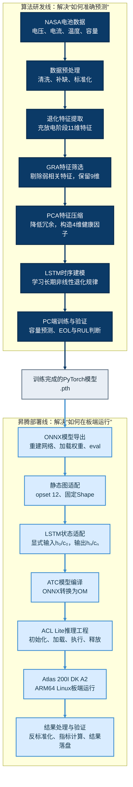

# 基于昇腾边缘计算平台的锂电池寿命预测系统--STAR

# S：项目背景

## 1. 行业背景：为什么需要预测锂电池剩余寿命

=={green}锂电池被广泛应用在**新能源汽车、储能系统和航天设备**==中。随着=={green}**充放电循环次数增加**==，电池内部会发生材料老化和电化学副反应，表现为=={green}**容量逐渐下降**、**内阻上升**以及**可用性能衰减**==。

对于使用锂电池的系统来说，=={green}只知道电池当前还有多少电是不够的==。SOC反映的是电池当前的剩余电量，而SOH和RUL关注的是=={green}电池已经老化到什么程度==，以及=={green}距离寿命终点还剩多少个充放电循环。==

如果不能提前判断剩余寿命，维护人员通常只能按照固定周期更换电池，或者等到容量明显下降以后再处理。前者可能造成电池尚未失效就被提前更换，增加维护成本；后者则可能导致设备性能下降，甚至增加系统运行风险。因此，=={green}提前预测电池的容量退化趋势和剩余寿命，可以为**电池维护、更换计划和健康管理**提供依据。==

## 2. 技术背景：为什么这个问题比较难=={pink}(算法难点)==

这个问题的难点在于

- =={yellow}电池退化是一个==**=={yellow}长期、非线性的时序过程==**
- 而且原始监测数据里有很多电压、电流、温度等变量（11维度数据），**=={yellow}不是所有特征都对寿命变化同样敏感==**=={yellow}。==
- 如果=={yellow}直接把==**=={yellow}所有特征都送进模型==**=={yellow}，容易带来==**=={yellow}冗余和噪声==**=={yellow}，尤其在寿命后期会==**=={yellow}影响预测精度==**=={yellow}。==

-----------------------------------------------------------------------------------------------------------------------------

## 3. 为什么选择数据驱动方法

锂电池寿命预测主要可以分为=={green}模型驱动==和=={green}数据驱动==两类方法。

=={green}模型驱动的方法==**=={green}可解释性强==**=={green}但是在==**=={green}复杂工况下落地难度高==**

模型驱动方法通常根据电池的电化学机理或等效电路建立数学模型，可解释性较强，但需要准确的模型参数和复杂的参数辨识。在电池型号、温度和充放电工况发生变化时，模型的建立和校准成本也比较高。

=={yellow}数据驱动方法==可以直接=={yellow}利用**电池历史充放电数据**==，学习多维监测特征与容量退化之间的非线性关系。这个项目具有**=={green}NASA公开的全生命周期电池数据==**，因此采用数据驱动方法=={yellow}更适合开展**特征分析**和**时序预测**研究。==

这并不意味着数据驱动方法一定优于机理模型，而是基于当前的数据条件和研究目标，我们更关注如何从历史数据中提取有效退化信息，并验证预测方法的可行性。

## 4. 为什么还要部署到昇腾边缘端

=={yellow}锂电池寿命预计系统在实际工程中，不可能把数据传回 PC 或云端再分析，而是需要==**=={yellow}低功耗、高实时、可嵌入==**=={yellow}的**就地推理能力**。==
在论文研究阶段，=={green}算法主要运行在PC环境中，可以验证预测方法是否有效==，但这仍然属于离线算法实验。

如果希望这套方法进一步服务于BMS，就需要考虑模型能否在资源受限的边缘设备上运行。实际应用中，完全依赖云端会受到网络连接、数据上传和隐私等因素影响；将模型部署在靠近电池管理系统的边缘侧，可以减少对网络的依赖，使设备在离线或弱网条件下仍然具备本地分析能力。

锂电池寿命预测并不是毫秒级控制任务，因此=={green}边缘部署的核心价值不是追求极低时延==，而是验证模型的本地可运行性、弱网可用性和嵌入式集成能力。

所以，在完成GRA、PCA和LSTM预测算法研究后，我进一步将PC端模型迁移到华为Atlas 200I DK A2平台，希望打通从算法研究到端侧部署的完整链路，把一个PC端离线模型转化为能够在昇腾边缘设备上独立运行的推理系统。

## S部分总结

这个项目的背景可以概括为：

> 面向BMS电池健康管理和维护决策需求，针对锂电池退化过程长期、非线性、多特征且EOL附近预测敏感的问题，我首先研究如何通过有效的特征筛选、特征压缩和时序建模提高容量及寿命预测效果；在算法验证的基础上，又进一步解决PC端模型向昇腾边缘平台迁移的问题，验证这套方法在端侧独立运行的可行性。

## 面试口述版

这个项目主要面向BMS中的电池健康管理和剩余寿命预测。

锂电池在长期充放电以后会逐渐老化，表现为容量下降和性能衰减。SOC只能告诉我们电池当前还剩多少电，但对于维护人员来说，还需要知道电池已经老化到什么程度，以及距离寿命终点还有多少个循环，也就是SOH和RUL。只有提前掌握这些信息，才能更合理地安排维护和更换。

这个问题的难点在于，电池退化是一个长期、非线性的过程。充放电数据中包含电压、电流、温度和时间等多种特征，但并不是所有特征都与容量衰减强相关。如果直接把所有特征输入模型，可能会引入冗余和噪声。尤其在寿命中后期和EOL附近，较小的容量预测偏差也可能影响寿命终点的判断。

因此，我首先基于NASA公开电池数据，研究如何从多维充放电数据中筛选有效退化特征，并建立长期时序预测模型。完成PC端算法以后，我又进一步把模型部署到华为Atlas 200I DK A2边缘平台。因为只在PC上跑通还属于离线算法，部署到板端以后，才能验证它能否在弱网或离线条件下进行本地推理，更接近未来与BMS集成的实际形态。

所以，这个项目实际上解决了两个连续的问题：第一个是怎样提高锂电池中后期的寿命预测效果，第二个是怎样把这个算法真正迁移到昇腾边缘设备上运行。

---

# T：项目任务与个人职责



配合这张图，T部分可以这样概括：

> 整个项目包含算法研发和工程部署两条主线。算法侧要解决的是如何从多维充放电数据中提取有效退化信息，并利用LSTM完成容量、EOL和RUL预测；工程侧要解决的是如何把PC端训练好的动态图模型转换成昇腾平台能够执行的静态OM模型，并在Atlas 200I DK A2上形成完整的推理链路。我负责打通这两条主线，使项目从论文中的预测方法进一步发展为可以在边缘板端运行的推理系统。

## 1. 整体任务

先说明项目最终要做成什么：

> 构建一套面向BMS的锂电池剩余寿命预测方案，从历史充放电数据中提取退化特征，建立容量预测模型，并将模型部署到昇腾边缘平台，形成从数据处理、模型训练到板端推理和结果验证的完整链路。

这里需要强调，任务不是单纯“训练一个LSTM”，而是包含两条连续主线：

- **=={yellow}算法侧==**=={yellow}：实现对电池容量和EOL的准确预测；==
- **=={yellow}工程主线==**=={yellow}：把PC端算法迁移成昇腾板端能够运行的推理系统。==

## 2. 需要解决的核心问题

T部分可以概括为四个任务目标：

1. **退化信息提取**
从NASA电池充放电数据中提取能够反映老化过程的特征，处理缺失、异常、重复记录和量纲差异。
2. **容量与寿命预测**
筛选与容量退化强相关的特征，降低输入冗余，建立时序模型预测容量变化，并进一步判断EOL和RUL。
3. **端侧模型迁移**
将PyTorch模型转换成昇腾平台支持的OM模型，解决动态图、动态序列和NPU静态编译之间的差异。
4. **板端推理闭环**
在Atlas 200I DK A2上完成数据预处理、模型加载、推理执行、结果反归一化、指标计算和结果保存，并验证端侧结果的有效性。

## 3. 个人职责边界

按照简历口径，你的个人职责可以表述为：

> 我作为项目的主要完成人和论文第一作者，负责从算法研究到昇腾端侧部署的整体实现，包括数据预处理与退化特征提取、GRA/PCA特征优化、LSTM模型构建与训练、PyTorch模型导出、ATC编译、LSTM静态图适配、ACL Lite板端推理工程以及最终实验验证。论文写作和研究讨论由课题组成员共同参与，但项目的算法实现和端侧部署是我的主要工作。

---

算法侧可以写成“**数据理解—特征构造—特征优化—时序预测—实验验证**”五步。除了说明用了哪些算法，还要体现你为什么这样组合、如何设计对照实验，以及怎样判断方案有效。

# A：算法研发侧

# 一、算法侧总体思路

锂电池寿命预测并不是直接把原始电压、电流和温度曲线送入LSTM，而是采用“先优化输入，再进行时序预测”的分层方法：

**原始充放电数据 → 数据清洗与标准化 → 11维退化特征提取 → GRA筛选强相关特征 → PCA压缩为4维健康因子 → LSTM容量预测 → EOL与RUL判断**

这套方法分别解决了三个问题：

- 特征提取负责将长时间原始采样曲线转换成每个循环的退化表征；
- GRA和PCA负责减少弱相关信息与特征冗余；
- LSTM负责学习健康因子与容量衰减之间的长期非线性关系。

## A1：数据预处理与退化特征提取

### 1. 需要解决的问题

NASA数据集记录了电池每次充放电过程中的电压、电流、温度、时间和容量等数据。这些数据存在三个问题：

- 不同循环的采样长度和时间间隔可能不一致；
- 原始记录中可能存在重复、缺失或无效数据；
- 原始采样曲线维度高，不能直接作为每个循环的固定维度输入。

因此，首先需要把不同循环的数据清洗并对齐，再从充放电过程提取能够反映老化趋势的固定维度特征。

### 2. 数据预处理

论文实验中的主要预处理包括：

- 删除重复的充电记录；
- 对缺失或无效数据进行检查，并使用对应特征的均值进行补充；
- 按充放电循环整理电压、电流、温度和容量数据；
- 对提取后的特征和容量进行Z-score标准化。

# $$

z

\frac{x-\mu}{\sigma}
$$

其中：

- (x)是原始数据；
- (\mu)是数据均值；
- (\sigma)是数据标准差。

标准化的目的不是改变特征之间的退化关系，而是消除电压、电流、温度和时间等不同量纲造成的数值尺度差异，避免数值范围较大的特征在PCA和模型训练中占据过大权重。

在规范实现中，均值、标准差、GRA筛选结果和PCA变换矩阵都应该只根据训练集计算，然后原样应用到验证集、测试集和板端，避免引入未来数据泄漏。

### 3. 11维退化特征

项目从充电和放电阶段提取了11维退化特征：

| 阶段 | 特征 | 物理意义 |
| --- | --- | --- |
| 充电 | 等电压上升充电时间 | 电压上升固定区间所需时间 |
| 充电 | 等时间间隔充电电压上升量 | 固定时间内的充电电压变化 |
| 充电 | 等时间间隔充电电流下降量 | 恒压阶段固定时间内的电流下降 |
| 充电 | 恒流充电持续时间 | 恒流阶段持续时长 |
| 放电 | 平均电压衰减MVF | 稳定放电区间相对标称电压的平均下降量 |
| 放电 | 恒流放电持续时间 | 固定放电电流下的持续时长 |
| 温度 | 等时间间隔温升 | 固定时间内的温度变化 |
| 温度 | 平均工作温度 | 单次循环的平均温度水平 |
| 放电 | 等电压下降放电时间 | 电压下降固定区间所需时间 |
| 放电 | 等时间间隔放电电压下降量 | 固定时间内的放电电压变化 |
| 放电 | 平均放电电压 | 单次放电过程的平均电压 |

# 其中，MVF选择相对稳定的放电区间，例如1000秒至2000秒，计算电压相对4.2 V的平均下降量：

$$
MVF_i

\frac{1}{N}
\sum_{j=1}^{N}
\left(
4.2-V_{i,j}
\right)
$$
随着电池老化，相同放电区间内的电压保持能力会发生变化，因此MVF可以作为反映退化程度的特征。

### 4. 为什么提取物理特征，而不是直接输入原始曲线

NASA电池数据规模相对有限。如果直接使用完整采样曲线，模型输入维度会明显增加，而且不同循环的序列长度不一致，需要进行重采样或填充。

提取充电时间、电压下降、平均温度等特征，可以把每个充放电循环转换为固定维度向量，同时保留一定的物理意义，减少模型规模和小样本下的过拟合风险，更适合后续边缘端部署。

它的局限是依赖人工特征设计，可能损失原始曲线中的局部细节。如果数据规模足够大，可以进一步尝试1D CNN、TCN或Transformer直接处理原始时序曲线。

## A2：GRA特征筛选与PCA降维

### 1. 为什么不能把11维特征全部输入LSTM

11个特征虽然都来自充放电过程，但它们对容量退化的敏感程度不同，而且部分特征之间可能表达相似信息。

如果直接全部输入模型，可能出现：

- 弱相关特征引入噪声；
- 高相关特征之间存在重复信息；
- 增加模型参数和训练难度；
- 影响模型在寿命中后期对关键退化趋势的判断。

因此，我采用GRA和PCA分两步优化输入。

### 2. GRA：筛选与容量退化强相关的特征

GRA，也就是灰色关联分析，通过比较特征序列与容量序列随循环变化的趋势相似程度，衡量每个特征与容量退化的关联性。

# 首先计算容量参考序列(x_0(k))与第(i)个特征序列(x_i(k))的绝对差：

$$
\Delta_i(k)

# \left|

x_0(k)-x_i(k)
\right|
$$
然后计算灰色关联系数：
$$
\xi_i(k)

# \frac{

\Delta_{\min}
+
\rho\Delta_{\max}
}{
\Delta_i(k)
+
\rho\Delta_{\max}
}
$$
其中，(\rho)是分辨系数。再对所有循环的关联系数求平均，得到该特征的灰色关联度：
$$
r_i

\frac{1}{n}
\sum_{k=1}^{n}
\xi_i(k)
$$
关联度越大，说明特征变化趋势与容量退化趋势越接近。

项目以0.75作为筛选阈值，从11维特征中保留9维，剔除了：

- 等时间间隔充电电流下降特征；
- 等时间间隔温度上升特征。

GRA适合当前数据量相对有限、变量关系不完全明确的场景。不过，GRA反映的是趋势关联，不代表因果关系，也不能消除入选特征之间的共线性。

### 3. PCA：进一步压缩冗余信息

经过GRA筛选后，剩余9个特征都与容量退化具有较强关联，但它们之间仍然可能存在信息重叠。例如平均放电电压、放电电压下降量和恒流放电时间，都可能从不同角度描述相近的退化现象。

因此，进一步使用PCA将相关特征投影到相互正交的主成分方向。

主要过程包括：

1. 对9维特征进行标准化和中心化；
2. 计算特征协方差矩阵；
3. 对协方差矩阵进行特征值分解；
4. 按特征值从大到小选择主成分；
5. 将原始特征投影到低维主成分空间。

项目中前四个主成分的累计方差贡献率达到98.65%，因此将9维特征压缩成4维健康因子，作为LSTM的输入。

### 4. 为什么GRA和PCA需要同时使用

GRA和PCA解决的不是同一个问题：

- GRA利用容量标签，回答“哪些特征与容量退化更相关”；
- PCA不使用容量标签，回答“如何消除入选特征之间的冗余和共线性”。

因此，整体逻辑是：

> GRA先去掉与预测目标关系较弱的特征，PCA再压缩保留特征中的重复信息。

如果只使用GRA，仍然可能保留大量相互相关的特征；如果直接使用PCA，方差较大的方向不一定与容量退化最相关。先GRA、后PCA，可以同时兼顾目标相关性和输入紧凑性。

### 5. 方法局限

- GRA的0.75阈值具有一定经验性；
- PCA只能完成线性降维；
- PCA主成分的物理可解释性弱于原始特征；
- 累计方差贡献率高，不等于预测性能一定最好；
- 主成分数量最终还应结合验证集误差和消融实验确定。

## A3：LSTM时序建模与寿命预测

### 1. 为什么使用LSTM

电池在当前循环的健康状态不仅与当前采集值有关，还与此前多个循环形成的长期退化趋势有关，因此这是一个典型的时序预测问题。

普通RNN能够处理序列，但在较长序列反向传播过程中容易出现梯度消失或梯度爆炸，难以稳定保留较早循环的信息。

LSTM在RNN基础上增加了细胞状态以及遗忘门、输入门和输出门：

- 遗忘门决定保留多少历史信息；
- 输入门决定写入多少当前信息；
- 输出门决定向下一时刻输出多少状态。

这种门控结构能够缓解长序列中的梯度问题，更适合学习电池长期、非线性的容量退化规律。这里应表述为“缓解”，不能说LSTM完全解决了梯度消失和梯度爆炸。

### 2. 模型输入与输出

经过GRA和PCA处理后，每个充放电循环被表示为4维健康因子。

LSTM接收连续多个循环的健康因子序列，提取其中的时间依赖关系，再通过全连接层输出容量预测值：
$$
\text{健康因子序列}
\rightarrow
\mathrm{LSTM}
\rightarrow
\text{最后时间步隐藏状态}
\rightarrow
\text{全连接层}
\rightarrow
\text{预测容量}
$$
模型直接预测的是容量，而不是直接输出“还剩多少寿命”。

# 得到未来容量预测曲线后，根据实验中统一设定的EOL容量阈值，找到预测曲线第一次越过阈值的循环位置：

$$
RUL

## \widehat{EOLCycle}

CurrentCycle
$$
因此，整个任务本质上是：

> 先完成容量回归，再根据容量预测曲线推导EOL和RUL。

### 3. 训练方法

论文研究阶段采用的主要设置包括：

- 优化健康因子模型使用50个LSTM神经元；
- 最大训练轮数为200；
- 使用Adam优化器；
- 初始学习率为0.01；
- 使用MSE作为训练损失；
- 分别进行21步和42步预测实验。

# MSE损失为：

$$
MSE

\frac{1}{N}
\sum_{i=1}^{N}
\left(
y_i-\hat{y}_i
\right)^2
$$
MSE对较大误差惩罚更明显，适合容量回归任务。模型训练完成后，再通过RMSE、MAE、R²、自定义准确率以及EOL循环误差进行综合评价。

论文研究版和后续板端部署版存在模型迭代：论文中的优化模型隐藏层为50，而当前部署模型使用100维隐藏状态。面试时应将其解释为不同阶段的模型版本，不能把两组参数混成同一个模型。

### 4. 21步与42步的区别

论文中比较了21步和42步两种预测策略。这里的“21步、42步”主要表示预测跨度，即使用当前及历史信息预测若干循环之后的容量。

预测跨度越大，提前量越高，但误差也更容易累积；预测跨度越小，能够更细致地跟踪局部退化变化。

需要注意，论文中的“预测跨度21步”和部署模型输入Shape中的“序列长度21”是两个概念：

- 预测跨度表示向未来预测多少个循环；
- 输入序列长度表示每次模型推理使用多少个历史循环。

两者在某个版本中都取21，但含义不同。

### 5. 实验对照设计

算法侧不仅训练了一个模型，还设计了两类对照。

#### 对照一：健康因子构造方式

比较：

- 一维综合健康因子＋LSTM；
- GRA＋PCA构造的多维优化健康因子＋LSTM。

目的在于验证预测提升来自特征优化，而不只是LSTM本身。

#### 对照二：预测跨度

比较：

- 42步预测；
- 21步预测。

目的在于观察不同预测提前量下的误差累积，以及模型在寿命中后期的跟踪能力。

这种对照设计能够回答两个关键问题：

- GRA和PCA是否真的改善了模型输入；
- 预测跨度变化会怎样影响容量和EOL预测。

### 6. 评价指标

项目使用多种指标评价模型，避免只看单一结果。

#### RMSE均方根误差

# $$

RMSE

\sqrt{
\frac{1}{N}
\sum_{i=1}^{N}
\left(
y_i-\hat{y}_i
\right)^2
}
$$

RMSE对较大预测误差更加敏感，单位是Ah。

#### MAE平均绝对误差

# $$

MAE

\frac{1}{N}
\sum_{i=1}^{N}
\left|
y_i-\hat{y}_i
\right|
$$

MAE表示平均容量误差，直观且不容易被少量极端值完全支配。

#### R²决定系数

# $$

R^2

1-
\frac{
\sum_{i=1}^{N}
\left(y_i-\hat{y}_i\right)^2
}{
\sum_{i=1}^{N}
\left(y_i-\bar{y}\right)^2
}
$$

R²用于衡量模型对容量变化趋势的解释程度。

#### 项目自定义准确率

# 后期实验中的准确率定义为：

$$
Accuracy

\left(
1-\frac{MAE}{\overline{Capacity}}
\right)
\times 100%
$$
它本质上是根据平均容量归一化后的相对误差指标，不是分类任务中的正确率。面试中需要主动说明计算公式。

#### EOL循环误差

# $$

EOL_{\text{Error}}

## \left|

\widehat{EOLCycle}

EOLCycle
\right|
$$

该指标直接反映预测寿命终点与真实寿命终点相差多少个循环，比单纯使用全周期容量误差更贴近寿命预测目标。

## 算法设计中体现的方法论

这个项目的算法设计不只是“把几个算法串在一起”，还体现了以下方法。

### 1. 分层解决问题

没有让一个复杂模型同时承担数据清洗、特征筛选、降维和时序预测，而是将问题拆成：

> 物理特征构造 → 目标相关性筛选 → 冗余压缩 → 时序建模

每一层只解决一个明确问题，便于解释、验证和替换。

### 2. 先优化输入，再增加模型复杂度

在数据量有限时，直接堆叠更深的网络不一定有效。这个项目优先通过GRA和PCA提高输入质量，再使用结构相对简单的LSTM完成预测。

这种思路可以降低小样本下的过拟合风险，也更有利于后续边缘部署。

### 3. 使用对照实验验证模块贡献

通过比较不同健康因子和不同预测跨度，判断性能变化来自哪一个设计，而不是只展示最终最优曲线。

如果后续继续完善，还可以增加以下消融实验：

- 11维原始特征＋LSTM；
- 仅GRA筛选＋LSTM；
- GRA＋PCA＋LSTM；
- 不同PCA维度；
- 不同窗口长度和隐藏层大小。

这些属于可以进一步补充的实验设计，不能在没有真实结果时说成已经完成。

### 4. 同时评价全周期误差和EOL误差

全周期RMSE较低，不代表EOL一定判断准确。因此，项目既评价完整容量曲线，也单独分析寿命中后期和EOL循环位置，保证评价指标与实际任务目标一致。

### 5. 保持训练与部署处理一致

训练时使用的特征顺序、均值、标准差、GRA筛选结果和PCA矩阵，都应该作为模型配套资产保存，并在板端使用同一版本。

否则即使OM模型本身转换正确，只要特征顺序或标准化参数不一致，板端结果也会发生整体偏移。

## 算法侧局限与改进方向

目前算法仍有以下局限：

- 使用NASA实验室数据，尚未验证不同电芯体系、温度和倍率下的泛化能力；
- GRA阈值和PCA维度具有一定经验性；
- PCA只能描述线性关系；
- 模型输出是单点预测，没有给出置信区间；
- EOL判断依赖预先设定的容量阈值；
- 不同数据划分方式会显著影响结果，必须避免时间序列数据泄漏。

如果继续优化，可以考虑：

- 使用留一电池验证评估跨电池泛化；
- 对GRA阈值、PCA维度、窗口长度和隐藏层大小进行敏感性分析；
- 使用GRU、TCN或1D CNN作为轻量化对照；
- 增加预测置信区间和不确定性估计；
- 将物理约束与数据驱动模型结合，提高域外工况下的可靠性。

## 算法侧面试口述版

算法侧我的总体思路是先优化输入，再进行时序预测。

首先，我对NASA电池充放电数据进行清洗和标准化，并从充电、放电和温度变化中提取了11维退化特征。因为这些特征对容量衰减的敏感程度不同，所以我先使用GRA计算每个特征与容量退化趋势的关联程度，以0.75为阈值保留9个强相关特征。

但是GRA只能剔除弱相关特征，不能解决入选特征之间的信息冗余，因此我又使用PCA进行降维。前四个主成分累计方差贡献率达到98.65%，所以最终将9维特征压缩成4维健康因子。

之后，我把连续多个循环的健康因子输入LSTM，通过LSTM学习电池长期、非线性的容量退化规律，再通过全连接层输出容量预测值。模型不是直接输出RUL，而是先得到未来容量曲线，再根据EOL阈值找到容量首次越过阈值的循环位置，进而计算剩余寿命。

实验设计上，我比较了一维综合健康因子和多维优化健康因子，也比较了21步和42步两种预测策略，用来验证特征优化和预测跨度对结果的影响。评价时不仅看RMSE和MAE，还单独分析EOL循环误差，因为全周期容量拟合准确，并不代表寿命终点一定判断准确。

---

# A：工程部署侧

# 一、工程部署侧总体思路

算法侧解决的是“如何预测”，工程部署侧解决的是“如何让训练完成的模型在昇腾边缘设备上运行”。

整体部署链路为：

**PyTorch `.pth`模型 → ONNX中间模型 → ATC编译 → OM离线模型 → ACL Lite板端推理 → 结果反标准化与验证**

这个过程中需要解决四类问题：

- PyTorch训练模型如何转换为跨框架的静态计算图；
- LSTM动态序列如何适配NPU的静态编译；
- ONNX模型如何编译为Ascend 310B4能够执行的OM模型；
- 如何在ARM64 Linux板端建立完整的推理和资源管理流程。

---

## A4：PyTorch模型导出与静态图适配

### 1. 对应简历表述

> 完成PyTorch → ONNX → OM转换，针对NPU静态编译约束采用固定Shape与opset 12，将LSTM动态序列固化为静态计算图。

### 2. 为什么不能直接把`.pth`文件放到昇腾板端

`.pth`通常保存的是PyTorch模型权重，也就是每一层的参数，并不等于一个可以被昇腾NPU直接执行的模型。

它缺少或者依赖以下内容：

- 与训练阶段一致的网络结构；
- PyTorch运行环境；
- 模型前向计算逻辑；
- 昇腾平台能够识别的算子表示；
- 针对Ascend芯片编译后的执行信息。

如果直接在ARM板端使用PyTorch加载`.pth`，即使能够运行，也主要是在CPU上执行，不能使用Ascend NPU的推理能力，而且板端还要安装完整的PyTorch依赖。

因此，需要先将PyTorch模型导出为ONNX，再通过昇腾ATC编译器生成OM模型。

### 3. 为什么使用ONNX作为中间格式

ONNX是一种与训练框架和硬件平台相对解耦的模型中间表示。

在这个项目中，ONNX承担了桥梁作用：

[ PyTorch\rightarrow ONNX\rightarrow Ascend\ OM ]

ONNX模型中包含：

- 模型计算图；
- 算子类型和连接关系；
- 模型权重；
- 输入输出名称；
- 输入输出Shape；
- 数据类型和算子属性。

这样，PyTorch负责模型训练和导出，ATC负责将ONNX计算图编译成昇腾平台专用的OM模型。

### 4. `.pth`导出ONNX的过程

#### 第一步：重建与训练时一致的网络结构

`.pth`中主要保存模型参数，因此导出前需要重新定义与训练阶段一致的网络结构。

部署版本的主要结构为：

- 输入特征数：4；
- LSTM隐藏层维度：100；
- LSTM层数：1；
- 全连接层输出维度：1；
- 输入序列长度：21。

如果网络结构、隐藏层大小或者层数与训练时不一致，`load_state_dict()`会出现参数Shape不匹配；即使通过部分加载，也可能导出一个语义错误的模型。

#### 第二步：加载模型权重

将训练得到的权重加载到重建的模型中：

```perl
state = torch.load(pth_path, map_location="cpu")
model.load_state_dict(state)
```

如果保存文件中还包含优化器和训练轮数等信息，则需要从Checkpoint中取出`state_dict`。

#### 第三步：切换到推理模式

导出前调用：

```javascript
model.eval()
```

`eval()`会将模型切换为推理状态，固定Dropout和BatchNorm等训练、推理行为不同的层。

当前LSTM结构中不一定包含Dropout和BatchNorm，但在模型导出流程中显式调用`eval()`仍然是必要的工程规范。

#### 第四步：构造固定Shape的虚拟输入

部署模型的主要输入为：

```makefile
x:  [1, 21, 4]
h0: [1, 1, 100]
c0: [1, 1, 100]
```

其中：

- 第一个维度是Batch Size；
- 21表示历史序列长度；
- 4表示PCA处理后的健康因子维度；
- 100表示LSTM隐藏层维度。

Dummy Input的作用是让PyTorch在导出过程中执行一次前向传播，并据此建立ONNX计算图。

#### 第五步：导出ONNX

```graphql
torch.onnx.export(
    model,
    (x, h0, c0),
    onnx_path,
    export_params=True,
    opset_version=12,
    do_constant_folding=True,
    input_names=["x", "h0", "c0"],
    output_names=["y", "hn", "cn"]
)
```

最终ONNX模型包含三个输入和三个输出：

```css
输入：
x   [1, 21, 4]
h0  [1, 1, 100]
c0  [1, 1, 100]

输出：
y   [1, 1]
hn  [1, 1, 100]
cn  [1, 1, 100]
```

### 5. 为什么使用opset 12

opset表示ONNX算子语义集合的版本。

不同opset下，LSTM、Gather、Squeeze等算子的属性和表达方式可能不同。昇腾ATC不一定支持最新版本中的所有算子，因此不能盲目选择最高版本。

项目选择opset 12，主要是在以下两方面之间取平衡：

- 能够完整表达当前LSTM模型；
- 与当时使用的PyTorch和CANN工具链具有较好的兼容性。

当前ONNX模型经过检查，主要包含LSTM、Transpose、Squeeze、Gather和Gemm等算子，计算图结构相对简单。

### 6. 为什么不使用动态Shape

部署版本没有设置`dynamic_axes`，而是固定为：
$$
\operatorname{shape}(x)=[1,21,4]
$$
固定Shape以后，ATC可以在编译阶段提前确定：

- 每个张量的内存大小；
- 中间结果的内存布局；
- 算子执行方式；
- 输入输出Buffer大小；
- 部分图优化和内存复用方案。

动态Shape灵活性更高，但会增加编译和运行时推导开销，而且LSTM动态序列在不同CANN版本中的支持程度存在差异。

当前项目的历史窗口固定为21，特征维度固定为4，因此使用静态Shape更符合实际输入形式。

它的代价是模型不能在运行时直接切换窗口长度。如果需要支持不同窗口，可以分别生成多个OM模型，或者使用平台支持的动态档位功能。

### 7. 如果不做这一步会出现什么问题

- 网络结构与权重不一致，会导致权重加载失败；
- 没有调用`eval()`，可能导致训练态和推理态结果不一致；
- 输入名称与ATC配置不一致，会导致编译器找不到输入节点；
- 使用不兼容的opset，可能产生ATC不支持的算子；
- 使用动态Shape，可能导致LSTM无法编译或者性能不稳定；
- 不显式暴露`h0/c0`，模型每次调用只能从固定初始状态开始。

### 8. 验证方式

模型导出后需要进行三级验证：

1. 使用ONNX Checker检查模型结构是否合法；
2. 检查输入输出名称、Shape和数据类型；
3. 使用相同输入对比PyTorch和ONNX Runtime输出。

当前保留的三个ONNX模型结构检查均通过，输入输出Shape也与部署代码一致。数值一致性验证仍应以当时保存的测试结果或运行日志为准。

### 9. 面试口述版

我首先将PyTorch训练得到的`.pth`模型转换为ONNX。因为`.pth`主要保存模型权重，所以导出前需要重建与训练时一致的网络结构、加载权重并调用`eval()`切换到推理模式。

考虑到昇腾NPU采用静态编译，我没有使用动态Shape，而是将输入固定为`[1,21,4]`。同时把LSTM的`h0/c0`设置为显式输入，把`hn/cn`设置为输出。导出时选择opset 12，主要是为了兼顾PyTorch导出和CANN工具链的兼容性。

---

## A5：ATC编译与OM模型生成

### 1. 对应简历表述

> 在Atlas 200I DK A2完成CANN环境配置与ATC编译，将ONNX模型转换为Ascend 310B4可执行的OM模型。

### 2. ONNX为什么还不能直接在NPU上运行

ONNX是通用计算图，并不包含针对Ascend 310B4编译后的执行信息。

Ascend NPU需要结合以下内容生成专用模型：

- 目标芯片型号；
- 算子支持情况；
- 输入输出Shape；
- 数据类型和精度模式；
- 内存规划；
- 算子实现选择；
- 图优化结果。

ATC，也就是Ascend Tensor Compiler，负责将通用ONNX图编译成与目标昇腾芯片匹配的OM模型。

### 3. 板端环境准备

目标平台为：

- 开发板：Atlas 200I DK A2；
- 处理器架构：ARM64 Linux；
- NPU：Ascend 310B4；
- 软件栈：CANN；
- 推理接口：ACL Lite。

通过SSH远程登录板端后，可以使用`npu-smi info`确认NPU型号和运行状态，并检查CANN环境变量、Python架构及依赖库是否与aarch64平台匹配。

### 4. ATC编译过程

三输入模型的典型ATC命令为：

```lua
atc \
  --model=./models/LSTM_net_raw_B0005_with_hc.onnx \
  --framework=5 \
  --output=./models/LSTM_net_raw_B0005_with_hc \
  --input_format=ND \
  --input_shape="x:1,21,4;h0:1,1,100;c0:1,1,100" \
  --soc_version=Ascend310B4 \
  --precision_mode=force_fp32 \
  --log=info
```

主要参数含义如下：

| 参数 | 作用 |
| --- | --- |
| `--model` | 指定输入的ONNX模型 |
| `--framework=5` | 表示输入模型格式为ONNX |
| `--output` | 指定输出OM模型名称 |
| `--input_format=ND` | 使用普通N维张量格式 |
| `--input_shape` | 指定三个输入的固定Shape |
| `--soc_version` | 指定目标芯片Ascend 310B4 |
| `--precision_mode` | 设置模型编译精度策略 |
| `--log=info` | 输出编译日志，便于定位问题 |

### 5. 为什么需要指定目标芯片

不同Ascend芯片支持的算子、AI Core架构和内存结构可能不同。

如果`--soc_version`与目标设备不匹配，可能出现：

- OM模型无法加载；
- 算子实现选择不正确；
- 模型编译失败；
- 模型可以生成但不能在目标板端执行。

因此，编译前必须根据实际开发板确认目标SoC，而不能只写笼统的`Ascend310`。

### 6. 为什么初版使用FP32

电池容量预测属于连续值回归，较小的数值误差也可能影响EOL越阈位置。

因此，初版使用FP32作为精度基线，优先保证模型迁移前后的数值稳定性，而不是一开始就使用FP16或INT8追求性能。

更严谨的优化方式是：

- 先得到FP32板端基准；
- 再分别测试FP16和INT8；
- 比较板端时延、RMSE和EOL误差；
- 根据业务指标决定是否降低精度。

没有完成对照实验时，只能说“FP32是保守的精度策略”，不能说FP16一定无法满足要求。

### 7. OM模型是什么

OM是昇腾平台的离线模型格式。

它不只是ONNX文件的简单改名，而是经过ATC编译后形成的硬件相关执行模型，其中包含：

- 针对目标SoC选择的算子实现；
- 固定的输入输出接口；
- 编译后的计算图；
- 内存规划信息；
- 部分算子融合和常量折叠结果；
- NPU运行时需要的模型描述。

当前目录中已经保留了B0005、B0006和B0007三组电池对应的ONNX和OM模型，可以证明模型转换链路已经实际完成。

### 8. 常见编译问题

#### 输入名称不一致

ATC命令中的`x`、`h0`和`c0`必须与ONNX Graph中的真实输入名称完全一致。

#### Shape不一致

如果ONNX模型是`[1,21,4]`，但ATC配置成其他Shape，编译或运行时会报输入不匹配。

#### 算子不支持

LSTM在不同opset和CANN版本中的表示可能不同。出现不支持时，需要检查：

- CANN版本；
- opset版本；
- LSTM属性；
- 是否存在动态序列；
- 能否用基础算子展开或更换模型结构。

#### 跨架构依赖问题

开发板是aarch64架构，安装Pandas、NumPy等依赖时，需要选择ARM64版本，不能直接使用x86环境下的安装包。

### 9. 验证方式

OM生成后不能只检查文件是否存在，还需要验证：

- OM能否被ACL Runtime成功加载；
- 输入数量和Shape是否正确；
- 三个输出是否能够正常获得；
- 板端推理是否出现算子执行错误；
- 输出容量是否处于合理范围；
- OM输出与PC端结果是否一致。

### 10. 面试口述版

ONNX只是通用中间模型，不能直接在Ascend 310B4上执行，所以我使用ATC将ONNX编译成OM。

编译时需要明确指定三组输入Shape、ND格式、目标芯片Ascend 310B4和精度模式。初版采用FP32，是为了先建立稳定的容量回归精度基线。OM生成后，我还会在板端通过ACL Lite实际加载和执行，而不是只以ATC编译成功作为部署完成的标准。

---

## A6：LSTM时序状态的板端适配

### 1. 对应简历表述

> 将LSTM初始隐状态与细胞状态`h₀/c₀`显式暴露为模型输入并跨推理迭代传递，配合固定滑动窗口恢复时序依赖。

### 2. 为什么LSTM比普通前馈模型更难部署

普通前馈网络通常是一次输入对应一次输出，每次推理之间相互独立。

LSTM除了当前输入(x_t)，还依赖上一时刻的：

- 隐藏状态(h_{t-1})；
- 细胞状态(c_{t-1})。

在PyTorch中，这些状态可以在Python运行逻辑中动态创建和传递；但OM是静态计算图，每次模型调用都是一次固定的输入到输出映射，不会自动保存Python对象中的状态。

如果不做处理，每次调用模型都会从零状态开始，跨次推理的时序上下文可能丢失。

### 3. 将状态显式设置为模型接口

为了解决这个问题，我将LSTM模型改为三个显式输入：

```undefined
x  ：当前21步健康因子序列
h0 ：初始隐藏状态
c0 ：初始细胞状态
```

同时输出：

```undefined
y  ：容量预测值
hn ：本次推理后的隐藏状态
cn ：本次推理后的细胞状态
```

板端完成一次推理后执行：

```ini
outputs = model.execute([window_array, h0, c0])

prediction = outputs[0]
h0 = outputs[1].copy()
c0 = outputs[2].copy()
```

这样，上一轮输出的`hn/cn`可以作为下一轮的`h0/c0`，由运行时显式维护状态。

### 4. 固定滑动窗口的构造

板端使用长度为21的队列保存最近的健康因子：

```css
第1次：[x1,  x2,  ..., x21]
第2次：[x2,  x3,  ..., x22]
第3次：[x3,  x4,  ..., x23]
```

每次加入新的健康因子，同时移除最早的数据，再将窗口整理为：

[ [1,21,4] ]

这种方式满足了OM模型的固定Shape要求，也能够让每次推理看到最近一段退化历史。

### 5. 为什么不直接使用单个时间步

如果每次只输入当前一个循环的4维健康因子，那么模型只能依赖`h/c`状态保存历史信息。

采用21步窗口后，即使状态在某次推理中被重置，模型仍然能够从当前窗口中获得一定的近期退化趋势，提高对状态异常和冷启动的容忍度。

### 6. 这套方案的局限

当前实现同时使用：

- 高度重叠的21步滑动窗口；
- 跨窗口传递的`h/c`状态。

相邻窗口有20个历史循环重复。如果同时把上一窗口状态传入下一窗口，部分历史信息可能被重复编码。

因此，这是一种面向静态OM部署的工程化实现，但不能直接断言它一定比零状态窗口更准确。

更严谨的验证应比较：

1. 每个滑动窗口都从零状态开始；
2. 滑动窗口同时跨次传递状态；
3. 使用不重叠Chunk并传递状态。

根据实际RMSE和EOL误差选择最终方式。

### 7. 异常处理

开发版本中还设计了状态重置逻辑：如果某一步推理执行异常，可以将`h0/c0`重新置零，避免异常状态继续影响后续推理。

正式系统还可以进一步增加：

- 模型输入范围检查；
- NaN和Inf检查；
- 隐藏状态数值范围监控；
- 状态异常时重新进行窗口预热。

### 8. 面试口述版

LSTM部署的特殊点是它不仅依赖当前输入，还依赖上一时刻的隐藏状态和细胞状态。但OM模型每次调用都是独立的静态图，不会自动保存Python运行时状态。

因此，我把`h0/c0`显式设置为模型输入，把`hn/cn`设置为输出。板端每次推理完成后，将新的状态保存并传入下一次推理。同时使用21步固定滑动窗口，使输入Shape始终保持`[1,21,4]`。

不过，相邻滑动窗口高度重叠，再跨窗口传递状态可能重复编码历史信息，因此这属于当前工程实现，后续仍需要通过消融实验选择最合理的状态管理方式。

---

## A7：ACL Lite板端推理工程

### 1. 对应简历表述

> 基于ACL Lite封装资源初始化、OM加载、执行与释放，构建“数据预处理→模型推理→精度评估→结果保存”的端到端推理链路，适配无图形界面的板端环境，并支持命令行参数化与多型号切换。

### 2. 为什么不能只把OM文件放到板端

OM只是编译完成的模型文件。真正完成板端部署还需要处理：

- ACL运行环境初始化；
- NPU设备和Context创建；
- OM模型加载；
- 输入输出Buffer管理；
- Host与Device之间的数据传输；
- 模型执行；
- 输出解析和反标准化；
- 资源释放。

因此，板端部署的交付物不仅是一个OM文件，还包括围绕OM模型建立的推理程序。

### 3. 为什么使用ACL Lite

ACL是昇腾平台底层推理接口，可以控制：

- Device；
- Context；
- Stream；
- 模型加载；
-内存申请和释放；
- 数据传输；
- 模型执行。

直接使用ACL代码量较大，容易在资源生命周期管理中出现遗漏。

ACL Lite是对ACL常用流程的Python封装。项目使用它简化资源初始化、模型加载和执行流程，但底层实际推理仍由ACL Runtime完成。

因此，准确口径是：

> 我基于ACL Lite搭建了板端推理工程，而不是自己重新实现了ACL运行时。

### 4. 推理工程的完整流程

#### 第一步：加载标准化参数

从文件中加载：

- 4维特征均值；
- 4维特征标准差；
- 容量均值；
- 容量标准差。

保证板端使用与训练阶段一致的数据处理方式。

#### 第二步：读取电池数据

根据命令行指定的电池编号读取对应数据，例如：

```undefined
B0005
B0006
B0007
```

并分离4维健康因子与真实容量。

#### 第三步：完成数据标准化

# $$

x_{\text{norm}}

\frac{x-\mu_x}{\sigma_x}
$$

容量也采用训练阶段保存的参数进行标准化。

#### 第四步：初始化ACL资源

```csharp
acl_resource = AclLiteResource()
acl_resource.init()
```

这一过程负责初始化ACL运行环境、NPU设备、Context和Stream等资源。

#### 第五步：加载OM模型

```ini
model = AclLiteModel(om_model_path)
```

`AclLiteModel`封装了OM加载、输入输出Dataset构造和模型执行等过程。

#### 第六步：构造三输入张量

每次推理构造：

```css
window_array  [1,21,4]
h0            [1,1,100]
c0            [1,1,100]
```

并统一转换为连续的FP32数组，保证字节数、Shape和数据类型与OM模型接口一致。

#### 第七步：执行模型

```ini
outputs = model.execute([window_array, h0, c0])
```

执行过程中由ACL Lite处理Host到Device的数据传输、NPU计算和结果返回。

#### 第八步：解析并更新状态

从模型输出中获得：

- 标准化容量预测值；
- 新的隐藏状态；
- 新的细胞状态。

然后将`hn/cn`保存为下一轮推理的`h0/c0`。

#### 第九步：容量反标准化

# $$

Capacity_{\text{pred}}

Capacity_{\text{norm}}
\times \sigma_{\text{cap}}
+
\mu_{\text{cap}}
$$

将模型输出恢复为单位为Ah的容量值。

#### 第十步：计算指标并保存结果

板端计算：

- RMSE；
- MAE；
- R²；
- 项目自定义准确率；
- EOL循环误差。

同时保存：

- 每个循环的真实容量；
- 每个循环的预测容量；
- 预测误差；
- 指标JSON；
- 容量预测曲线；
- RMSE曲线；
- 误差分布图。

### 5. 无图形界面环境适配

Atlas板端通常通过SSH终端使用，没有桌面图形环境。

因此，Matplotlib需要切换为无GUI后端：

```cpp
import matplotlib
matplotlib.use("Agg")
```

程序不调用`plt.show()`，而是将结果保存为PNG文件，再通过SSH下载查看。

这属于板端工程中容易忽略但实际必要的适配。

### 6. 命令行参数化

推理脚本支持通过命令行指定：

- 电池编号；
- OM模型路径；
- 21步或42步预测；
- 数据目录；
- 结果输出目录；
- 使用哪一类特征。

例如：

```css
python inference_on_acsend_battery_rul_2.py \
  --battery B0005 \
  --om ./models/LSTM_net_raw_B0005_with_hc.om \
  --raw \
  --lag 21 \
  --data-dir ./battery_rul/data \
  --output-dir ./battery_rul
```

这样不需要为每组电池重新修改代码，可以通过参数切换模型和数据。

### 7. 资源释放

推理结束后，需要按照生命周期释放：

- 模型资源；
-输入输出Dataset；
- Device内存；
- Stream；
- Context；
- Device；
- ACL Runtime。

如果只初始化而不释放，连续运行时可能产生设备内存泄漏，最终导致模型加载或内存申请失败。

### 8. 开发模式与正式结果的边界

早期推理代码为了方便在没有ACL环境的PC上调试数据处理和可视化流程，保留了模拟推理兜底。

这类兜底只能用于验证：

- 数据能否读取；
- 图表能否生成；
- 指标流程是否能够执行；
- 命令行和文件路径是否正确。

正式实验结果必须来自实际加载OM并执行NPU推理的路径，不能把模拟输出作为板端性能结果。

项目后期已经使用真实模型和真实电池数据完成正式实验，最终指标统一放在R部分说明。

### 9. 板端验证方法

整个部署链路应从四个层次验证：

#### 模型结构验证

确认ONNX输入输出、数据类型和Shape正确。

#### 编译验证

确认ATC成功生成目标芯片对应的OM模型，且没有不支持算子。

#### 运行验证

确认OM可以在Atlas 200I DK A2上成功加载和连续执行，`h/c`状态能够正确更新。

#### 结果验证

对比PC端和板端：

- 相同输入下的容量预测值；
- 完整容量曲线；
- RMSE和MAE；
- EOL循环位置。

只有模型成功编译、能够在板端运行，并且结果处于允许误差范围内，才能说明部署链路真正完成。

### 10. 当前方案的局限

- 使用固定Shape，窗口长度和特征维度不能运行时任意变化；
- 当前主要处理离线整理后的NASA数据，尚未接入真实BMS在线数据流；
- 滑动窗口和跨窗口状态传递需要进一步消融验证；
- 初版采用FP32，尚未完成FP16和INT8的精度、时延对照；
- 尚未形成完整的模型版本管理、签名校验和回滚机制；
- 仍需要补充板端时延、内存和功耗等系统化性能测试。

---

## 工程部署侧面试口述版

工程部署侧，我主要完成了从PyTorch模型到昇腾板端推理的完整链路。

首先，我重建了与训练时一致的LSTM网络结构，加载`.pth`权重并切换到推理模式。考虑到昇腾NPU采用静态编译，我将输入固定为`[1,21,4]`，并把LSTM的`h0/c0`显式设置为输入，把`hn/cn`设置为输出，然后使用opset 12导出ONNX。

之后，我使用ATC将ONNX编译成面向Ascend 310B4的OM模型。编译时需要确保输入名称、固定Shape、目标SoC和精度模式与实际板端环境一致。初版使用FP32，主要是为了建立稳定的容量回归精度基线。

在板端，我基于ACL Lite搭建了完整推理工程，包括ACL资源初始化、OM加载、数据标准化、21步窗口构造、三输入模型执行、`h/c`状态更新、容量反标准化、指标计算和资源释放。由于板端没有图形界面，我将图表切换为无GUI方式生成并保存到文件。

最终，这个部署过程把PC端训练模型转换成了可以在Atlas 200I DK A2上独立执行的推理系统，而不只是完成模型格式转换。

---

# R：项目结果

## 1. 算法研究结果

算法侧形成了完整的锂电池寿命预测流程：

**充放电数据预处理 → 11维退化特征提取 → GRA筛选 → PCA降维 → LSTM容量预测 → EOL与RUL判断**

通过GRA从11维退化特征中筛选出9维强相关特征，再利用PCA将其压缩为4维健康因子。前四个主成分累计方差贡献率达到98.65%，在保留主要退化信息的同时减少了弱相关信息和特征冗余。

在此基础上，使用LSTM学习电池长期、非线性的容量退化规律，实现全生命周期容量曲线预测，并根据预测容量越过EOL阈值的位置计算电池剩余寿命。

## 2. 实验结果

论文阶段使用NASA公开电池数据验证了GRA＋PCA＋LSTM方法，证明优化后的多维健康因子能够改善寿命中后期，特别是EOL附近的容量预测效果。

后续又对模型和实验流程进行了完善，并扩展到五组电池的全周期容量预测。最终实验结果为：

- 五组电池平均RMSE不超过0.004 Ah；
- 项目自定义准确率超过99.8%；
- EOL判断误差小于2个充放电循环。

其中，项目中的准确率定义为：
$$
Accuracy =
\left(
1-\frac{MAE}{\overline{C}}
\right)
\times 100%
$$
它本质上是以平均真实容量为基准的相对误差指标，并不是分类任务中的正确率。

EOL误差定义为：
$$
EOL_{\mathrm{error}} =
\left|
\widehat{N}_{EOL}-N_{EOL}
\right|
$$
相比只使用全周期RMSE，EOL循环误差能够更直接地反映模型对电池寿命终点的判断能力。

## 3. 昇腾板端部署结果

工程侧打通了完整的端侧部署链路：

**PyTorch `.pth` → ONNX → ATC编译 → OM → ACL Lite → Atlas 200I DK A2板端推理**

主要完成了：

- 将PyTorch模型导出为opset 12的ONNX静态图；
- 将输入固定为`[1,21,4]`；
- 将LSTM的`h₀/c₀`显式设置为输入，将`hₙ/cₙ`设置为输出；
- 使用ATC生成面向Ascend 310B4的OM模型；
- 在ARM64 Linux环境中完成模型加载和连续推理；
- 实现标准化、窗口构造、容量反标准化和指标计算；
- 支持通过命令行切换电池数据和OM模型；
- 将预测结果、评价指标和结果图保存到板端文件。

最终，PC端离线预测算法被转换为可以在Atlas 200I DK A2上独立运行的边缘推理系统，验证了该算法在昇腾端侧部署的可行性。

## 4. 论文成果

项目中的GRA＋PCA＋LSTM寿命预测方法形成论文：

**《Remaining Useful Life Prediction for Lithium-Ion Batteries Based on GRA and LSTM》**

我作为第一作者完成了主要算法研究、实验分析和论文工作，论文发表于ICEDCA 2026 EI会议。

后续昇腾端侧部署是在论文算法基础上的进一步工程化扩展，不属于论文原始实验内容。

## 5. 项目成果边界

当前项目已经完成算法研究、公开数据集实验和昇腾板端部署，但仍然属于研究与工程验证阶段。

目前尚未完成：

- 真实车辆或储能系统BMS在线数据接入；
- 不同电芯体系、温度和倍率下的大规模泛化验证；
- 长期连续运行、功耗和端侧时延的系统化测试；
- 面向安全应用的置信度估计和失效保护；
- 模型在线更新、版本管理和安全升级。

因此，这个项目证明的是：

> GRA＋PCA＋LSTM方法能够用于锂电池容量及剩余寿命预测，并且可以从PC端算法进一步迁移到昇腾边缘设备上运行。

不能将其表述为已经完成车规级BMS量产部署。

## R部分总结

最终，我完成了从锂电池退化特征构造、时序预测算法研究，到昇腾边缘端模型转换和推理部署的完整流程。

算法侧通过GRA、PCA和LSTM实现了五组电池的全周期容量预测，平均RMSE不超过0.004 Ah、自定义准确率超过99.8%、EOL判断误差小于2个循环；工程侧完成了PyTorch模型向ONNX和OM的转换，并在Atlas 200I DK A2上建立了完整的板端推理链路。相关算法研究最终以第一作者发表EI会议论文。

## 面试口述版

最终，我完成了一套从算法研究到昇腾端侧部署的锂电池寿命预测方案。

算法侧，我从NASA电池数据中提取了11维退化特征，通过GRA筛选出9维强相关特征，再使用PCA压缩成4维健康因子，最后利用LSTM预测容量变化，并根据容量曲线判断EOL和RUL。后期对五组电池进行了全周期实验，平均RMSE不超过0.004 Ah，自定义准确率超过99.8%，EOL判断误差小于2个循环。

工程侧，我完成了`.pth`到ONNX再到OM的模型转换，通过固定Shape和显式`h₀/c₀`解决LSTM在静态图中的部署问题，并基于ACL Lite在Atlas 200I DK A2上实现了数据预处理、模型执行、结果反标准化和指标保存的完整推理流程。

项目中的算法研究最后以第一作者发表了EI会议论文。不过目前它仍然属于公开数据集和边缘板端验证阶段，还没有接入真实量产BMS，所以我不会把它描述成车规级部署成果。

---

# 针对昇腾端侧部署做了哪些适配和优化

这是整个项目最值得重点讲的一部分。

算法在PC端能够运行，并不代表它可以直接部署到NPU上。PyTorch模型具有动态图、动态序列和Python运行时依赖，而昇腾平台使用的是经过静态编译的OM模型，对算子、输入Shape、数据类型和运行时资源都有明确要求。

因此，我主要从**输入、模型格式、静态图、LSTM状态、芯片精度、运行时和板端环境**七个方面进行了适配。

---

## 一、输入侧优化：将11维退化特征压缩为4维健康因子

算法侧最初提取了11维退化特征，先通过GRA筛选出9维强相关特征，再使用PCA压缩为4维健康因子。

这项设计首先是为了减少弱相关特征和冗余信息、提高预测效果，同时也给端侧部署带来了收益：

- 将每个时间步的输入维度从11降低到4；
- 减少LSTM输入矩阵的参数量和计算量；
- 减少Host到Device的数据传输量；
- 使模型输入接口更加紧凑；
- 降低板端预处理和内存占用。

因此，GRA和PCA不仅属于算法特征优化，也可以看作端侧部署前的输入轻量化。

---

## 二、模型格式适配：完成`.pth → ONNX → OM`转换

PC端训练模型是PyTorch格式，`.pth`主要保存模型权重，不能直接由Ascend NPU执行。

我完成了下面的转换链路：

```markdown
PyTorch权重
    ↓
重建LSTM网络并加载权重
    ↓
导出ONNX通用静态计算图
    ↓
使用ATC针对Ascend 310B4编译
    ↓
生成昇腾可执行的OM模型
```

其中：

- PyTorch负责模型训练；
- ONNX负责连接训练框架与硬件编译器；
- ATC负责结合Ascend 310B4进行编译；
- OM是最终由昇腾运行时加载的离线模型。

这一步解决的是训练框架与目标NPU之间的模型格式差异。

---

## 三、静态图适配：固定Shape并选择opset 12

LSTM在PyTorch中可以接收不同长度的序列，但昇腾NPU更适合在编译阶段确定输入Shape。

因此，我将模型输入固定为：

```yaml
x  : [1, 21, 4]
h0 : [1, 1, 100]
c0 : [1, 1, 100]
```

并且在导出ONNX时不设置动态维度。

固定Shape以后，ATC能够提前完成：

- 输入输出Buffer大小确定；
- 中间张量内存规划；
- 算子实现选择；
- 部分常量折叠和图优化；
- 推理过程的资源规划。

同时，ONNX导出选择opset 12，主要用于平衡PyTorch导出能力和CANN工具链的算子兼容性。

这项适配牺牲了运行时切换窗口长度的灵活性，但提高了模型编译和执行的确定性。

---

## 四、LSTM状态适配：显式输入和输出`h/c`状态

LSTM与普通前馈模型的主要区别是，它不仅依赖当前输入，还依赖上一时刻的隐藏状态和细胞状态。

在PyTorch中，这些状态可以由Python程序动态维护；但OM是静态计算图，不会自动保存两次模型调用之间的状态。

因此，我将模型接口改为三个输入：

```undefined
x   ：当前21步健康因子窗口
h0  ：本次推理的初始隐藏状态
c0  ：本次推理的初始细胞状态
```

同时设置三个输出：

```undefined
y   ：容量预测结果
hn  ：本次推理结束后的隐藏状态
cn  ：本次推理结束后的细胞状态
```

板端每次推理后，将`hn/cn`保存下来，作为下一次推理的`h0/c0`：

```ini
outputs = model.execute([window_array, h0, c0])

prediction = outputs[0]
h0 = outputs[1].copy()
c0 = outputs[2].copy()
```

这样就把原来由PyTorch运行时隐式维护的状态，转换成了OM模型明确的输入输出接口。

同时，我在板端使用长度为21的固定滑动窗口，使每次输入都保持`[1,21,4]`。

需要说明的是，相邻滑动窗口存在较多重复数据，再同时传递`h/c`可能重复编码部分历史信息。因此，这是当前完成的工程适配方案，后续仍可通过零状态窗口、不重叠窗口和状态传递三种方式进行消融比较。

---

## 五、芯片与精度适配：绑定Ascend 310B4并采用FP32基线

ATC编译时需要明确指定目标芯片：

```ini
soc_version = Ascend310B4
```

这样编译器才能根据实际NPU选择算子实现和生成对应的OM模型。

初版部署采用FP32精度，主要原因是：

- 电池容量预测属于连续值回归；
- 较小的数值偏差可能影响EOL越阈位置；
- 需要先建立PC端到板端的精度基线；
- 在没有FP16和INT8对照实验前，优先保证数值稳定性。

因此，FP32更准确地说是一种**保守的精度适配策略**，不是性能优化。

后续如果进行性能优化，可以在FP32基线基础上评估FP16或INT8，并同时比较板端时延、容量RMSE和EOL循环误差。

---

## 六、运行时适配：基于ACL Lite搭建完整推理链路

OM模型生成后，还需要编写板端推理程序。

我基于ACL Lite完成了以下流程：

```bash
初始化ACL资源
    ↓
加载OM模型
    ↓
读取标准化参数和电池数据
    ↓
构造固定Shape输入
    ↓
Host到Device数据传输
    ↓
NPU执行模型
    ↓
获取预测值和新的h/c状态
    ↓
容量反标准化
    ↓
计算指标并保存结果
    ↓
释放模型和ACL资源
```

其中主要使用：

- `AclLiteResource`：封装Device、Context和Stream等资源初始化；
- `AclLiteModel`：封装OM模型加载、输入输出管理和执行；
- NumPy：构造连续的FP32输入张量；
- Pandas和JSON：保存预测值与指标；
- Matplotlib：生成容量曲线和误差图。

这里的准确表述是：

> 我基于ACL Lite完成了板端推理工程和资源生命周期管理，而不是重新实现ACL Runtime。

---

## 七、板端环境适配：ARM64、无GUI和参数化运行

### 1. ARM64依赖适配

Atlas 200I DK A2运行ARM64 Linux，不能直接使用x86环境下的Python依赖包。

因此，需要确认：

- Python版本；
- NumPy和Pandas的aarch64版本；
- CANN与Python接口版本；
- 动态链接库路径；
- ACL Lite模块路径。

否则可能出现安装包架构不匹配、动态库找不到或者ACL模块无法导入等问题。

### 2. 无图形界面适配

板端主要通过SSH终端使用，没有桌面图形环境。因此，将Matplotlib切换为无GUI后端：

```cpp
import matplotlib
matplotlib.use("Agg")
```

推理程序不弹出窗口，而是将容量曲线、RMSE曲线和误差分布图保存为PNG文件。

### 3. 命令行参数化

程序支持通过命令行指定：

- 电池编号；
- OM模型路径；
- 输入数据目录；
- 输出目录；
- 预测跨度；
- 特征模式。

例如：

```css
python inference_on_acsend_battery_rul_2.py \
  --battery B0005 \
  --om ./models/LSTM_net_raw_B0005_with_hc.om \
  --raw \
  --lag 21
```

这样可以在不修改代码的情况下切换不同电池和模型，提高板端程序的复用性。

### 4. 资源释放闭环

推理结束后释放：

- OM模型；
- 输入输出Dataset；
- Device内存；
- Stream；
- Context；
- Device；
- ACL Runtime。

如果没有完整释放资源，程序反复运行后可能出现NPU内存泄漏或者模型加载失败。

---

## 八、这些工作分别解决了什么问题

| 适配与优化 | 解决的问题 |
| --- | --- |
| GRA＋PCA输入降维 | 减少弱相关特征、输入冗余和端侧计算 |
| `.pth → ONNX → OM` | 解决训练框架与昇腾NPU格式不兼容 |
| 固定Shape | 适配NPU静态编译和内存规划 |
| opset 12 | 解决ONNX算子与CANN工具链兼容问题 |
| 显式`h0/c0`和`hn/cn` | 解决LSTM状态跨OM调用传递问题 |
| 固定21步窗口 | 保证模型输入Shape稳定并提供历史上下文 |
| Ascend 310B4绑定 | 保证OM模型与目标芯片匹配 |
| FP32基线 | 优先保证容量回归与EOL判断精度 |
| ACL Lite推理工程 | 完成模型加载、执行、数据传输和资源管理 |
| ARM64依赖适配 | 解决板端Python和依赖架构问题 |
| 无GUI结果落盘 | 适配SSH和Headless运行环境 |
| 命令行参数化 | 支持多电池和多模型切换 |
| 资源释放 | 避免连续运行中的设备内存泄漏 |

---

## 九、哪些属于适配，哪些属于优化

严格来说，这个项目中已经完成的工作既有“适配”，也有“优化”。

### 适配工作

- `.pth → ONNX → OM`模型格式转换；
- 固定Shape；
- opset兼容；
- 显式`h/c`状态接口；
- Ascend 310B4芯片绑定；
- ARM64依赖和无GUI环境适配；
- ACL Lite运行时接入。

这些工作主要解决“模型能否正确运行”的问题。

### 已完成的优化

- GRA＋PCA减少输入维度和特征冗余；
- 固定Shape提高编译和执行确定性；
- 参数化多模型切换；
- 统一标准化和反标准化流程；
- 完整资源生命周期管理。

这些工作提高了输入紧凑性、工程复用性和运行可靠性。

### 尚未作为最终实测结果声称的优化

- FP16和INT8量化；
- 结构化剪枝；
- 知识蒸馏；
- GRU、TCN等轻量结构替换；
- 算子融合和自定义Kernel；
- 基于Profiling的运行时性能优化。

这些可以作为后续优化方向和面试追问储备，但不能说成已经完成并取得了量化收益。

---

## 十、面试口述版

针对昇腾端侧部署，我主要做了七个方面的适配。

第一，算法输入侧通过GRA和PCA把11维退化特征压缩为4维健康因子，在提高输入质量的同时降低了端侧输入维度。

第二，完成了`.pth → ONNX → OM`模型转换，把PyTorch训练模型转换成Ascend 310B4能够执行的格式。

第三，针对NPU静态编译，将模型输入固定为`[1,21,4]`，并选择与CANN兼容性较好的opset 12。

第四，针对LSTM状态传递问题，把`h0/c0`显式设置为输入，把`hn/cn`设置为输出，由板端程序在多次OM调用之间维护状态。

第五，在ATC编译时绑定Ascend 310B4，并采用FP32作为初始精度基线。

第六，基于ACL Lite搭建了从资源初始化、模型加载、数据预处理、NPU推理、容量反标准化到资源释放的完整推理链路。

第七，针对ARM64 Linux和无图形界面环境完成依赖、命令行和结果落盘适配，并支持通过参数切换不同电池和OM模型。

所以，这个项目不是简单地把模型格式转换了一下，而是围绕模型接口、静态图、LSTM状态、芯片编译和板端运行环境，完成了从PC算法到昇腾边缘推理系统的完整适配。
