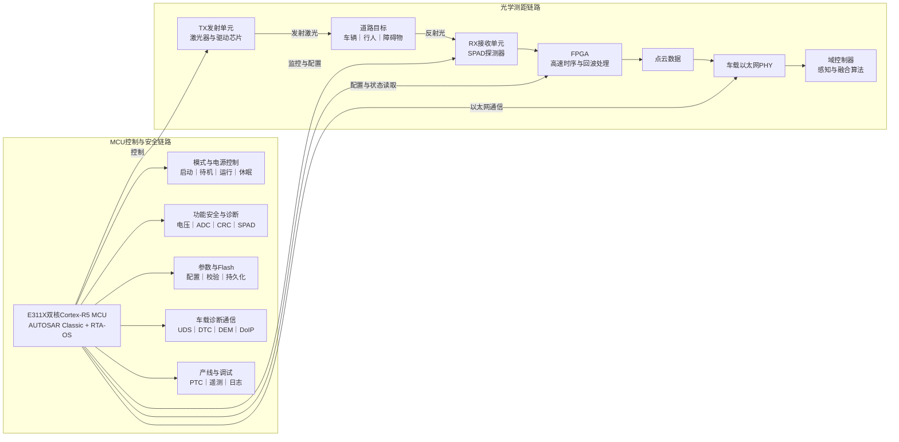
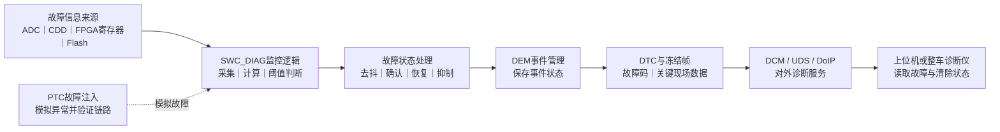

# 禾赛实习——面试整理

# 第一部分：实习全景

## 1. 实习基本信息

- **公司**：上海禾赛科技有限公司
- **部门**：软件部——雷达功能与功能安全组
- **岗位**：嵌入式软件工程师
- **产品**：新一代车载激光雷达
- **硬件平台**：芯驰E311X系列双核Cortex-R5 MCU
- **软件平台**：AUTOSAR Classic + ETAS RTA-OS
- **项目背景**：参与小米、理想、吉利等客户的量产项目
- **主要方向**：MCU功能开发、功能安全诊断、调试工具和软件版本交付

文档中同时涉及E3116和E3119等具体型号。面试中可以统一表述为：

> 芯驰E311X系列双核Cortex-R5平台，不同项目使用的具体芯片型号和软件配置略有差异。

---

## 2. 车载激光雷达是做什么的

车载激光雷达是自动驾驶和ADAS系统中的环境感知传感器。

它通过发射激光并接收目标物体反射回来的光，测量激光往返时间，计算物体与车辆之间的距离，最终形成三维点云。

基本链路是：

```markdown
激光发射
    ↓
照射到车辆、行人和道路等目标
    ↓
反射光被SPAD等接收器捕获
    ↓
测量激光往返时间
    ↓
结合扫描角度计算三维坐标
    ↓
生成点云并发送给域控制器
```

域控制器再基于点云完成目标检测、障碍物识别和多传感器融合。

---

## 3. 激光雷达整机大致由哪些部分组成



整个雷达可以简单分成两个“大脑”：

- **FPGA**擅长高速、并行和时序严格的工作，例如激光时序、回波采样以及部分点云数据处理；
- **MCU**负责整机控制、模式管理、外设驱动、参数管理、通信诊断和功能安全。

我的实习工作主要位于**MCU软件侧**，不负责光学设计、FPGA点云算法和域控制器感知算法。

---

## 4. MCU软件为什么重要

MCU虽然不一定负责主要的点云计算，但它决定了雷达能否安全、稳定地工作。

例如，雷达上电后，MCU需要：

1. 初始化芯片、RTA-OS和基础软件；
2. 读取Flash中的程序及标定参数；
3. 加载和配置FPGA；
4. 初始化SPAD、发射高压、接收高压和扫描机构；
5. 按照状态机逐步进入正常工作模式；
6. 持续监控电压、温度、通信和存储数据；
7. 出现异常时记录DTC，必要时限制功能或关闭激光；
8. 响应上位机和整车的UDS诊断请求；
9. 支持产线调试、软件升级及版本交付。

因此，MCU软件的定位可以概括为：

> 它是激光雷达的控制与安全中枢，负责把光学器件、FPGA、Flash、电源、网络和诊断系统组织起来。

---

## 5. MCU软件采用什么架构

项目采用AUTOSAR Classic分层架构。

```markdown
ASW应用层
模式控制、功能诊断、参数管理、PTC和基础功能
                ↓
RTE运行时环境
连接软件组件，转发数据与服务调用
                ↓
BSW基础软件 / CDD复杂设备驱动
OS、诊断栈、存储、通信、FPGA和SPAD等专用驱动
                ↓
MCAL微控制器抽象层
ADC、DIO、SPI、以太网、Flash等芯片驱动
                ↓
E311X MCU及外围硬件
```

可以用一句话记忆：

> ASW负责业务，RTE负责连接，BSW负责通用汽车软件，CDD负责雷达专用硬件，MCAL负责访问MCU外设。

### ASW

ASW由多个SWC软件组件组成，负责上层业务，例如：

- `SWC_Mode_Ctl`：模式状态机；
- `SWC_DIAG`：功能安全诊断；
- `SWC_UDS`：诊断服务；
- `SWC_Basic_Function`：基础功能；
- `SWC_Parameter`：参数管理；
- `SWC_PTC`：产线和调试功能。

### RTE

RTE位于应用软件和底层模块之间，负责转发数据和服务调用，使上层SWC不需要直接依赖具体硬件驱动。

### BSW

BSW提供AUTOSAR通用基础服务，例如：

- RTA-OS任务调度；
- DCM诊断通信；
- DEM故障管理；
- Flash和NvM存储管理；
- 以太网和DoIP协议栈；
- EcuM、BswM等系统管理。

### CDD

CDD负责标准AUTOSAR模块难以直接覆盖的雷达专用硬件，例如：

- FPGA；
- SPAD；
- 高压和电源域；
- 特殊ADC采集；
- 自定义遥测和调试协议。

### MCAL

MCAL是最靠近MCU硬件的一层，提供ADC、DIO、SPI、ETH和Flash等标准驱动接口。

---

## 6. 双核和RTA-OS怎样分工

项目使用的RTA-OS是符合AUTOSAR规范的车规操作系统，不是FreeRTOS。

在整体分工上：

- **Core0**主要运行模式控制、诊断、通信、参数管理以及大部分BSW和CDD；
- **Core1**主要承担点云相关的实时处理；
- 周期任务主要由RTE Schedule Table按照1ms、5ms、10ms、100ms等周期调度；
- QM和Trusted分区之间通过IOC等机制通信；
- 高实时数据路径也会使用中断和共享内存进行跨核协作。

实习面试中不需要一开始背出全部任务，只需说明：

> 项目使用双核Cortex-R5和AUTOSAR RTA-OS，通过周期任务、事件、中断及跨分区通信，将诊断、控制、通信和点云处理分配到不同核心和安全分区。

---

## 7. 项目的量产属性

这不是一个单机实验项目，而是需要适配不同客户、硬件版本和软件版本的量产工程。

因此，开发中除了实现功能，还需要考虑：

- 不同客户配置和硬件差异；
- AUTOSAR接口和模块边界；
- ISO 26262功能安全要求；
- MISRA C编码规范；
- MemMap内存段管理；
- APP、BOOT、Release和Factory版本；
- 实机验证、故障注入和问题追溯；
- 软件包与硬件版本的匹配关系。

这也是禾赛实习与普通个人项目最大的区别：

> 不仅要让代码实现功能，还要保证它能够被配置、测试、诊断、集成、追溯并最终交付。

---

## 8. 实习全景口语化介绍

> 我在禾赛软件部的雷达功能与功能安全组担任嵌入式软件实习生，主要参与新一代车载激光雷达的MCU软件开发。
> 
> 
> 激光雷达通过发射激光、接收回波并计算飞行时间生成三维点云。整个系统中，FPGA主要承担高速时序、回波采样和部分点云处理，E311X双核Cortex-R5 MCU则负责模式控制、外设管理、参数与Flash、以太网通信、UDS诊断和功能安全监控。我主要负责的是MCU软件侧，不涉及光学设计和车端感知算法。
> 
> 
> 软件采用AUTOSAR Classic和ETAS RTA-OS。上层ASW实现模式控制和诊断等业务，RTE连接软件组件，BSW提供OS、通信、诊断和存储服务，CDD与MCAL负责访问FPGA、SPAD、ADC和Flash等硬件。项目同时需要适配不同客户和量产版本，因此开发流程不仅包括编码，还包括需求分析、故障注入、实机验证和软件包发布。
> 
> 
> 我的工作主要分成四部分：AUTOSAR嵌入式功能开发、功能安全与诊断、调试工具开发，以及APP、BOOT和Factory软件包交付。

---

# 第二部分：职责地图

## 1. 职责总览

我的工作主要位于雷达MCU软件侧，围绕以下四条工作线展开：

```mermaid
flowchart TB
    ROLE["禾赛雷达功能与功能安全组<br/>嵌入式软件工程师"]

    ROLE --> DEV["AUTOSAR嵌入式功能开发"]
    ROLE --> SAFE["功能安全与诊断"]
    ROLE --> DEBUG["调试工具与问题定位"]
    ROLE --> DELIVERY["工程规范与版本交付"]

    DEV --> DEV1["运行模式与状态机"]
    DEV --> DEV2["参数配置与Flash可靠性"]
    DEV --> DEV3["芯片和硬件状态监控"]

    SAFE --> SAFE1["入口电压与ADC诊断"]
    SAFE --> SAFE2["Rx Start Signal诊断"]
    SAFE --> SAFE3["Program / Flash CRC"]
    SAFE --> SAFE4["SPAD Chip Monitor"]
    SAFE --> SAFE5["UDS / DTC / DEM闭环"]

    DEBUG --> DEBUG1["PC1300遥测UDP改造"]
    DEBUG --> DEBUG2["EfuseId / Chip ID设备区分"]
    DEBUG --> DEBUG3["PTC远程调试指令"]
    DEBUG --> DEBUG4["日志、抓包与故障注入"]

    DELIVERY --> DELIVERY1["IAR / ADS / Tasking / CMake"]
    DELIVERY --> DELIVERY2["MISRA C / MemMap"]
    DELIVERY --> DELIVERY3["APP / BOOT Release"]
    DELIVERY --> DELIVERY4["Factory软件包"]
```



---

## 2. 工作线一：AUTOSAR嵌入式功能开发

### 在系统中的位置

这一部分主要位于MCU软件的ASW和CDD层，并通过RTE与BSW、MCAL及硬件交互。

### 主要工作

- 在AUTOSAR分层架构下进行嵌入式C功能开发；
- 根据RTE接口接入周期任务和模块间通信；
- 理解1ms、5ms、10ms等OS任务的调度关系；
- 参与模式状态机、参数配置和芯片监控功能；
- 处理Flash读取、参数校验和可靠性相关逻辑；
- 根据客户和硬件差异进行功能复用与配置适配。

### 职责边界

我的职责是基于已有AUTOSAR平台完成具体功能的开发、适配和验证，不负责从零开发整套AUTOSAR基础软件或RTA-OS内核。

---

## 3. 工作线二：功能安全与诊断开发

### 在系统中的位置

这一部分主要位于`SWC_DIAG`及相关CDD、RTE、DEM和DCM链路，是实习期间最核心的工作方向。

### 独立完成的功能

- 入口电压诊断；
- Rx Start Signal诊断；
- MCU ADC采样诊断；
- Program Parameters CRC；
- Flash数据CRC自检；
- SPAD Chip Monitor等芯片监控功能。

### 一项诊断功能的完整工作内容

1. 阅读系统与软件需求；
2. 明确检测对象、执行条件和安全目标；
3. 确定数据来源以及ASW、CDD、FPGA的职责边界；
4. 实现初始化、周期检测和状态判断；
5. 设计故障确认、去抖和恢复策略；
6. 接入DTC、DEM及冻结帧信息；
7. 增加故障注入接口；
8. 通过日志、上位机和实机验证故障上报及恢复链路。

### 形成的诊断闭环

```markdown
硬件状态或数据异常
        ↓
CDD/FPGA提供原始检测信息
        ↓
SWC_DIAG执行故障判定和去抖
        ↓
DEM记录事件状态
        ↓
生成DTC和冻结帧
        ↓
通过UDS/DoIP向上位机上报
        ↓
故障消失后按恢复策略更新状态
```

### 职责边界

我主要负责MCU侧的软件需求拆解、诊断逻辑开发、配置接入和实机验证。部分原始故障计数或寄存器状态由FPGA或底层CDD提供，我不负责对应的FPGA硬件逻辑实现。

---

## 4. 工作线三：调试工具与问题定位

### PC1300遥测UDP协议改造

原有PC1300遥测数据在多台雷达同时接入时，缺少足够明确的设备唯一标识。

我在遥测数据中增加了：

- EfuseId；
- Chip ID。

使上位机能够区分不同雷达或芯片的数据来源，支持多设备并发监控和问题追溯。

### PTC调试指令

针对芯片电源域和SPAD电压通道调试需求，我开发了上位机PTC指令，支持：

- 远程选择和切换通道；
- 控制相关电源域；
- 读取ADC采样电压；
- 根据阈值判断通道状态；
- 将结果返回给上位机。

这一功能主要用于台架、实验室和产线问题定位，减少为了验证一个硬件通道而反复修改代码、重新编译固件的成本。

### 使用的调试方式

- 串口和运行日志；
- 以太网抓包；
- PTC和UDS上位机；
- ADC数据回读；
- 故障注入；
- 寄存器和状态量检查；
- 不同软硬件版本对照验证。

---

## 5. 工作线四：工程规范与版本交付

除了功能开发，我还负责相关软件包的编译和发布，包括：

- MCU APP Release软件包；
- MCU BOOT Release软件包；
- Factory产线软件包。

主要工作包括：

1. 确认客户、硬件和软件分支；
2. 检查版本号及配置项；
3. 使用对应编译工具和Preset完成构建；
4. 检查编译结果、产物名称和校验信息；
5. 整理APP、BOOT和Factory产物；
6. 按发布流程上传并保存版本记录；
7. 支持后续烧录、验证和问题追溯。

工程中接触的主要工具和规范包括：

- IAR；
- ADS/Tasking；
- CMake；
- 串口、日志和抓包工具；
- MISRA C编码规范；
- AUTOSAR MemMap内存段管理。

---

## 6. 职责边界总结

### 我主要负责

- 雷达MCU应用软件；
- AUTOSAR框架下的功能开发；
- 功能安全诊断逻辑；
- CDD、RTE、DEM等接口集成；
- 故障注入和实机验证；
- 上位机调试功能；
- APP、BOOT和Factory软件包发布。

### 我不负责

- 激光雷达光学系统设计；
- FPGA内部点云算法和RTL逻辑；
- 整车域控制器的感知算法；
- 从零开发AUTOSAR BSW和RTA-OS；
- 芯片底层MCAL驱动的整体实现。

## 7. 职责地图口语化回答

> 我在整个雷达系统中主要负责MCU软件侧，可以分成四条工作线。
> 
> 
> 第一条是AUTOSAR嵌入式功能开发，我在已有ASW、RTE、BSW、CDD和MCAL分层架构下，参与模式状态机、参数配置、芯片监控和Flash可靠性等功能开发。
> 
> 
> 第二条是功能安全诊断，也是我的主要工作。我独立完成了入口电压、Rx Start Signal、ADC、Program和Flash CRC，以及SPAD Chip Monitor等诊断功能，工作范围包括需求拆解、嵌入式C实现、DTC和DEM接入、故障注入、去抖恢复及实机验证。
> 
> 
> 第三条是调试工具。我改造了PC1300遥测UDP数据，增加EfuseId和Chip ID用于多雷达设备区分；也开发了PTC调试指令，用于远程切换电源和电压通道、读取ADC并进行阈值判断。
> 
> 
> 第四条是工程交付。我使用IAR、Tasking和CMake等工具完成集成编译，并独立负责APP、BOOT Release和Factory软件包发布。我的工作边界主要在MCU应用软件和诊断链路，不涉及光学设计、FPGA点云算法和车端感知算法。

---

# 第三部分：具体案例与代表性工作

# 一、功能安全诊断的通用开发框架

## 1. 为什么激光雷达需要功能安全诊断

激光雷达会向整车输出点云，域控制器再根据点云完成障碍物识别和驾驶决策。

如果雷达内部出现电压异常、接收信号错误、芯片通信异常或Flash数据损坏，但系统仍然输出看似正常的数据，整车可能无法判断这些数据是否可信。

因此，诊断功能不只是“发现程序报错”，而是需要完成一条完整链路：

```markdown
发现内部异常
    ↓
确认异常是否真实、是否持续
    ↓
记录故障状态和现场信息
    ↓
必要时限制雷达功能
    ↓
通过车载诊断协议上报
    ↓
异常消失后按照策略恢复
```

诊断系统最终要回答三个问题：

1. 雷达内部发生了什么异常；
2. 当前输出的数据是否仍然可信；
3. 售后或整车怎样读取和定位这个异常。

---

## 2. 一条诊断链路包含哪些模块



各模块的职责可以简单理解为：

- **CDD、FPGA或MCAL**：提供原始硬件数据；
- **SWC_DIAG**：判断数据是否异常；
- **DEM**：统一管理故障事件状态；
- **DTC**：给故障分配可以被外部读取的故障码；
- **冻结帧**：保存故障发生时的关键数据；
- **DCM和UDS**：响应整车或上位机的诊断请求；
- **PTC故障注入**：人为制造异常，验证整条诊断链路。

---

## 3. 两类诊断功能

项目中的诊断功能可以分成两类。

### 3.1 运行期周期诊断

这类诊断在雷达运行过程中持续执行，例如：

- 入口电压；
- ADC采样；
- 温度；
- Rx Start Signal；
- 芯片通信状态。

它们通常按照5ms或其他周期执行：

```markdown
周期读取数据
    ↓
判断是否超过阈值
    ↓
连续异常达到次数
    ↓
确认故障并上报
    ↓
连续恢复达到次数
    ↓
清除或更新故障状态
```

因为电压和信号可能出现瞬时波动，所以需要去抖和恢复策略，避免一次异常采样就误报故障。

### 3.2 上电自检

这类诊断只在雷达上电阶段执行一次，例如：

- Flash数据CRC；
- FPGA参数完整性；
- 程序或出厂参数签名。

它们在上电自检阶段由周期任务分步推进，完成后进入`DONE`状态，正常运行阶段不再反复执行。

由于自检只运行一次，故障注入通常需要：

```markdown
上位机写入注入配置
        ↓
将配置保存在掉电或重启可保留区域
        ↓
重启雷达
        ↓
上电自检读取注入配置
        ↓
模拟故障并验证DTC
```

---

## 4. 诊断功能的标准开发流程

### 第一步：拆解需求

首先明确：

- 需要检测什么对象；
- 这个对象为什么影响系统安全；
- 原始数据由谁提供；
- 在什么模式下执行；
- 什么条件算故障；
- 什么条件可以恢复；
- 出现故障后系统采取什么动作。

这一步最重要的是划清职责边界。例如，FPGA可能负责统计异常次数，MCU只负责读取计数并形成DTC，不能把两部分混在一起。

### 第二步：确定软件分层和数据链路

确认功能分别位于哪些层：

```markdown
硬件或FPGA
    ↓
MCAL/CDD读取原始状态
    ↓
RTE传递数据
    ↓
SWC_DIAG执行故障判断
    ↓
DEM/DCM完成记录和上报
```

### 第三步：设计检测逻辑

根据诊断类型选择：

- 周期检测；
- 上电自检；
- 阈值判断；
- 连续次数去抖；
- 非阻塞状态机；
- 故障恢复；
- 故障抑制。

### 第四步：接入诊断配置

需要配置：

- 诊断项；
- 故障事件；
- DTC；
- 故障等级；
- 去抖和恢复策略；
- 抑制条件；
- 冻结帧内容；
- 故障动作。

项目中部分配置由Fault Matrix等配置表自动生成，业务代码只负责返回检测结果。

### 第五步：实现诊断接口

根据诊断类型实现：

- 初始化接口；
- 周期检测或自检接口；
- 关键故障信息读取接口；
- 故障注入接口。

### 第六步：验证完整链路

验证不是只看函数返回值，而是检查：

```markdown
故障是否能够注入
    ↓
监控模块是否能够检测
    ↓
去抖和恢复是否符合要求
    ↓
DEM事件是否正确更新
    ↓
UDS是否能够读取DTC
    ↓
冻结帧是否保存正确数据
    ↓
故障解除后状态是否正确恢复
```

## 5. 通用口语化回答

> 我在开发诊断功能时，一般先从需求出发，明确检测对象、安全风险、执行条件和故障恢复规则。然后确认原始数据来自MCU的ADC、CDD接口、FPGA寄存器还是Flash，再划分底层采集和上层诊断的职责。
> 
> 
> 代码实现上，周期诊断通常会加入阈值、去抖和恢复逻辑；上电自检则一般使用非阻塞状态机分步执行。检测结果接入DEM和DTC，同时保存冻结帧。最后通过PTC故障注入、实机运行和UDS读取，验证从故障产生、软件检测到外部上报的完整闭环。

---

# 二、代表性案例：Flash数据CRC自检

## 1. S：背景与问题

激光雷达的Flash中不仅存放MCU程序，还保存：

- FPGA Bitstream；
- FPGA程序参数；
- 工厂标定参数；
- 高压和温度相关配置。

可以把Flash理解成雷达的“硬盘”。这些数据会影响FPGA配置、激光发射、接收电路和点云生成。

Flash数据可能因为升级异常、掉电、存储介质异常或数据写入错误而损坏。如果雷达在不知道参数已经损坏的情况下继续运行，可能导致点云输出不可信。

因此，系统需要在上电阶段校验关键Flash数据的完整性：

```markdown
Flash中的关键数据
        ↓
读取保存的CRC
        ↓
重新计算当前数据CRC
        ↓
比较两者是否一致
        ↓
判断数据是否可信
```

---

## 2. T：个人任务

我的任务是为六类关键Flash数据开发上电CRC自检功能，包括：

- FPGA Bit镜像；
- FPGA Para1；
- FPGA Para2；
- VOV工厂参数；
- VBR查找表；
- 高温开关参数。

需要满足以下要求：

1. 适配不同数据对象的CRC存储格式；
2. 等待Flash及参数模块初始化完成后再执行；
3. 使用非阻塞方式完成多项数据校验；
4. 对临时读取或参数加载异常进行有限重试；
5. 将最终结果接入DEM和DTC；
6. 保存“存储CRC＋实时计算CRC”作为冻结帧；
7. 支持故障注入和上位机验证；
8. 校验完成后退出自检，不占用正常运行周期。

---

## 3. A：具体实现

### 3.1 先梳理三种CRC存储方式

六类数据并没有使用完全相同的文件格式，所以不能用一个固定地址读取CRC。

#### FPGA Bit镜像

CRC存放在镜像头部，软件需要：

1. 读取镜像头中的CRC；
2. 跳过文件头；
3. 对实际镜像内容重新计算CRC；
4. 比较两个结果。

#### FPGA Para1和Para2

CRC存放在参数文件最后4字节。

软件通过`CddPeriPara`接口获取文件中保存的CRC和实时计算结果。发生不一致时，可以重新加载参数后再次校验。

#### 工厂小参数

VOV、VBR和高温开关参数的数据与CRC分别存放：

- 数据保存在工厂参数分区；
- CRC保存在独立CRC表中。

软件先根据参数偏移找到对应CRC记录，再计算数据本身的CRC并进行比较。

这一阶段解决的核心问题是：

> 同样是CRC自检，但不同数据对象的存储格式不同，需要在统一诊断框架下适配多种读取方式。

---

### 3.2 使用表驱动组织六类数据

我没有为六个数据对象分别复制一套完整状态机，而是为每个对象配置：

- 校验类型；
- 对应的诊断事件；
- 运行时CRC结果；
- 当前是否已经完成和上报。

状态机按照配置表依次处理每个对象。

这样新增Flash参数时，主要扩展配置表和对应读取方式，不需要重新修改整个调度流程。

---

### 3.3 设计非阻塞状态机

Flash读取、参数加载和CRC计算可能需要多个周期完成。如果在5ms任务中使用阻塞循环等待，会影响其他诊断和控制任务。

因此，我将自检拆成四个状态：

```markdown
WAIT_DEPS
等待参数和Flash模块就绪
        ↓
CHECK
逐项读取并比较CRC
        ↓
RETRY_WAIT
校验失败后触发参数重载并等待完成
        ↓
DONE
全部校验完成，后续不再执行
```

虽然自检逻辑由5ms任务重复调用，但单次调用只推进一步，不会长时间占用CPU。

这里需要准确表述：

> Flash CRC属于上电自检，不是正常运行期间一直执行的5ms周期诊断；5ms任务只是用来在上电阶段分步推进状态机。

---

### 3.4 增加重试和前置条件

为了避免把暂时性加载异常直接判断成Flash永久损坏，我增加了有限重试：

```markdown
第一次CRC不一致
        ↓
触发参数重新加载
        ↓
等待加载完成
        ↓
重新读取并计算CRC
        ↓
最多完成三次检查
        ↓
仍不一致才确认故障
```

同时，自检只有在相关参数模块加载完成、系统不处于故障模式等前置条件满足后才执行。

部分外部条件异常时还会抑制CRC故障上报，避免在供电等基础条件不可靠时产生误判。

---

### 3.5 接入DEM、DTC和冻结帧

每一类Flash数据对应独立的故障事件。

如果有效的存储CRC与计算CRC最终不一致，诊断模块向DEM上报故障状态，并形成对应DTC。

冻结帧保存8字节关键数据：

```undefined
前4字节：Flash中保存的CRC
后4字节：软件实时计算的CRC
```

售后读取DTC时，可以同时看到两个CRC值，从而判断是哪个数据对象出现了完整性问题，以及保存值和计算值之间有什么差异。

---

### 3.6 通过故障注入进行验证

Flash CRC属于上电自检，运行阶段不会重新执行。因此，故障注入不能像普通电压诊断一样立即生效。

验证流程是：

```markdown
通过PTC写入自检故障注入配置
        ↓
配置保存到重启后仍然有效的区域
        ↓
重启雷达
        ↓
上电自检读取注入配置
        ↓
模拟CRC校验失败
        ↓
通过UDS读取DTC
        ↓
检查冻结帧中的两个CRC
```

验证重点包括：

- 正常数据是否通过校验；
- 注入故障后是否产生正确事件；
- UDS是否能够读取对应DTC；
- 冻结帧是否返回正确的双CRC；
- 多个数据对象是否能够分别定位；
- 重试和自检结束状态是否符合预期。

---

## 4. R：最终结果

最终完成了六类关键Flash数据的上电CRC自检功能，实现了：

- 三种CRC存储格式的统一适配；
- 基于配置表的多对象校验；
- 非阻塞状态机分步执行；
- 参数加载等待和有限重试；
- DEM、DTC与冻结帧接入；
- PTC故障注入及UDS读取验证。

该功能使雷达在进入正常工作模式前，能够判断关键程序和参数数据是否可信，并在发生异常时保留可供售后定位的CRC信息。

---

# 三、Flash CRC案例口语化回答

> 我在实习中完成过一个Flash数据CRC上电自检功能。激光雷达的Flash中不仅存放程序，还存放FPGA镜像、程序参数和工厂标定参数。如果这些数据损坏，但雷达仍然按照错误参数运行，输出的点云可能不再可信，所以需要在上电阶段验证关键数据的完整性。
> 
> 
> 这个功能一共校验六类Flash数据，难点是它们的CRC存储方式不统一：FPGA Bit的CRC在镜像头部，Para参数的CRC在文件尾部，工厂小参数的CRC则放在独立的CRC表中。我先梳理每类数据的存储结构，再通过统一配置表记录校验类型和对应故障事件。
> 
> 
> 因为Flash读取和参数重载可能需要多个周期，我设计了`WAIT_DEPS`、`CHECK`、`RETRY_WAIT`和`DONE`四个状态。自检在上电阶段由5ms任务分步推进，每次只处理一步，避免阻塞其他实时任务。如果Para参数第一次校验失败，会触发重新加载并有限重试，仍然不一致才上报故障。
> 
> 
> 最后，我把结果接入DEM和DTC，并将Flash中保存的CRC和实时计算CRC作为8字节冻结帧。验证时通过PTC写入上电自检故障注入配置，重启雷达后触发故障，再通过UDS读取DTC和冻结帧，完成从故障注入、软件检测到外部上报的闭环。

---

# 四、高频追问速答

## 1. CRC是什么，为什么能检测Flash损坏？

> CRC会根据一段数据计算出固定长度的校验值。数据写入Flash时保存一份CRC，上电后对当前数据重新计算。如果数据发生变化，两次CRC通常不同，因此可以发现数据损坏。CRC主要用于完整性检测，不等同于防篡改的密码学签名。

## 2. 为什么不直接在一个函数中把六项全部校验完？

> Flash读取和参数加载可能比较耗时，在5ms任务中一次完成所有操作会长时间占用CPU。因此我使用非阻塞状态机，每次调度只推进一步，在多个周期内完成自检。

## 3. 为什么第一次CRC不一致不立即报故障？

> 一次不一致可能来自参数尚未加载完成或暂时性读取异常。对于支持重载的参数，我先重新加载并有限重试，只有多次结果仍然不一致才确认数据不可信。

## 4. 为什么要保存两个CRC作为冻结帧？

> DTC只能说明发生了CRC故障，两个CRC可以进一步说明Flash中保存的期望值和软件实际计算值，方便售后确认具体的数据完整性问题。

## 5. 为什么故障注入后需要重启？

> Flash CRC只在上电自检阶段执行一次。运行阶段写入注入配置后，自检流程已经结束，所以需要将配置保存在重启后可读取的区域，再通过重启重新进入上电自检。

## 6. 你的职责边界是什么？

> 我负责Flash CRC诊断需求拆解、不同CRC格式适配、非阻塞状态机、诊断配置、DEM/DTC接入、冻结帧和故障注入验证。底层Flash读写驱动、现有CRC计算接口和AUTOSAR诊断基础框架是项目已有能力，我是在这些接口之上完成具体诊断功能。

---

# 代表性案例二：PC1300遥测UDP协议改造

## 1. 先解释PC1300和遥测UDP是什么

PC1300是激光雷达接收链路中的SPAD接收与信号处理芯片，主要负责接收回波光信号并完成部分片上处理。

为了观察PC1300内部的运行状态，雷达会按照固定周期发送一类遥测UDP数据，其中包含：

- 芯片寄存器状态；
- DSP和采样通道信息；
- FPGA统计数据；
- 时间戳和序列号；
- 其他调试状态。

这些数据主要供研发、台架和DV监控上位机使用，不是对外输出的点云UDP。

---

## 2. S：背景与问题

在多雷达联调场景中，最多会有6台雷达同时向同一个监控端发送PC1300遥测UDP数据。

原有v1.01协议只包含：

- 固定魔数；
- 协议版本；
- 寄存器数据；
- 时间戳和序列号。

这些字段都不能稳定标识具体设备：

```css
雷达A ──遥测UDP──┐
雷达B ──遥测UDP──┤
雷达C ──遥测UDP──┼──▶ 同一个DV监控端
雷达D ──遥测UDP──┤
雷达E ──遥测UDP──┤
雷达F ──遥测UDP──┘
```

由于不同雷达发送的包长、魔数和协议版本完全相同，序列号和时间戳也可能重叠，上位机无法可靠判断一条遥测数据来自哪台物理设备。

这会导致：

- 多台雷达的数据混在一起；
- 无法为每台设备分别绘制监控曲线；
- 出现芯片异常时难以定位具体设备；
- 台架和DV测试无法进行稳定的多设备并发监控。

---

## 3. T：个人任务

我的任务是升级PC1300遥测UDP协议，为每个数据包增加稳定的设备唯一标识，并完成MCU端数据读取、协议组包和上位机联调。

同时需要满足以下约束：

1. 设备标识在出厂后不能随配置变化；
2. 多台雷达之间不能出现重复；
3. 保持原有501字节报文总长度不变；
4. 不改变原有寄存器数据区；
5. 避免每个遥测周期都访问SPAD寄存器；
6. Efuse读取失败不能阻塞遥测发包；
7. 新旧协议需要能够通过版本号区分。

---

## 4. A：具体实现

### 4.1 选择Efuse作为设备标识

我首先分析了几种可能的设备区分方式：

- 魔数和协议版本所有设备都相同；
- 时间戳和序列号会循环或重叠；
- IP地址可能因客户配置或测试环境发生变化；
- 普通Flash参数可能被重新烧写。

PC1300内部的Efuse信息在芯片出厂时写入，正常情况下不可修改，包含：

- `waferId`：晶圆编号；
- `dieCorX`：芯片在晶圆上的X坐标；
- `dieCorY`：芯片在晶圆上的Y坐标。

三者组合可以定位一颗具体芯片，因此将它们作为设备标识：

```undefined
设备标识 = waferId + dieCorX + dieCorY
```

这三个字段各占1字节，最终需要在遥测包中增加3字节。

---

## 4.2 调整协议并保持总长度不变

原协议中存在Reserved预留字段，因此我没有直接扩大数据包，而是重新分配预留空间：

```markdown
原v1.01协议
包头 + Reserved + 原有遥测数据 + Reserved
                    ↓
新v1.02协议
包头 + 3字节Efuse ID + 原有遥测数据 + 调整后的Reserved
```

主要改动包括：

- 协议版本由v1.01升级为v1.02；
- 在包头预留区域加入3字节Efuse信息；
- 同步缩减其他Reserved空间；
- 原有寄存器数据区保持不变；
- UDP应用层报文总长度仍为501字节。

这样做的好处是：

- 固定长度收包框架不需要修改；
- 原有寄存器字段偏移尽量保持稳定；
- 上位机可以通过版本号判断是否存在设备ID；
- 协议变化范围可控。

---

## 4.3 按AUTOSAR分层完成代码改造

这个功能分成CDD硬件访问层和ASW遥测业务层。

### CDD_SPAD层

CDD负责读取PC1300的Efuse寄存器，并向上层提供统一接口。

主要工作包括：

1. 增加Efuse寄存器地址和位域掩码；
2. 读取两个32位Efuse寄存器；
3. 通过移位和掩码解析三个字段；
4. 封装`CDD_Spad_EfuseChipIdType`结构体；
5. 提供`CDD_Spad_GetEfuseChipId()`接口；
6. 对空指针和寄存器读取失败进行检查。

CDD对上层返回：

```undefined
waferId
dieCorX
dieCorY
```

遥测模块不直接访问寄存器，从而保持硬件访问和协议组包解耦。

### ASW遥测业务层

在`dv_telemetry_pc1300`中：

1. 将协议版本更新为v1.02；
2. 增加Efuse字段的组包类型；
3. 增加独立的Efuse打包函数；
4. 从CDD接口获取芯片ID；
5. 按照3字节顺序写入UDP包；
6. 更新字段配置表及Reserved长度。

完整链路是：

```markdown
PC1300 Efuse寄存器
        ↓
CDD_SPAD读取并解析
        ↓
返回EfuseChipId结构体
        ↓
ASW遥测模块组包
        ↓
UDP发送
        ↓
上位机根据ID区分设备
```

---

## 4.4 使用缓存降低硬件访问开销

PC1300遥测包大约每200ms发送一次，而Efuse是出厂固化数据，上电后不会发生变化。

如果每次发包都重新读取Efuse寄存器，会产生没有必要的SPAD通信和SPI总线开销。

因此，我增加了静态缓存：

```markdown
第一次成功读取Efuse
        ↓
解析waferId和die坐标
        ↓
保存到MCU RAM
        ↓
后续遥测直接读取缓存
```

缓存有效后，不再重复访问硬件。

---

## 4.5 定位并修复“全零ID被永久缓存”的问题

在调试中发现，UDP包中的Efuse ID一直为全零，但通过PTC直接读取寄存器时又能得到正确结果。

经过排查，原因是：

```markdown
MCU上电较早
        ↓
PC1300/SPAD尚未完全就绪
        ↓
第一次读取Efuse返回全零
        ↓
旧逻辑把全零结果标记为有效
        ↓
后续遥测永远使用全零缓存
```

也就是说，问题不在位域解析，而在缓存有效条件设计得不完整。

我的修复方式是：

1. 只有寄存器读取成功且结果不是无效全零时，才设置缓存有效；
2. 缓存无效时，后续遥测周期继续尝试读取；
3. 在SPAD完成初始化或模式切换后主动刷新缓存；
4. 一旦读取到有效值，再缓存并停止重复访问硬件。

修复后的流程是：

```markdown
上电时读取全零
        ↓
不设置缓存有效
        ↓
后续周期继续重试
        ↓
SPAD初始化完成
        ↓
读取到有效Efuse
        ↓
缓存生效并用于后续遥测
```

---

## 4.6 增加读取失败容错

Efuse设备标识是监控增强功能，不能因为暂时读取失败而中断整个遥测链路。

因此，如果CDD读取失败：

- Efuse字段暂时填充为0；
- 输出错误日志；
- 继续发送其他遥测数据；
- 缓存保持无效，后续继续重试。

这样可以保证：

> 设备ID获取失败只影响设备区分，不影响PC1300其他状态数据的正常上报。

---

## 4.7 完成协议验证

我通过三层方式进行验证。

### 第一层：寄存器数据验证

使用PTC指令直接读取PC1300 Efuse寄存器，确认：

- waferId；
- dieCorX；
- dieCorY。

### 第二层：UDP报文验证

使用Wireshark抓取501字节遥测UDP包，检查：

- 协议版本是否为v1.02；
- Efuse字段是否位于约定位置；
- UDP中的三个字段是否与PTC读取结果一致；
- 报文总长度是否仍然为501字节；
- 原有遥测字段是否正常。

### 第三层：多设备联调

在6台雷达并发场景下，验证监控端能够根据Efuse ID将不同遥测数据流分开，建立数据包与物理设备之间的对应关系。

---

# 5. R：最终结果

最终完成了PC1300遥测UDP协议从v1.01到v1.02的升级，实现了：

- 在报文中增加3字节Efuse设备标识；
- 保持501字节总长度不变；
- CDD硬件读取与ASW协议组包分层；
- Efuse有效数据缓存；
- 上电未就绪场景下的重试机制；
- 读取失败不中断遥测；
- PTC寄存器、Wireshark报文及多设备联调验证。

在6台雷达同时监控的场景下，上位机能够根据Efuse ID区分各路遥测数据，解决了多设备数据混流和异常难以定位的问题。

---

# 6. 口语化STAR回答

> 我做过一个PC1300遥测UDP协议改造。当时最多会有6台雷达同时向一个DV监控端发送遥测数据，但原来的v1.01协议只有固定魔数、版本、寄存器数据和序列号，没有稳定的设备标识，所以上位机无法判断每个数据包来自哪台物理雷达。
> 
> 
> 我的任务是在不改变原有501字节包长和寄存器数据区的情况下，为协议增加设备唯一标识。我选择了PC1300芯片中出厂固化的Efuse信息，将waferId和芯片在晶圆上的X、Y坐标组合成3字节ID。协议版本升级到v1.02，并利用原有Reserved空间存放这3个字段，同时调整其他预留区域，保持总长度不变。
> 
> 
> 代码上，我在CDD_SPAD层实现Efuse寄存器读取、位域解析和缓存接口，遥测业务层只调用CDD接口完成组包。因为遥测每200ms发送一次，而Efuse不会变化，所以成功读取后直接缓存，避免反复访问硬件。
> 
> 
> 调试时还遇到过一个问题：上电早期SPAD没有就绪，第一次读取返回全零，旧逻辑却把全零永久缓存了。我将缓存条件改成只有读取成功且数据有效时才生效，缓存无效时继续重试，并在SPAD初始化后主动刷新。
> 
> 
> 最后，我通过PTC读取寄存器、Wireshark检查UDP字段，再进行6台雷达联调，验证上位机能够根据Efuse ID正确分离各路遥测数据。

---

# 7. 高频追问速答

## 1. 为什么不用IP地址或MAC地址区分设备？

> IP地址可能因为客户配置、网络环境或产线设置发生变化，也可能出现重复配置。Efuse是芯片出厂固化信息，不依赖软件配置，更适合作为应用层的稳定设备标识。

## 2. 为什么使用waferId和die坐标？

> waferId表示晶圆编号，dieCorX和dieCorY表示芯片在晶圆上的位置。三者组合能够定位一颗具体芯片，而且只需要3字节，适合嵌入现有协议。

## 3. 为什么要保持501字节不变？

> 原有监控端按照固定长度接收和解析数据。如果直接扩包，会影响接收缓冲和解析逻辑。利用Reserved空间可以增加字段，同时将协议改动控制在较小范围。

## 4. 为什么不能每次发包都读取Efuse？

> Efuse数据上电后不会变化，但遥测每200ms发送一次。每次读取都会占用SPAD通信和SPI资源，所以成功读取一次后缓存更合理。

## 5. 为什么出现全零缓存问题？

> 第一次读取发生在SPAD硬件就绪之前，接口没有报严重错误，但寄存器内容还是全零。旧逻辑只判断调用是否成功，没有判断数据是否有效，于是把全零永久缓存。修复后需要同时满足读取成功和数据有效两个条件。

## 6. 如果Efuse一直读取失败怎么办？

> 当前设计会在ID字段中填0、记录日志并继续发送遥测数据，同时保持缓存无效并继续重试。这样不会因为辅助标识读取失败而阻断主要监控链路。

## 7. 怎样验证协议修改正确？

> 先通过PTC读取原始Efuse寄存器，再用Wireshark抓取UDP包，比较报文中的3字节ID与寄存器解析结果，同时检查协议版本和总包长。最后通过多台雷达并发联调验证上位机分流效果。

## 8. 这个案例中你的职责边界是什么？

> 我负责MCU端Efuse读取接口、位域解析、缓存与重试、遥测协议字段调整、组包逻辑以及抓包和多设备验证。Efuse寄存器定义由芯片和硬件规格提供，上位机最终展示逻辑由对应工具侧配合适配。

---

# 代表性案例三：入口电压诊断功能复用与适配

## 1. S：背景与问题

车载激光雷达通常由整车12V电源供电。入口电压是整个雷达电源链路的基础，如果出现过压或欠压，可能导致：

- MCU和FPGA工作不稳定；
- 发射、接收或通信模块异常；
- 产生大量由供电问题引发的次生故障；
- 雷达输出数据不再可信。

RGBD项目已经从ETXP项目复用了入口电压诊断框架，但硬件平台发生了变化，原有代码存在三个问题：

1. 诊断代码中保留了固定10V的调试桩，真实ADC采样被覆盖；
2. ADC换算系数和平均采样次数沿用了旧平台配置；
3. 过压、欠压阈值没有按照新硬件的8～17V工作范围调整。

这意味着代码表面上存在入口电压诊断功能，但实际无法正确反映当前雷达的真实供电状态。

---

## 2. T：个人任务

我的任务不是重新开发整套诊断框架，而是将已有入口电压诊断能力复用到RGBD/PC1300平台，并完成软硬件适配。

需要实现：

1. 启用MCU B7通道的真实ADC采样；
2. 根据新硬件分压电路调整ADC换算参数；
3. 更新过压、欠压和滞回阈值；
4. 保留5ms周期调度、去抖和恢复机制；
5. 接入DEM、DTC、冻结帧和故障抑制链路；
6. 通过故障注入和实机测试验证故障确认及恢复。

---

## 3. A：具体实现

### 3.1 梳理完整数据链路

入口电压并不是由诊断模块直接读取ADC寄存器，而是按照AUTOSAR分层逐级传递：

```markdown
整车入口电压
        ↓
板级分压电路
        ↓
MCU B7 ADC通道
        ↓
CDD_AV采样、滤波和电压换算
        ↓
ReadRequest_PwrInVolt接口
        ↓
SWC_DIAG阈值判断
        ↓
DEM / DTC / 冻结帧
```

这样，CDD_AV只负责硬件采集和物理量换算，SWC_DIAG只负责诊断策略，两部分能够独立适配和复用。

---

### 3.2 移除固定值调试桩

原代码虽然调用了ADC读取接口，但随后又使用恒成立条件将电压写死为10V，导致真实采样值永远不会进入诊断判断。

我将逻辑修改为：

- 没有开启故障注入时，读取真实ADC电压；
- 读取成功后更新当前入口电压；
- 读取失败时跳过本周期诊断，避免使用无效值误报；
- 开启故障注入时，使用上位机下发的模拟电压。

修改后的数据选择逻辑是：

```markdown
是否启用故障注入
    ├── 是：使用注入电压
    └── 否：读取真实ADC
                 ├── 成功：执行诊断
                 └── 失败：跳过本周期
```

---

### 3.3 适配ADC换算参数

MCU ADC是12位采样，参考电压为3.3V。由于入口电压经过板级分压后才能进入ADC，因此需要乘以硬件对应的分压系数。

换算关系可以简化为：

```yaml
入口电压
=
ADC码值 ÷ 4096 × 3.3V × 分压系数
```

RGBD平台使用的分压系数与旧平台不同，因此我将配置调整为新硬件对应的系数，并将平均采样次数调整为50次。

例如，12V输入经过换算后，在诊断模块中保存为：

```yaml
1200，表示12.00V
```

内部使用0.01V作为单位，可以避免诊断逻辑中频繁使用浮点数。

---

### 3.4 设置过压、欠压和滞回阈值

根据新硬件工作范围，将诊断阈值调整为：

- 电压高于17.00V：判定为过压；
- 电压低于8.00V：判定为欠压；
- 滞回区间：0.50V。

滞回表示故障触发阈值和恢复阈值不同。

以过压为例：

```markdown
电压超过17.00V
        ↓
进入过压故障
        ↓
电压必须降低到16.50V以下
        ↓
才允许进入恢复过程
```

欠压则相反：

```markdown
电压低于8.00V
        ↓
进入欠压故障
        ↓
电压必须升高到8.50V以上
        ↓
才允许进入恢复过程
```

这样可以避免电压在阈值附近波动时，故障状态反复切换。

---

### 3.5 增加时间去抖和恢复

除了数值上的滞回，诊断框架还使用连续次数进行时间去抖：

- 连续异常15个5ms周期后确认故障；
- 连续正常100个5ms周期后确认恢复。

对应时间约为：

```undefined
故障确认：15 × 5ms = 75ms
故障恢复：100 × 5ms = 500ms
```

这种设计体现了不同方向的策略：

- 故障需要较快确认；
- 恢复需要更谨慎，避免短暂恢复后再次异常。

过压和欠压事件互斥，同一时刻不会同时上报。

---

### 3.6 接入故障抑制和冻结帧

入口电压是整个雷达供电链路的根因指标。

如果入口电压已经异常，入口电流、功率或部分通信异常可能只是由电压问题引发的次生故障。如果所有下游诊断同时上报，会产生大量故障，反而不利于定位根因。

因此，入口电压故障确认后会设置抑制条件，暂时屏蔽部分依赖稳定供电的下游诊断。

同时，诊断模块会将当前入口电压保存为冻结帧，方便上位机读取故障发生时的实际电压。

---

### 3.7 完成故障注入和实机验证

验证分为正常、故障和恢复三类。

#### 正常电压

给雷达提供约12V电压，检查：

- ADC换算结果是否接近12.00V；
- 不产生过压或欠压DTC；
- 冻结帧和遥测值是否与实际电压一致。

#### 过压和欠压

通过PTC故障注入或台架电源分别模拟：

- 高于17V的过压；
- 低于8V的欠压。

检查连续异常达到去抖时间后：

- DEM事件是否确认；
- UDS能否读取对应DTC；
- 冻结帧是否保存故障电压；
- 下游诊断抑制是否生效。

#### 故障恢复

将电压恢复到正常区域，验证：

- 只有跨过滞回区间后才开始恢复；
- 连续正常达到恢复时间后更新故障状态；
- 不会在阈值附近频繁报故障和恢复。

---

## 4. R：最终结果

最终将入口电压诊断从“固定调试值、无法反映真实硬件状态”改造成可用的运行期周期诊断，实现了：

- 真实ADC采集；
- 新硬件分压系数和滤波参数适配；
- 8～17V工作范围对应的过压、欠压判断；
- 数值滞回和时间去抖；
- 故障确认与恢复；
- DEM、DTC及冻结帧上报；
- 下游诊断抑制；
- PTC故障注入和实机验证。

同时保留了原有诊断框架，硬件差异主要收敛在CDD_AV配置层，减少了跨项目复用时对上层诊断逻辑的改动。

---

# 5. 入口电压案例口语化回答

> 我在RGBD项目中做过入口电压诊断的复用和硬件适配。入口电压是整台雷达供电链路的基础，如果发生过压或欠压，可能同时引起MCU、FPGA和通信等多个模块异常。
> 
> 
> 项目虽然已经从原平台复用了诊断框架，但代码中还保留了固定10V的调试值，真实ADC采样被覆盖，而且ADC分压系数和诊断阈值也没有适配新的硬件平台。
> 
> 
> 我先梳理了完整数据链路：MCU通过B7 ADC采样，CDD_AV负责平均滤波和物理量换算，再通过标准接口将电压提供给SWC_DIAG。我移除了固定值调试桩，启用真实ADC采样，并根据新硬件调整分压系数、滤波次数及8V欠压和17V过压阈值。
> 
> 
> 为防止电压在阈值附近波动，我保留了0.5V滞回，并通过15个5ms周期确认故障、100个周期确认恢复。故障确认后接入DEM和DTC，保存当前电压冻结帧，同时抑制部分下游诊断，避免供电异常引起大量次生故障。
> 
> 
> 最后，我通过正常电压、过压、欠压和恢复场景进行故障注入与实机验证，确认从ADC采集、故障判断到UDS上报和恢复的链路正常。

---

# 6. 高频追问速答

## 为什么既需要滞回，又需要时间去抖？

> 滞回解决的是数值在阈值附近上下波动的问题，时间去抖解决的是异常持续时间过短的问题。一个限制恢复的电压边界，一个要求异常或正常状态连续保持足够时间，两者作用不同。

## 为什么ADC读取失败时跳过本周期，而不是直接报欠压？

> ADC读取失败并不等于入口电压为零。如果直接按照零值判断，会把采集链路异常误报成供电欠压。读取失败应该由对应的ADC或采集链路诊断处理。

## 为什么故障恢复时间比确认时间长？

> 供电异常需要较快被发现，但恢复要更加谨慎。要求电压在正常范围内持续更长时间，可以避免系统在不稳定电源下反复退出和进入故障状态。

## 为什么入口电压故障会抑制其他诊断？

> 入口电压是很多模块的共同供电来源。当它异常时，其他电流、通信或芯片故障可能只是次生现象。先抑制部分下游故障，可以减少故障风暴并突出根因。

## 这个案例中你是从零开发的吗？

> 不是从零搭建整个诊断框架。原项目已经具备调度、DEM、故障注入和冻结帧能力，我负责将入口电压诊断复用到新平台，修复真实采样问题，适配ADC参数和阈值，并完成故障及恢复链路验证。

---

# 三个详细案例的代表性总结

## 1. 三个案例分别代表什么

| 详细案例 | 代表场景 | 主要能力 |
| --- | --- | --- |
| 入口电压诊断 | 雷达运行期周期监控 | ADC采集、阈值判断、滞回、时间去抖、故障恢复、DEM/DTC |
| Flash CRC自检 | 雷达上电完整性检查 | Flash与CRC、表驱动、非阻塞状态机、重试、冻结帧、上电故障注入 |
| PC1300遥测UDP改造 | 多设备调试与监控 | UDP协议设计、CDD/ASW分层、Efuse读取、缓存优化、兼容性、抓包联调 |

## 2. 三个案例形成的完整能力覆盖

```undefined
入口电压诊断
解决“雷达运行过程中，怎样持续发现并恢复硬件异常”

Flash CRC自检
解决“雷达启动之前，怎样判断关键程序和参数是否可信”

PC1300遥测UDP改造
解决“多台雷达联调时，怎样将内部状态准确对应到具体设备”
```

它们分别覆盖了雷达生命周期中的三个阶段：

```markdown
上电启动阶段
Flash CRC检查关键数据完整性
        ↓
正常运行阶段
入口电压诊断持续监控供电状态
        ↓
研发与产线调试阶段
PC1300遥测协议支持多设备监控
```

## 3. 面试时怎样选择案例

### 面试官问：“你做过哪些功能安全诊断？”

优先回答入口电压诊断，故事直观，并能自然引出去抖、恢复、DEM和DTC。

### 面试官问：“你做过最复杂的功能是什么？”

回答Flash CRC自检，重点讲多种存储格式、非阻塞状态机和上电注入验证。

### 面试官问：“你遇到过什么实际问题，怎么定位的？”

回答PC1300遥测UDP改造，重点讲多设备混流和全零缓存Bug。

### 面试官问：“你怎样理解AUTOSAR分层？”

可以结合入口电压或PC1300案例：

- CDD负责硬件访问；
- RTE或接口层负责传递数据；
- ASW负责业务与诊断策略；
- DEM/DCM负责故障管理和对外上报。

## 4. 最终记忆主线

三个案例不需要逐字背诵，只要记住三条主线：

```undefined
入口电压：
真实ADC → 换算 → 阈值 → 去抖恢复 → DTC

Flash CRC：
读取CRC → 状态机校验 → 重试 → DTC与冻结帧

PC1300：
多设备混流 → Efuse ID → 协议改造 → 缓存修复 → 多机验证
```

这三个详细案例已经足以支撑禾赛实习中的主要技术和项目追问，不需要再增加同等篇幅的长STAR。

---

是的。三个详细小 STAR 已经覆盖主要能力，其余简历功能整理成 **30～60 秒案例卡**最合适。下面这组案例卡重点补齐简历条目，不再重复源码细节。

# 四、其他功能案例卡

## 案例卡 1：Rx Start Signal Diagnosis

### 1. 功能是什么

Rx Start 信号用于控制接收芯片按照正确时序开始采集。该诊断主要检查两类问题：

- Start 信号是否丢失；
- Start 信号前沿时刻是否超出允许范围。

### 2. 为什么需要

如果 Start 信号缺失或时序偏移，接收端可能无法在正确时间窗口采集回波，最终导致测距数据异常或点云不可信。

### 3. 我的工作

我负责 MCU 侧诊断模块的设计和接入，包括：

- 拆解 FPGA 与 MCU 的职责；
- 设计寄存器握手机制；
- 实现周期采样、故障判定和恢复逻辑；
- 接入诊断任务表、故障注入和冻结帧接口。

### 4. 实现链路

```markdown
FPGA在FOV窗口内检测Start信号
        ↓
统计前沿异常次数和丢失次数
        ↓
MCU每5 ms轮询诊断完成状态
        ↓
读取异常计数并进行阈值判断
        ↓
提交DEM进行防抖、确诊和恢复
        ↓
冻结帧保存两类异常计数
```

MCU不直接测量信号波形，而是通过 `begin/done` 握手消费 FPGA 的检测结果。只有本轮采样完成后，才读取计数、进行判断并启动下一轮。

### 5. 成果与边界

完成了 MCU 侧诊断模块骨架、框架注册、故障注入和冻结帧链路。实习阶段真实 FPGA 寄存器映射、正式 DTC 和完整上板验收尚未全部闭环，因此面试中不要表述成“整个功能已经量产验证完成”。

### 6. 口语化回答

> Rx Start 信号相当于接收芯片开始采集的时序触发信号，如果它丢失或者来得太早、太晚，接收端就可能错过回波。我负责的是 MCU 侧诊断逻辑：FPGA在有效扫描窗口内完成信号检测并统计异常次数，MCU每5毫秒通过寄存器轮询完成状态，读取前沿异常和丢失计数，再交给DEM做防抖、确诊和恢复，同时把计数存进冻结帧。这个功能我完成了MCU侧的软件框架和注入链路，但部分正式硬件配置在当时还需要继续联调。

---

## 案例卡 2：MCU ADC采样链路诊断

### 1. 功能是什么

该功能诊断的不是某一路电源本身是否异常，而是判断 **ADC、MUX及采样链路本身是否可信**。

### 2. 为什么需要

如果ADC发生卡滞或漂移，它可能持续输出一个看似合理的固定值。此时普通电压诊断可能发现不了问题，所以需要额外验证“测量工具本身是否正常”。

### 3. 我的工作

我完成了ADC诊断从底层到应用层的接入，包括：

- MCAL层ADC通道和模拟引脚配置；
- CDD_AV层电压换算与滤波配置；
- SWC_DIAG层双路一致性判定；
- DEM、DTC、防抖、抑制条件和冻结帧配置。

### 4. 实现链路

```markdown
MCAL采集四路固定电压
        ↓
CDD_AV完成分压换算和均值滤波
        ↓
SWC_DIAG每5 ms读取采样结果
        ↓
判断同一ADC组的两路电压是否同时越限
        ↓
区分ADC链路故障与真实电源故障
        ↓
DEM防抖并记录冻结帧
```

核心判定规则是：

- 单路越限：更可能是这一路电源异常，交给电源诊断处理；
- 同一组两路同时越限：更可能是ADC采样链路异常；
- 两组同时大范围异常：更可能是整板供电问题，避免重复报ADC故障。

### 5. 结果

完成两组ADC诊断项的代码和配置接入，形成了MCAL、CDD_AV、SWC_DIAG、DEM和UDS冻结帧的完整链路。故障连续5个周期确认，连续100个正常周期恢复。

### 6. 口语化回答

> 这个功能不是判断某一路电源是否过压欠压，而是判断ADC这个测量工具本身靠不靠谱。我把两路正常区间不重叠的固定电压划为一组，如果只有一路越限，就认为更可能是电源本身的问题；如果同组两路同时越限，就认为ADC、MUX或者采样链路可能出现了卡滞或漂移。我负责从MCAL通道配置、CDD_AV换算滤波一直接到SWC_DIAG和DEM，并加入了防抖、故障抑制和冻结帧。

---

## 案例卡 3：Program Parameters CRC诊断复用

### 1. 功能是什么

雷达上电加载FPGA运行参数时，对比：

- Flash中原先保存的CRC；
- 参数加载过程中实时计算的CRC。

两者不一致，说明参数可能发生位翻转、加载损坏或非法修改。

### 2. 为什么需要

FPGA参数即使只损坏一个字节，也可能导致后续点云异常。因此必须在雷达开始正常工作前确认参数完整性。

### 3. 我的工作

这项工作属于 **成熟平台功能的跨项目复用与适配**，不是从零重写CRC算法。我主要完成：

- 在RGBD项目中启用诊断项；
- 适配诊断配置、事件和冻结帧；
- 接入PTC产线故障注入；
- 修复故障注入标记经过电源复位后丢失的问题。

### 4. 实现链路

```markdown
上电等待FPGA参数加载完成
        ↓
读取Flash存储CRC和实时计算CRC
        ↓
对比两个CRC
        ↓
不一致则上报DEM故障
        ↓
冻结帧记录两个CRC值
```

模块采用三态状态机：

```undefined
WAIT_LOADED → CRC_RUN → DONE
```

为了支持产线验收，我把原先保存在RAM中的注入标记改为通过NVM持久化，使其能够跨电源复位继续生效。

### 5. 结果

完成Program Parameters CRC诊断在新项目中的启用和适配，并打通PTC注入、硬复位、自检、故障查询和恢复链路。

### 6. 口语化回答

> 这个功能是对FPGA运行参数做上电完整性检查。参数从Flash加载时，底层会一边读取一边计算CRC，我在诊断侧等待加载完成，再比较Flash中保存的CRC和实时计算值，不一致就上报故障，并把两个CRC存入冻结帧。这里的核心算法是平台已有的，我主要做跨项目配置适配。另外我解决了一个产线问题：原来的故障注入标志放在RAM里，电源复位后会丢失，我把它改成NVM持久化，使产线能够完成“注入—硬复位—上电自检—查询故障”的验收闭环。

---

## 案例卡 4：PC1300 SPAD Chip Monitor

### 1. 功能是什么

SPAD Chip Monitor不是单一诊断，而是一组针对PC1300接收芯片的安全监控机制，覆盖：

- 内部时钟；
- BGR基准电压；
- SRAM ECC；
- Loopback；
- LVDS通信链路等。

### 2. 为什么需要

SPAD是雷达接收回波的核心芯片。如果内部时钟、电压、存储或通信链路异常，雷达可能继续输出数据，但数据实际上已经不可信，因此需要在故障扩散前发现问题。

### 3. 我的工作

我主要完成了：

- 功能安全需求拆解；
- 硬件检测与MCU诊断职责划分；
- 时钟、BGR和SRAM ECC等子机制的MCU侧软件框架；
- `Init/MainTask/GetKeyInfo`接口设计；
- CDD_SPAD寄存器访问、DEM、故障注入和冻结帧接入方案；
- LVDS通信诊断状态机骨架。

### 4. 实现链路

```markdown
PC1300内部硬件执行检测
        ↓
FPGA作为寄存器访问桥接
        ↓
MCU通过CDD_SPAD配置并读取状态
        ↓
SWC_DIAG进行故障聚合和状态判断
        ↓
DEM完成确诊、恢复和DTC管理
        ↓
冻结帧保存故障位图或原始计数
```

职责可以概括为：

- PC1300负责“测”；
- MCU负责“配、读、判、报”。

### 5. 成果与边界

完成了需求拆分和部分子机制的软件框架与业务逻辑，但部分寄存器地址、正式Fault Matrix、DTC映射以及上板验证当时仍未闭环。面试时应表述为“参与SPAD Chip Monitor的需求分析和MCU侧框架开发”，不要说成所有子机制都已量产交付。

### 6. 口语化回答

> SPAD Chip Monitor可以理解为接收芯片自身的体检系统，它不是一个故障，而是一组针对内部时钟、基准电压、SRAM ECC和通信链路的安全监控。芯片内部硬件负责真正检测，MCU通过FPGA桥接访问SPAD寄存器，完成使能和阈值配置，周期读取故障状态，再接入DEM、DTC和冻结帧。我主要做了需求拆解以及MCU侧的诊断框架和部分子机制实现，但部分正式寄存器配置和上板验证在当时还没有完全闭环。

---

## 案例卡 5：PTC电压通道切换与ADC回读

### 1. 功能是什么

该功能允许产线或研发上位机通过PTC命令，远程切换PC1300内部的ANA/DC测试电压通道，再读取ADC电压进行判断。

### 2. 为什么需要

PC1300内部有大量电源域。如果每次测试都依赖人工修改寄存器，不仅效率低，而且容易配置错误，因此需要统一的上位机指令完成自动选路和电压读取。

### 3. 我的工作

我完成了：

- 新增ANA、DC两条PTC扩展命令；
- 命令注册、参数长度和通道范围检查；
- CDD_SPAD寄存器读改写接口；
- 通道选择、ADC回读和错误码处理；
- 配套UDP遥测通道及阈值修正。

### 4. 实现链路

```markdown
上位机下发PTC选路命令
        ↓
PTC协议层解析子命令和通道号
        ↓
CDD_SPAD读改写SPAD MUX寄存器
        ↓
将目标电压输出到外部测试引脚
        ↓
GetADC读取滤波后的电压
        ↓
上位机与上下限比较并给出PASS/FAIL
```

两条命令分别负责ANA和DC选路，通道号范围为0～247。读取失败、通道越界和固件不支持都有独立返回码。

### 5. 结果

把原先依赖手工寄存器操作的调试过程封装成标准PTC命令，支持产线和台架通过同一链路完成选路、回读和阈值判断。

### 6. 口语化回答

> 这项功能主要服务产线和硬件调试。PC1300内部有很多模拟和数字电压通道，以前测试时需要人工修改寄存器。我在PTC协议里增加了ANA和DC两条扩展命令，上位机传入通道号后，MCU通过CDD_SPAD读改写对应MUX寄存器，把目标电压切到测试引脚，再复用GetADC读取滤波后的电压，由上位机和阈值表比较。这样就把手工寄存器操作变成了标准化、可自动执行的测试流程。

---

## 案例卡 6：MCU APP/BOOT Release与Factory软件包交付

### 1. 功能是什么

同一套雷达软件需要根据客户和使用场景生成不同固件：

- Release版本用于正常整车运行；
- Factory版本保留故障注入、产线测试等能力；
- APP和BOOT还必须使用匹配的客户配置与版本线。

### 2. 为什么需要

嵌入式开发不仅要写代码，还要确保正确的代码、配置、工具链和Bootloader被组合成可烧录、可验证的软件包。版本组合错误可能直接导致雷达无法启动或PTC无法连接。

### 3. 我的工作

我参与了：

- 根据客户、版本类型和工具链选择CMake构建预设；
- 编译MCU APP和BOOT工程；
- 检查编译告警和产物；
- 使用既有pack工具生成烧录包；
- 通过SDFactoryTool烧录并完成基本功能回归；
- 排查Release/Factory APP和BOOT混用问题。

### 4. 实现链路

```markdown
确认客户及版本需求
        ↓
选择对应CMake/Build.bat构建Preset
        ↓
编译APP和BOOT镜像
        ↓
使用pack工具生成烧录包
        ↓
通过SDFactoryTool依次烧录BOOT和APP
        ↓
重启后检查日志、网络、PTC和诊断功能
```

### 5. 结果

能够独立完成APP、BOOT的编译、打包、烧录和基础回归，确保Release与Factory版本配置、Boot和App版本线保持一致。

### 6. 口语化回答

> 除了功能开发，我也参与软件包交付。首先根据客户、Release或Factory类型以及编译器选择对应的CMake预设，分别编译APP和BOOT；然后使用项目已有的pack工具生成SDTool需要的烧录包，依次烧录BOOT和APP，重启后检查启动日志、以太网、PTC和诊断功能。我还遇到过Factory Boot和Release App混用导致上位机无法连接的问题，最后确认这两类固件必须按相同版本线配套使用。这里我负责的是构建和交付流程，不是从零开发打包工具。

---

## 备选案例卡 7：ModeCtl Flash耗时测试

这张不需要主动讲，主要用于支撑简历中的“模式状态机、Flash可靠性和异步任务”能力。

### 1. 功能是什么

在ModeCtl的1毫秒周期任务中，测量ParaM和Serial Flash不同层级的读、写、擦除耗时。

### 2. 为什么需要

同步Flash操作可能长时间阻塞周期任务，影响模式切换和其他实时业务。因此需要比较同步、异步接口的耗时与调度影响。

### 3. 我的工作

我实现并对比了三种测试方式：

- ParaM同步阻塞测试；
- 底层Serial Flash异步轮询测试；
- 六选一非阻塞异步状态机测试。

### 4. 实现方式

推荐方案采用：

```undefined
IDLE → 提交异步任务 → WAIT等待回调 → DONE/FAILED
```

每个1毫秒周期只推进一步，通过回调通知完成，并加入互斥开关和60秒超时保护，避免长期阻塞ModeCtl任务。

### 5. 口语化回答

> 我在ModeCtl里做过一套Flash耗时测试，目的是比较ParaM上层接口和Serial Flash底层驱动的读写擦性能。早期同步接口会在函数内部阻塞等待，不适合挂在1毫秒周期任务中，所以我后来把六类操作统一成一个非阻塞状态机：先提交异步任务，后续周期等待回调，再记录微秒级耗时，同时加入互斥和超时保护。它主要是一个研发测试功能，用来评估Flash调用链和阻塞风险。

## 案例卡使用优先级

| 级别 | 案例 | 面试使用方式 |
| --- | --- | --- |
| 重点掌握 | MCU ADC诊断 | 展示完整AUTOSAR分层开发能力 |
| 重点掌握 | Program Parameters CRC | 展示跨项目复用和问题修复能力 |
| 重点掌握 | PTC电压通道控制 | 展示协议、驱动和产测闭环能力 |
| 基础掌握 | APP/BOOT软件包交付 | 回答工程化和版本交付问题 |
| 注意边界 | Rx Start Signal | 强调MCU侧实现，说明未完全上板闭环 |
| 注意边界 | SPAD Chip Monitor | 强调需求拆解和部分框架实现 |
| 备选补充 | ModeCtl Flash测试 | 回答状态机、异步和Flash相关追问 |

这样处理后，三个详细小STAR负责“讲深”，这些案例卡负责“覆盖广”，两者合起来基本就覆盖了简历上禾赛实习的主要功能。

---

# 五、技术知识追问与面试简答库

下面的回答均控制在约15～30秒，面试时先回答核心概念，面试官继续追问再结合案例展开。

## 5.1 AUTOSAR与软件架构

### 1. 什么是AUTOSAR Classic？

AUTOSAR Classic是面向传统车载ECU的标准化软件架构。它把应用逻辑、通信接口、基础软件和硬件驱动分层，降低应用代码与具体芯片、驱动之间的耦合。

### 2. AUTOSAR和RTOS是什么关系？

AUTOSAR是一套软件架构和接口标准，RTOS负责具体的任务调度。项目使用AUTOSAR Classic架构，底层由RTA-OS负责周期任务、事件和优先级调度。

### 3. ASW、RTE、BSW、MCAL和CDD分别是什么？

- ASW负责模式控制和故障诊断等业务逻辑；
- RTE负责连接不同软件组件；
- BSW提供通信、诊断、存储等通用服务；
- MCAL封装MCU内部外设；
- CDD处理AUTOSAR标准驱动难以覆盖的定制硬件。

### 4. 什么是SWC？

SWC是AUTOSAR中的软件组件，例如诊断、模式控制和参数管理组件。它封装一类相对独立的业务，通过RTE与其他组件交互。

### 5. Runnable是什么？

Runnable是SWC内部可以被调度执行的函数单元。它可以由初始化事件、周期事件或数据到达事件触发，最终会被映射到具体OS Task中运行。

### 6. Runnable和OS Task是什么关系？

Runnable描述“执行什么业务”，OS Task描述“由谁、在什么优先级和周期下执行”。RTE会根据配置，在相应Task被调度时调用其中映射的Runnable。

### 7. RTE接口是怎么使用的？

接口通常先在ARXML中配置，再生成`Rte_Read`、`Rte_Write`或`Rte_Call`等代码。应用层通过这些接口访问其他组件，不直接依赖对方内部实现。

### 8. 为什么不直接从ASW操作底层寄存器？

直接操作会让业务逻辑与芯片强耦合，不利于复用和测试。项目中通常由MCAL或CDD封装寄存器操作，ASW只调用稳定的抽象接口。

### 9. CDD和MCAL有什么区别？

MCAL主要封装ADC、SPI、GPIO等标准MCU外设；CDD用于FPGA、SPAD等项目专用硬件，或者标准AUTOSAR模块无法满足的复杂访问链路。

### 10. RTA-OS是什么？

RTA-OS是符合AUTOSAR OS规范的车规实时操作系统。项目中它负责周期任务、事件唤醒、任务优先级和多核调度。

### 11. 为什么诊断任务有1 ms、5 ms等不同周期？

不同功能的实时性和开销不同。安全响应要求较高的诊断可以使用较短周期，耗时较大或变化较慢的功能使用较长周期，避免无意义地占用CPU。

### 12. 双核是怎么划分的？

项目使用双Cortex-R5，通常按照业务属性和实时负载分区，例如Core 0承载系统控制与诊断，Core 1承载点云或数据链路。划分后还要控制共享资源和跨核通信，避免并发访问冲突。

### 13. 为什么大量使用状态机？

嵌入式操作经常依赖硬件就绪、异步回调或超时等待。状态机可以让任务每个周期只推进一步，避免Flash、FPGA等操作长时间阻塞周期任务。

### 14. MemMap是什么？

MemMap用于把代码、常量和变量放到指定的Flash或RAM段。它配合编译器和链接脚本实现内存分区、初始化属性和安全域隔离。

### 15. MISRA C是什么？

MISRA C是一套车载C语言编码规范，主要限制容易产生歧义或未定义行为的写法。它不能保证程序没有Bug，但能减少指针、类型转换和控制流方面的风险。

---

## 5.2 功能安全与诊断

### 16. 什么是功能安全？

功能安全关注的是系统发生随机硬件故障或软件故障后，是否能及时检测并进入安全状态。它不仅要求功能正常，还要求功能异常时不会产生不可接受的风险。

### 17. ASIL是什么？

ASIL是ISO 26262定义的汽车安全完整性等级，分为A、B、C、D，等级越高要求越严格。它会影响诊断覆盖率、故障响应时间和开发验证流程。

### 18. UDS、DTC和DEM是什么关系？

DEM负责管理内部故障事件，DTC是对外可读取的标准故障码，UDS是诊断仪与ECU交互的诊断协议。内部故障经过DEM确诊并映射成DTC后，可以通过UDS服务读取。

### 19. 一个硬件异常怎样变成DTC？

底层驱动先采集硬件状态，SWC_DIAG进行阈值判断，再把本周期结果提交给DEM。DEM完成防抖和确诊后映射为DTC，最后由DCM通过UDS响应给上位机。

### 20. debounce是什么？

Debounce是时间维度的防抖。故障必须连续出现若干周期才确诊，恢复也必须连续正常若干周期才清除，避免瞬时干扰导致误报。

### 21. hysteresis是什么？

Hysteresis是数值维度的滞回。故障阈值和恢复阈值不完全相同，使信号在边界附近波动时不会反复报故障和恢复。

### 22. debounce和hysteresis有什么区别？

Hysteresis解决的是“数值在阈值附近抖动”，debounce解决的是“异常持续时间不够”。实际诊断中两者经常同时使用。

### 23. 为什么故障恢复周期通常比确认周期长？

故障需要及时发现，以满足安全响应时间；恢复则需要更加谨慎，防止设备刚回到正常边界就立即清除故障。因此一般确认快、恢复慢。

### 24. 什么是冻结帧？

冻结帧是故障确诊时保存的现场数据，例如电压、阈值、CRC和错误计数。它可以帮助研发、产线和售后判断故障发生时的真实状态。

### 25. 什么是故障注入？

故障注入是在不真实破坏硬件的情况下，人为向诊断模块提供异常数据。它主要用于验证判障、防抖、DTC、冻结帧和恢复链路是否完整。

### 26. 什么是诊断抑制？

诊断抑制是指在前置条件不满足时暂时不执行某些诊断。例如入口电压已经严重异常时，后续多个电源诊断可能都不可信，需要先屏蔽，避免产生故障风暴。

### 27. 什么是故障互斥？

故障互斥用于处理逻辑上不能同时成立的故障，例如同一路电压的过压和欠压。确诊其中一个后，需要阻止另一个同时上报。

### 28. 什么是故障风暴？

一个根因可能引起大量下游诊断同时失败，这种现象称为故障风暴。通常通过诊断抑制、根因优先级和故障互斥减少重复DTC。

### 29. 上电自检和运行期诊断有什么区别？

上电自检通常只在启动阶段执行一次，例如Flash CRC；运行期诊断按照固定周期持续执行，例如入口电压和ADC诊断。前者关注启动完整性，后者关注运行过程中的动态故障。

### 30. 什么是FHTI？

项目中的FHTI用于检查从故障发生或注入，到故障被检测、确认和处理的时间是否满足安全要求。产线会校验故障码、故障等级和处理状态是否在规定时间内完成。

---

## 5.3 硬件监控相关概念

### 31. SPAD是什么？

SPAD是单光子雪崩二极管，可以检测非常微弱的光信号。在激光雷达中，它负责接收目标反射回来的光子，是测距链路的核心器件。

### 32. PC1300在系统中负责什么？

PC1300是接收端芯片，负责SPAD阵列、时间测量和部分内部安全监控。MCU通过FPGA桥接访问它的寄存器，完成配置、诊断和状态读取。

### 33. FPGA和MCU怎么分工？

FPGA适合处理高速并行时序、数据采集和计数；MCU负责模式控制、诊断判断、故障管理和通信。可以概括为FPGA负责快速执行，MCU负责控制和决策。

### 34. Rx Start信号是什么？

Rx Start信号用于触发接收端在正确时间窗口开始采集。它如果丢失或前沿时序异常，就可能导致接收窗口错位，从而影响测距结果。

### 35. ECC是什么？

ECC是错误检测与纠正机制。它能检测存储器中的位翻转，部分情况下还能自动纠正单比特错误；MCU负责读取ECC状态并上报诊断事件。

### 36. Loopback是什么？

Loopback是把发送的数据在内部或链路末端回送，再比较发送值与接收值。它可以在不依赖完整外部链路的情况下检查接口和内部数据通路是否正常。

### 37. LVDS是什么？

LVDS是低压差分信号，具有高速、低功耗和抗干扰能力，常用于芯片与FPGA之间的数据传输。诊断通常监控CRC错误、计数异常或信号丢失。

### 38. ADC诊断和电源诊断有什么区别？

电源诊断判断被测电压是否正常；ADC诊断判断测量链路本身是否可信。单路异常更可能是电源故障，同组多路同时异常更可能是ADC或MUX故障。

---

## 5.4 Flash、CRC与Bootloader

### 39. CRC是什么？

CRC是一种错误检测算法，把一段数据计算成固定长度校验值。数据发生变化后CRC通常也会改变，因此适合检测传输或存储损坏。

### 40. CRC和Hash有什么区别？

CRC计算快，主要用于发现随机数据错误，但不能防止恶意篡改。SHA-256等Hash抗碰撞能力更强，可配合数字签名用于安全校验。

### 41. 为什么要比较存储CRC和实时计算CRC？

存储CRC代表数据写入时的正确结果，实时CRC代表本次实际读取到的数据。两者一致，才能说明Flash中的数据在存储和加载过程中没有发生损坏。

### 42. 为什么CRC诊断要等待参数加载完成？

参数没有加载完成时，实时CRC还不是最终值，提前比较会产生误判。因此诊断使用状态机等待底层加载完成后再执行一次校验。

### 43. 为什么Flash操作经常使用异步接口？

Flash擦写耗时可能达到毫秒甚至更长。如果在周期任务中同步等待，会阻塞其他实时业务；异步接口可以提交任务后返回，由后续周期或回调通知结果。

### 44. 什么是Flash可靠性设计？

主要包括分区管理、完整性校验、掉电保护、写入结果检查、参数备份和升级回滚。目标是避免断电或数据损坏导致设备无法启动。

### 45. APP和Bootloader分别负责什么？

Bootloader负责上电启动、镜像校验、固件升级和跳转；APP负责雷达正常运行时的业务功能。MCU复位后先运行Bootloader，再由它决定是否跳转到APP。

### 46. Bootloader如何跳转到APP？

先校验APP镜像和启动地址，再关闭或重置Boot阶段使用的资源，设置APP栈指针和中断向量表，最后跳转到APP的复位入口。

### 47. Release和Factory固件有什么区别？

Release用于正常整车运行，只保留量产需要的功能；Factory用于产线测试，通常包含故障注入、寄存器测试和额外调试命令。

### 48. 为什么APP和BOOT必须版本匹配？

它们共享Flash布局、启动参数、通信配置和镜像格式。版本线不一致可能导致启动失败、网络不通或升级校验异常。

---

## 5.5 通信协议与调试

### 49. TCP和UDP有什么区别？

TCP面向连接、保证顺序和可靠传输，适合PTC命令和固件升级；UDP开销小、实时性高，适合点云和周期遥测，但应用层需要自行处理丢包与版本兼容。

### 50. PTC和UDS/DoIP有什么区别？

PTC是禾赛内部用于研发和产线的私有TCP调试协议；UDS是标准车载诊断服务，DoIP负责通过以太网传输UDS报文。两条链路用途不同，可以并行存在。

### 51. PTC命令是怎样执行的？

上位机发送TCP报文，PTC Server完成分包和合法性校验，再根据命令注册表找到对应Handler。Handler调用下游驱动或业务模块，最后组装应答返回。

### 52. 为什么遥测数据使用UDP？

遥测需要周期、低延迟地连续发送，偶尔丢失一个包通常不会影响后续数据。UDP不需要重传和连接维护，更适合这种实时监控场景。

### 53. UDP协议升级为什么要考虑兼容性？

收发双方必须对字段偏移和长度有一致理解。升级时最好增加版本号或复用预留字段，避免老工具按旧格式解析出错。

### 54. 为什么PC1300改造复用了Reserved字节？

设备标识只需要3字节，原协议又有足够预留空间。复用Reserved字节可以保持总包长501字节不变，降低接收端和网络配置的改造范围。

### 55. 什么是大端序和小端序？

它们描述多字节数据的排列顺序。网络协议通常使用大端序，解析`uint32`或`float`时，发送端和接收端必须使用一致的字节顺序。

### 56. Efuse ID有什么作用？

Efuse中保存芯片制造阶段写入的唯一信息，例如Wafer ID和Die坐标。把它放入遥测包后，可以让同一接收端区分多台雷达的数据。

### 57. 为什么Efuse ID需要缓存？

Efuse数据上电后基本不变，而遥测包每200毫秒发送一次。成功读取后缓存可以减少重复寄存器访问和总线占用。

### 58. 为什么读取到0不能立即永久缓存？

早期启动阶段SPAD可能还没有初始化完成，此时读取到0不代表真实Efuse值。如果永久缓存0，后续即使硬件就绪也不会再读取，因此只能缓存成功且非零的结果。

### 59. 什么是寄存器RMW？

RMW就是Read-Modify-Write：先读取整个寄存器，只修改目标位，再写回。这样可以避免配置一个字段时误覆盖同一寄存器中的其他有效位。

### 60. 日志、Wireshark和故障注入分别解决什么问题？

日志用于观察软件内部状态和调用结果；Wireshark用于检查实际网络报文；故障注入用于验证异常路径。三者结合可以定位“软件有没有执行、报文有没有发对、故障链路是否生效”。

---

## 5.6 工具链与交付

### 61. IAR、ADS和Tasking是什么？

它们都是嵌入式编译和调试工具链，用于不同芯片或项目配置。主要负责代码编译、链接、生成镜像以及在线调试。

### 62. CMake在项目中负责什么？

CMake负责组织源文件、编译选项、工具链、链接脚本和客户配置。项目通过不同Preset生成小米、理想等客户的Release或Factory版本。

### 63. 编译、链接和打包有什么区别？

编译把单个源文件变成目标文件；链接把目标文件和库组合成可执行镜像；打包再按照烧录或升级格式，把APP、BOOT等镜像组合成最终软件包。

### 64. ELF、BIN和烧录包有什么区别？

ELF包含符号表和调试信息，适合在线调试；BIN是纯二进制镜像；烧录包是在BIN基础上加入分区、校验或多镜像信息，供产线工具使用。

### 65. 什么是构建Preset？

Preset是一组预定义构建参数，包含客户、版本类型和编译器等信息。例如Release和Factory会选择不同的源文件、宏定义和配置表。

### 66. Fault Matrix是什么？

Fault Matrix是诊断配置的统一来源，记录故障码、周期、等级、防抖、抑制条件和DTC映射。项目可以通过脚本把它转换成诊断配置代码，减少手工修改错误。

### 67. 如何完成一次软件包交付？

先确认客户和版本，选择正确Preset编译APP与BOOT；再检查产物和告警，使用既有工具打包烧录；最后通过启动日志、网络连接、PTC和诊断功能完成基础回归。

### 68. ModeCtl模式状态机是怎么设计的？

模式状态机负责管理雷达从初始化、待机到正常工作的切换。每次转换都要检查前置条件，并按照固定步骤控制电源、FPGA和激光高压；如果某一步失败，就停止转换或进入安全状态。

### 69. 为什么模式切换不能直接修改一个状态变量？

因为模式变化通常对应一系列有先后顺序的硬件操作。直接修改状态无法保证电源、SPAD、FPGA等模块已经就绪，因此需要通过状态机分步骤执行并检查每一步结果。

### 70. 项目中的参数配置是怎么管理的？

编译期配置通过CustomerConfig、ARXML、XDM和Fault Matrix管理；运行期参数通过ParaM或NvM保存在Flash中。业务代码读取统一接口，不直接依赖参数的物理地址。

### 71. 什么是参数持久化？

参数持久化是把需要跨复位保存的数据写入Flash或NvM。上电后重新加载，并结合默认值、CRC或有效标志判断数据是否可信。

### 72. DEM中的故障状态是怎么变化的？

诊断模块先向DEM提交本周期的通过或失败结果。经过防抖后，事件从未确诊变为Pending或Confirmed；恢复后状态位再按照项目策略清除，最终通过UDS读取。

### 73. PTC电源域控制和电压通道切换有什么区别？

电源域控制负责打开或关闭某个硬件供电区域；通道切换只是控制MUX，把某一路内部电压接到测试引脚。两者都通过PTC Handler调用CDD修改寄存器，但控制对象不同。

### 74. 双核之间如何避免数据冲突？

首先明确模块和硬件资源的核心归属，避免两个核心直接修改同一份状态。跨核数据优先通过RTE、消息队列或受控共享内存传递，并通过同步机制保证读写一致性。

### 75. 不同客户的软件差异如何管理？

公共功能保留在平台ASW和CDD中，客户差异放在CustomerConfig、配置表和条件编译中。构建时通过CMake Preset选择客户、Release或Factory版本以及对应工具链。

## 优先背诵范围

第一轮优先掌握以下15个问题：

- AUTOSAR五层架构
- SWC、Runnable和OS Task关系
- CDD与MCAL区别
- 状态机和异步设计
- UDS、DTC、DEM关系
- debounce与hysteresis区别
- 冻结帧
- 故障注入
- 诊断抑制
- 上电自检与周期诊断
- CRC原理
- APP与Bootloader
- TCP与UDP
- PTC与UDS/DoIP
- Release与Factory区别

这些问题已经能够覆盖禾赛实习的大部分第一轮技术追问。

---

## 最终判断

现在这套材料形成了三层回答：

1. **实习全景和职责地图**：回答“你在禾赛做了什么”。
2. **详细STAR和案例卡**：回答“某项功能具体怎么做”。
3. **技术简答库**：回答“简历中的技术名词是什么”。

---

# 六、实习口语化介绍

## 6.1 一分钟版本

> 我在禾赛软件部的雷达功能与功能安全组实习，岗位是嵌入式软件工程师，主要参与基于E311X双核Cortex-R5、AUTOSAR Classic和RTA-OS的车载激光雷达MCU软件开发。
> 
> 
> 我的工作主要有三条线。第一条是功能安全诊断，包括入口电压、ADC采样链路、Rx Start Signal和Flash CRC等功能，主要负责诊断业务逻辑、CDD接口、DEM/DTC配置、故障注入和验证。第二条是工具与通信开发，例如给PC1300遥测UDP包增加Efuse设备标识，以及开发PTC电压通道切换和ADC回读命令。第三条是工程交付，包括APP、BOOT的Release和Factory版本编译、打包、烧录与基础回归。
> 
> 
> 比较有代表性的工作是入口电压诊断复用、Flash CRC上电自检和PC1300 UDP协议改造。通过这段实习，我主要建立了对AUTOSAR分层开发、功能安全诊断和量产软件交付流程的完整认识。

## 6.2 三十秒精简版

> 我在禾赛雷达功能与功能安全组做嵌入式软件开发，主要基于E311X双核平台、AUTOSAR Classic和RTA-OS开发MCU APP。工作内容包括电压、ADC、Rx Start和Flash CRC等诊断功能，PC1300遥测UDP和PTC调试命令，以及APP、BOOT软件包交付。我的工作重点是ASW业务逻辑、CDD接口、DEM/DTC接入、故障注入和整机验证。

## 6.3 如果面试官问“你最有代表性的工作是什么”

> 我会选三个案例。入口电压诊断代表运行期周期诊断，Flash CRC代表上电自检和数据完整性，PC1300 UDP改造代表协议开发和跨模块问题定位。这三个案例分别覆盖了诊断、可靠性和调试工具三类工作，也比较能体现我在实习中的实际职责。

---

# 七、困难、协作与复盘问题

## 7.1 你在实习中遇到的最大困难是什么？

> 我遇到的最大困难是PC1300 Efuse ID偶尔一直为0。这个问题表面上像寄存器读取失败，但最后发现是初始化时序和缓存策略共同造成的：遥测任务启动较早，第一次读取时SPAD还没有完全初始化，旧逻辑又把这个0永久缓存了，后续就不再访问硬件。
> 
> 
> 我的处理方式是只缓存读取成功且非零的结果，无效时继续重试，并在SPAD初始化完成或模式切换后主动刷新。最后再通过PTC直接读取寄存器、日志和Wireshark抓包交叉验证。这件事让我认识到，缓存不仅要考虑性能，还要考虑数据什么时候才真正有效。

## 7.2 你是怎么定位跨模块问题的？

> 我通常按照数据流从底向上排查：先确认硬件原始值，再检查CDD换算和滤波，然后检查SWC判定、DEM状态，最后看UDS或UDP输出。
> 
> 
> 例如入口电压诊断一直无法反映真实电压，我沿着ADC到CDD_AV再到SWC_DIAG检查，最后发现诊断代码中保留了一个固定10 V的调试桩，覆盖了真实采样值。删除硬编码并重新对齐分压系数、阈值和防抖后，诊断链路才恢复正常。

## 7.3 你是怎么和团队成员协作的？

> 这类功能通常横跨MCU、FPGA、硬件、功能安全和测试。我会先把接口边界列清楚：谁负责产生数据、MCU读取什么、故障条件来自哪份矩阵、最后由什么工具验证。
> 
> 
> 联调时尽量用可复现的证据沟通，例如寄存器值、日志、Wireshark报文和故障注入结果，而不是只描述“功能不正常”。这样其他同事能快速判断问题属于硬件接口、配置还是MCU业务逻辑。

## 7.4 如果需求或上游接口还不完整，你会怎么办？

> 我会先把确定的部分和未确定的部分分开。确定的业务流程先做成可配置框架，例如Init、周期采样、DEM上报和冻结帧；不确定的寄存器地址、阈值和DTC先明确标记为占位，默认不访问真实硬件，避免误报。
> 
> 
> 同时整理一份待确认清单，与FPGA、芯片和诊断同事逐项对齐。Rx Start和SPAD Chip Monitor就是这种情况，我完成了MCU侧框架和部分逻辑，但没有把未完成的硬件闭环描述成量产交付。

## 7.5 有没有没能完全闭环的工作？

> 有。Rx Start Signal和SPAD Chip Monitor的部分机制，在我实习期间完成了需求拆解、MCU侧框架和部分业务逻辑，但正式寄存器配置、Fault Matrix、DTC映射和完整上板验证没有全部闭环。
> 
> 
> 这件事让我认识到，车规功能不仅是代码写完，还包括需求冻结、配置、硬件联调和测试证据。面试中我会明确说明自己完成到哪一层。

## 7.6 如果重新做一次，你会怎么改进？

> 我会更早建立“需求—接口—代码—验证”的追踪表，把寄存器地址、阈值、DTC、任务周期和验证方法在开发前对齐。对于依赖上游的功能，也会更早准备故障注入和Dummy接口，使软件逻辑与硬件联调能够并行推进。

## 7.7 你从这段实习中最大的收获是什么？

> 最大的收获是从“功能代码能运行”转向“功能能交付”。量产项目不仅看业务逻辑，还要考虑任务时序、故障恢复、配置一致性、版本管理、产线验证和问题追溯。这也是我对车规嵌入式开发理解最明显的变化。

---

# 八、最终真实性口径复核

## 8.1 简历条目与推荐口径

| 简历内容 | 推荐表述 | 不能扩大成 |
| --- | --- | --- |
| AUTOSAR分层开发 | 在现有AUTOSAR Classic平台中进行ASW、CDD、RTE和诊断配置开发 | 从零搭建了整套AUTOSAR架构 |
| RTA-OS与任务调度 | 配置或使用Runnable、周期Task和诊断调度链路 | 开发了RTA-OS内核 |
| 双核分区 | 理解并参与组件、任务在双核平台上的配置和集成 | 独立设计整套双核架构 |
| RTE接口 | 配置或调用RTE接口完成组件间交互 | 开发了RTE生成器 |
| 入口电压诊断 | 跨项目复用并适配采样、阈值、滞回和DEM链路 | 从零设计了整套诊断框架 |
| MCU ADC诊断 | 完成MCAL、CDD_AV到SWC_DIAG的代码和配置接入 | 独立开发了MCU ADC硬件驱动 |
| Rx Start Signal | 完成MCU侧诊断框架、握手逻辑和注入链路 | 整个FPGA与MCU功能已完成量产验收 |
| Flash CRC自检 | 实现或优化诊断业务状态机、重试、DEM和冻结帧 | 开发了底层Flash驱动和CRC算法库 |
| Program Parameters CRC | 复用成熟算法，完成项目配置和注入持久化适配 | 从零发明并实现CRC校验方案 |
| SPAD Chip Monitor | 参与需求拆解和MCU侧部分机制开发 | 独立完成全部SPAD安全机制 |
| PC1300 UDP改造 | 完成协议字段、Efuse读取、缓存和多雷达联调 | 开发了完整点云UDP协议栈 |
| PTC调试命令 | 新增命令Handler和CDD寄存器控制链路 | 从零开发整套PTC服务器 |
| UDS、DTC、DEM | 将诊断项接入现有DEM/DTC体系并通过UDS验证 | 独立开发了UDS和DEM基础软件 |
| APP/BOOT交付 | 使用现有构建和打包工具完成编译、打包、烧录和回归 | 从零开发了Bootloader和打包工具 |
| 小米、理想、吉利量产项目 | 参与面向这些客户的项目开发和配置适配 | 独立负责整个客户量产项目 |
| 功能安全 | 按安全需求实现诊断和验证链路 | 独立完成ASIL认证或安全分析全过程 |

## 8.2 可以明确说“我完成”的内容

- PC1300遥测UDP协议字段改造；
- Efuse ID读取、解析和缓存问题修复；
- PTC ANA/DC通道切换命令及相关CDD接口；
- 入口电压诊断的项目复用和参数适配；
- Flash CRC诊断业务逻辑、重试和冻结帧设计；
- Program Parameters CRC配置接入及注入持久化适配；
- APP、BOOT软件包的编译、打包、烧录和基础验证。

这里的“完成”仍然限定在自己的MCU软件职责内，不代表独立完成整个雷达系统。

## 8.3 应该说“基于现有平台复用和适配”的内容

- AUTOSAR诊断框架；
- DEM、DTC和UDS链路；
- CDD_AV、Flash、CRC等底层公共接口；
- 入口电压和Program Parameters CRC原有算法；
- CMake、代码生成和软件包打包工具。

推荐句式：

> 这部分平台已经有成熟框架，我负责的是新项目中的业务适配、配置接入、问题修复和验证，不是从零重写底层框架。

## 8.4 应该明确说明“尚未完全闭环”的内容

### Rx Start Signal Diagnosis

已完成：

- MCU侧模块设计；
- FPGA握手与计数读取逻辑；
- DEM、故障注入和冻结帧接入。

未完全闭环：

- 部分正式寄存器映射；
- 正式DTC配置；
- 完整真实硬件验收。

### SPAD Chip Monitor

已完成：

- 需求拆解；
- MCU与硬件职责划分；
- 时钟、BGR、SRAM ECC等部分模块框架；
- 故障注入和冻结帧方案。

未完全闭环：

- 全部子机制开发；
- 部分寄存器和阈值定稿；
- 正式Fault Matrix及DTC；
- 全量上板测试。

## 8.5 明确不属于自己的职责

- 激光器和光学系统设计；
- SPAD、FPGA芯片本身的硬件设计；
- FPGA RTL和点云算法开发；
- 域控制器感知算法；
- AUTOSAR BSW和RTA-OS内核开发；
- 整个Bootloader或PTC协议平台的从零设计；
- 完整的ISO 26262认证与安全分析。

## 8.6 面试中的统一边界回答

如果面试官问：“这些功能都是你独立完成的吗？”

可以回答：

> 不完全是。禾赛项目本身已经有AUTOSAR、诊断、CDD和通信平台。我独立负责的是自己分配到的MCU业务逻辑、项目配置、接口接入、问题定位和验证；底层公共框架以复用为主。像入口电压和Program CRC属于跨项目适配，PC1300 UDP和PTC命令是我承担较完整的功能开发；Rx Start和SPAD Monitor则完成了MCU侧部分工作，但没有把尚未闭环的部分算成已量产交付。
