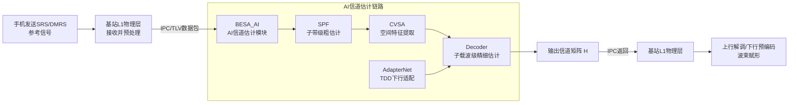
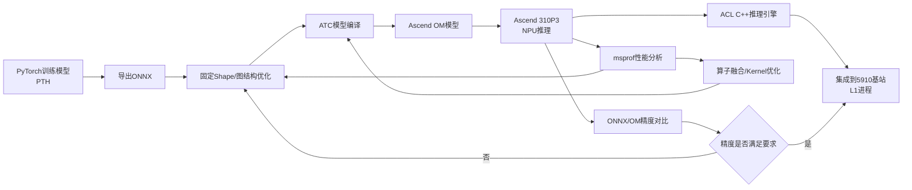
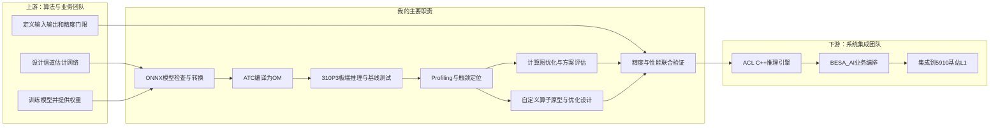
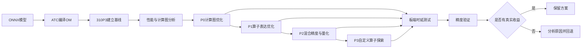

# 华为实习——面试整理

# 一、华为实习全景

## 1. 这段实习所在的=={pink}业务场景==

这段实习面向的是 **=={yellow}5G基站物理层AI信道矩阵估计==**=={yellow}。==

=={green}无线信号从手机传到基站==时，=={green}会受到==建筑物反射、遮挡、多径和噪声等=={green}各种==影=={green}响==。=={green}基站需要根据SRS（=={yellow}=={green}Sounding Reference Signal，==**=={green}探测参考信号==**=={green}）、DMRS（===={green}Demodulation Reference Signal，==**=={green}解调参考信号==**=={yellow}）等参考信号，**估计当前无线信道的状态**，也就是**信道矩阵 (H)**。==

=={yellow}信道估计结果会直接用于==：

- =={yellow}**上行数据解调**==；
- =={yellow}**下行预编码**；==
- =={yellow}**多用户MIMO干扰抑制**；==

> =={yellow}**同时间、同频点**，同时服务**多个用户**。==
> =={green}理想情况：不同用户的波束完全正交，互相之间互不影响。== 
> =={green}现实做不到完全正交，==**=={green}一个用户的信号会泄露到另一个用户接收端，就产生多用户 MIMO 干扰，也叫用户间空间干扰==**=={green}。==

- 波束赋形和资源调度。

=={yellow}如果信道估计不准确，后续**解调和预编码**都会**受到影响**。==

---

## =={pink}2. 为什么要引入AI信道估计==

=={green}传统信道估计==通常使用LS、MMSE和插值等数学方法。这些方法计算过程明确，但在大规模天线、多用户MIMO和复杂传播环境下存在一定=={green}局限==：

- =={yellow}固定算法对**不同无线场景**的**适应能力有限**；==
- =={yellow}**参考信号稀疏时不太行**，难以恢复完整信道信息；==
- =={yellow}**大规模天线**之间存在**复杂的空间和频率相关性，计算时延太长**==；
- 不同场景可能需要人工设计不同的估计和滤波策略。

AI模型可以从历史信道数据中学习时间、频率和天线空间之间的相关性，从而得到更精细的信道估计结果。

=={pink}但AI模型要真正进入基站，还必须解决一个问题==：

> =={yellow}模型不仅要**算得准**，还必须在基站物理层**规定的时间内算完**。==

因此，=={green}这段实习的重点**不是训练一个新模型**，而是**把已有Transformer信道估计模型  部署到Ascend 310P3**，并**优化**它在真实**NPU上的执行效率**。==

### =={pink}Ascend 310P3 vs 310B4的区别==

> =={yellow}310P3：==310P 系列**高性能版本**，**面向服务器 / 高性能边缘平台**，PCIe 加速卡形态为主；**达芬奇 V200 架构**

> =={yellow}310B4：==310B 系列**降频低配版本**，**面向嵌入式 SoC**，Atlas200I DK A2、香橙派 AIpro (8T) 用的就是它；**达芬奇 V300 架构**

---

## =={pink}3. BESA_AI在基站系统中的位置==

BESA_AI不是一个独立的AI应用，而是=={yellow}嵌入**5G基站L1物理层**的功能**模块**==。



=={yellow}完整数据流==可以理解为：

1. **L1接收**手机发送的SRS或DMRS**参考信号**；
2. **通过IPC**把输入数据**发送给**BESA_AI（**本模块**）；
3. **AI模型在Ascend NPU上执行信道估计**；
4. **输出信道矩阵 (H)**；
5. 再**通过IPC返回L1**，供**后续解调**和**预编码**使用。

---

## =={pink}4. 整个AI模型链路有哪些组成部分==

### =={green}整个信道矩阵估计模块由四个不同的网络组成==

### =={yellow}SPF（SRS Processing Filter）：粗信道估计==

=={green}**核心结构**：**四层 Transforme**r Block + **输入输出Linear层**==

SPF位于模型链路前端，负责=={green}**从SRS数据**中**提取子带级信道信息**==，=={green}为后续模型**提供基础特征**==。

我实习期间重点优化的模型是内部型号为 **=={pink}SPF_27B_10RB==** 的Transformer模型。

> **SPF_27B_10RB** 是按照模型处理的频域规格命名的：- **27B**：表示模型输出包含 **=={green}27个子带（Band）==**，即输出频域被划分为27个子带级特征。
> 
> 
> - **10RB**：表示输入对应 **=={green}10个资源块（Resource Block）==**。在5G NR中，=={green}1个RB包含12个子载波==，因此10RB对应 **120个子载波的频域带宽配置**。

### =={yellow}CVSA（Channel Vector Sparse Attention）：信道特征提取==

=={green}**核心结构**：稀疏注意力、位置编码==

CVSA通过注意力机制建模不同天线、频率和参考信号之间的相关性，=={green}增强信道特征==。

### =={yellow}Decoder：精细信道估计==

**=={green}核心结构==**=={green}：Transformer + LSTM，带状状态传递==

Decoder结合Transformer和LSTM结构，按照时间步迭代推理，逐步恢复更精细的信道信息。

### =={yellow}AdapterNet：场景适配==

=={green}**核心结构**：小型全连接网络==

AdapterNet主要处理TDD下行场景中的DMRS相关信息，为最终信道估计提供适配结果。

这段实习并不是优化整条链路的全部模型，=={pink}而是以== **=={pink}SPF_27B_10RB==** =={pink}为主要对象，建立和验证部署侧优化方法。==

---

## 5. 模型是怎么部署到基站上的

算法侧提供训练后的模型，部署侧需要完成如下转换：



各层的作用如下：

| 层级 | 主要内容 |
| --- | --- |
| 算法模型层 | PyTorch训练模型及Transformer网络结构 |
| 通用模型层 | ONNX计算图，用于跨框架表达模型 |
| 编译层 | ATC将ONNX编译为Ascend可执行的OM模型 |
| 运行时层 | CANN/ACL负责模型加载、内存管理和推理执行 |
| 硬件层 | Ascend 310P3的Cube、Vector、MTE和片上缓存 |
| 业务集成层 | C++推理引擎将OM模型集成到5910基站L1链路 |

项目中有两套推理方式：

- Python/PyACL脚本用于离线调试、时延测试和精度验证；
- C++/ACL推理引擎用于正式集成，采用异步执行和Stream同步。

#### =={pink}CANN和ACL的关系==

| 名称 | 定位 | 主要作用 |
| --- | --- | --- |
| **CANN** | =={yellow}完整的**异构计算软件栈**== | 包含模型转换、算子开发、图优化、运行时、驱动适配和性能分析等能力 |
| **ACL** | =={yellow}CANN中的**应用开发接口**== | 负责设备初始化、内存管理、模型加载、推理执行、数据传输和资源释放 |

---

## =={pink}6. 为什么模型已经能运行，还需要继续优化==

=={green}SPF_27B_10RB最初**能够成功转换并在310P3上运行**==，但仍存在明显的部署效率问题。

### 基线情况

| 指标 | 基线结果 |
| --- | --- |
| =={yellow}**ONNX节点数**== | =={yellow}**618**== |
| =={yellow}NPU**稳态推理时延**== | =={yellow}**572 μs**== |
| =={yellow}**端到端余弦相似度**（相比于算法侧pytorch）== | 0.999999 |
| =={yellow}**端到端MSE**== | 约 (4.70\times10^{-7}) |

这说明模型的=={green}精度没有明显问题，但性能仍有优化空间。==

### =={pink}端侧模型优化对比指标==

围绕 **=={yellow}性能、精度和资源占用==** 三类指标

| 类别 | 主要指标 | 说明 |
| --- | --- | --- |
| =={green}性能== | **=={green}端到端推理时延==** | 从**输入准备**到**获得输出**的**整体耗时**，通常是**=={green}最核心指标==** |
| =={green}性能== | **=={green}模型执行时延==** | 只统计**NPU执行模型的时间**，用于**排除前后处理**和**数据传输**干扰 |
| 性能 | **吞吐量** | 单位时间内处理的样本数，如FPS、samples/s |
| =={yellow}精度== | **=={yellow}余弦相似度==** | **优化模型**与**基准模型 输出方向**和**=={yellow}整体分布===={yellow}**的==**===={yellow}={yellow}={yellow}={yellow}={yellow}={yellow}={yellow}={yellow}={yellow}={yellow}={yellow}={yellow}={yellow}={yellow}={yellow}={yellow}={yellow}={yellow}={yellow}={yellow}={yellow}={yellow}={yellow}一致性==** |
| =={yellow}精度== | **=={yellow}MSE（均方根误差）==** | 比较**=={yellow}具体元素的数值偏差==**，**补充余弦相似度**的不足 |
| =={pink}资源== | **=={pink}内存占用==** | 包括**Host内存**、**Device内存**和**模型权重占用** |
| =={pink}资源== | **=={pink}算力与利用率==** | **AI Core利用率**、**各类算子耗时**以及**数据搬运开销** |
| 工程 | **模型大小与稳定性** | OM文件大小、连续运行是否报错、输出是否稳定 |

### 主要瓶颈

分析后发现，瓶颈不只是模型的数学计算量，还包括：

- 动态Shape推导产生大量冗余节点；
- 细碎算子增加Kernel调度开销；
- Cube和Vector之间切换产生TransData；
- 中间张量在GM与片上缓存之间反复搬运；
- Cast等类型转换可能破坏CANN已有的算子融合链路。

因此，=={pink}**优化目标**==不是简单减少MACs，而是同时减少：

> =={yellow}**冗余计算量**、**Kernel调度开销**、**格式转换**和**全局内存搬运。**==

---

## =={pink}7. 整体优化路线==

这段实习采用的是“=={green}**先建立基线，再逐层优化**==”的路线。

### =={yellow}第一阶段：模型部署与profiling基线分析==

完成ONNX到OM的模型转换，在Ascend 310P3上进行推理，建立**时延和精度基线**，并使用msprof分析算子执行和数据搬运特征。

### =={yellow}第二阶段：计算图优化==

利用输入Shape固定的特点，实施：

- 静态Shape固化；
- 常量折叠；
- 冗余Shape、Gather、Unsqueeze节点消除；
- 从模型输出反向进行死代码删除；
- 重新执行ATC编译和算子融合。

最终实验记录中，ONNX节点由618降至272，模型从多个子图合并为单个设备子图，稳态时延由572 μs降至324 μs；进一步调整融合配置后达到320 μs。

### =={yellow}第三阶段：量化优化与算法优化==

进一步评估了：

- GELU的Tanh近似替换为Erf近似；
- FP16自动混合精度；
- 手工FP16和Mixlist；
- INT8量化方案。

这些方案在理论计算量上可能更低，但部分方案引入了额外Cast，或者破坏CANN原有融合链路，导致实际时延没有下降甚至发生退化，因此没有进入最终方案。

### =={yellow}第四阶段：自定义Kernel优化探索==

针对Attention中多个算子独立执行造成的调度和中间张量搬运问题，开展FusedAttention自定义算子开发与方案设计，包括：

- Host侧Tiling；
- Ascend C设备端Kernel；
- ONNX自定义节点与子图替换；
- QK转置、Softmax和Value加权计算融合；
- 多核Head并行、Ping-Pong双缓冲及片上数据复用方案。

这里需要明确边界：

> 基础FusedAttention工程和Kernel框架已经完成，但当时尚未完成端到端OM集成和性能实测；多核、双缓冲和完整流水属于后续深度优化设计，不能与已经闭环的计算图优化结果混为一谈。

---

## =={pink}8. 最终形成的优化闭环==

> =={yellow}**模型转换**（ONNX -> OM）==
>    ↓
> =={yellow}板端推理**建立基线**(端到端时延+精度)==
>    ↓
> =={yellow}**msprof**与**计算图分析**（AI Core利用率+算子时延+数据搬移特征）==
>    ↓
> =={yellow}**提出**图优化、量化优化、算法优化和Kernel**优化方案**==
>    ↓
> =={yellow}重新**编译OM**并在310P3**实测**==
>    ↓
> =={yellow}**余弦相似度**、**MSE**和**时延验证**==
>    ↓
> =={yellow}**有效方案保留**，**无收益方案回退**==

这段实习真正形成的是：

> **Profiling发现问题 → 提出优化方案 → NPU实测 → 精度验证 → 根据结果保留或回退**

其中，已经闭环并产生最终时延收益的核心是 **静态Shape、常量折叠、死代码删除和ATC融合恢复**。

---

## 9. 项目成果的统一口径

### =={pink}已经完成并实测闭环==

- =={yellow}ONNX到OM模型转换；==
- =={yellow}Ascend 310P3板端推理；==
- =={yellow}基线性能和精度分析；==
- =={yellow}**静态Shape**、**常量折叠**和DCE**计算图优化**；==
- =={yellow}ATC重新编译及融合效果验证；==
- =={yellow}时延由**572 μs降至320 μs**，降低**44.1%**；==
- =={yellow}**余弦相似度保持0.999999**；==
- =={yellow}FP16、INT8及GELU替换方案评估和回退决策。==

### 完成工程或方案，但未取得端到端实测结果

- FusedAttention基础自定义算子工程；
- 多核Head并行方案；
- Ping-Pong双缓冲；
- GM到片上缓存的流水化设计。

### 不属于这段实习的核心职责

- 从零训练信道估计模型；
- 设计完整5G物理层协议栈；
- 开发CANN或ATC编译器；
- 独立优化BESA_AI中的全部模型；
- 完成FusedAttention生产部署和量化收益。

---

## 10. 关于简历中“节点降低37%”的口径

简历上的37%是阶段性统计口径，指早期识别出的动态Shape相关冗余节点比例。

后续又加入了迭代常量折叠和反向DCE，最终实验记录是：

```undefined
618个节点 → 272个节点
```

总节点实际下降约56%。

面试中建议以面试官看到的简历为主：

> 前期识别并处理了约37%的动态Shape类冗余；继续进行常量折叠和死代码删除后，最终节点由618降至272。简历使用的是阶段性保守口径。

---

## 11. 一句话介绍

> 这段实习是在5G基站AI信道估计场景中，把Transformer模型部署到Ascend 310P3，并围绕计算图、编译器融合、数据搬运和自定义Kernel开展端侧性能优化。

## 12. 一分钟口语化介绍

> 我在华为无线产品线做的是=={yellow}5G基站物理层 **AI信道矩阵估计模型**的**端侧部署**与**性能优化**==。简单来说，基站需要根据手机发送的SRS、DMRS参考信号估计无线信道矩阵，传统方法使用固定数学算法，而项目引入Transformer模型提升复杂场景下的估计能力。
> 
> 
> 我的工作重点不是模型训练，而是把SPF_27B_10RB模型从ONNX转换成Ascend 310P3可以执行的OM模型，并通过msprof和计算图分析定位瓶颈。基线模型有618个ONNX节点，稳态时延约572微秒。后续利用固定输入特性，完成静态Shape固化、常量折叠和死代码删除，恢复ATC算子融合，使时延降到320微秒，同时保持余弦相似度0.999999。
> 
> 
> 在此基础上，我还评估了GELU等价替换、FP16和INT8方案，发现部分低计算量方案会因为额外Cast或融合失效导致性能倒退，因此依据板端实测进行了回退；同时完成了FusedAttention基础算子工程和多核、双缓冲的后续优化设计。整个工作形成了Profiling、优化、实测和精度验证的闭环。

---

# 二、职责地图

## 1. 一句话职责定位

> 算法团队提供一个“能算对”的Transformer信道估计模型，我负责把它转换、部署到Ascend 310P3，并通过计算图和Kernel优化，让它在满足精度要求的前提下“算得更快”。

我的岗位位于 **算法模型与端侧NPU硬件之间**，=={yellow}核心是**端侧推理部署和性能优化**，不是模型训练==。

---

## 2. 我在整个项目中的位置



可以把**=={green}分工==**概括成：

- =={yellow}上游负责“模型应该怎么训练”；==
- =={yellow}我负责“**模型怎样在310P3上正确、高效地运行**”；==
- =={green}下游负责“怎样把优化后的模型集成进基站业务”。==

---

## 3. 我的五项主要职责

## 3.1 模型部署与基线建立

首先把算法模型变成目标NPU能够执行的形式。

我的工作包括：

- 检查ONNX输入输出、Shape和数据类型；
- 使用ATC将ONNX编译为OM；
- 在Ascend 310P3上加载并执行OM；
- 建立推理时延、MSE和余弦相似度基线；
- 确认模型转换后能够正确运行。

这一部分回答的是：

> 模型能不能在目标硬件上运行，运行结果是否正确，初始性能是多少？

---

## 3.2 Profiling与性能瓶颈定位

模型能够运行后，我负责判断时间具体花在哪里。

主要分析：

- 哪些算子耗时较高；
- Cube、Vector等计算单元的使用特点；
- 是否存在大量TransData和格式转换；
- 是否存在动态Shape和冗余节点；
- Kernel调度和数据搬运是否成为主要开销；
- 理论计算量与实际时延为什么存在明显差距。

分析工具和证据包括：

- msprof性能数据；
- ATC编译日志；
- ONNX计算图；
- OM板端实测时延；
- 同系列模型的Profiling结果。

这一部分回答的是：

> 模型慢在哪里，真正的瓶颈是计算、调度还是数据搬运？

---

## 3.3 计算图优化

这是我已经形成完整实测闭环的核心工作。

主要完成：

- 根据固定输入特性固化静态Shape；
- 手动推导中间张量维度；
- 迭代执行常量折叠；
- 删除Shape、Gather、Unsqueeze等冗余节点；
- 从模型输出反向执行DCE死代码清理；
- 重新执行ATC编译，恢复被冗余节点打断的融合链路。

最终使ONNX节点由618降至272，OM稳态时延由572 μs降至320 μs。

这一部分回答的是：

> 怎样在不修改网络算法和不重新训练的情况下，降低模型的调度与搬运开销？

---

## 3.4 混合精度与优化方案评估

不是所有理论上更省计算的方案，放到NPU上都会更快。因此我的职责还包括做实验和方案取舍。

主要评估了：

- GELU的Tanh近似替换为Erf近似；
- 自动混合精度；
- 强制FP16和手工FP16；
- Mixlist精度配置；
- INT8量化路径；
- 不同ATC融合配置。

我不仅比较理论MACs，还会重新编译OM，在310P3上实测时延并验证精度。

例如Erf方案虽然减少了理论计算量，但破坏了CANN原有的GELU融合，时延反而由320 μs退化至458 μs，因此最终回退。

这一部分回答的是：

> 一个方案理论上可行，是否真的值得进入端侧版本？

---

## 3.5 自定义算子与Kernel优化探索

针对Attention多算子串联造成的Kernel调度和中间张量搬运，我参与了FusedAttention自定义算子开发。

完成内容主要包括：

- FusedAttention算子工程搭建；
- Host侧算子注册和Tiling；
- Ascend C设备端Kernel主流程；
- ONNX自定义节点和子图替换；
- QK转置、Softmax和Value加权的融合设计；
- 多核Head并行、Ping-Pong双缓冲和片上复用的深度优化方案。

需要明确：

> 基础算子工程和Kernel框架已经完成，但当时尚未完成端到端OM集成与性能实测；多核和双缓冲属于完成的设计方案，不属于已经验证的性能成果。

---

## 4. 我的交付物

我的工作最终形成了以下几类产出：

| 交付物 | 具体内容 |
| --- | --- |
| 模型产物 | 优化前后的ONNX和OM模型 |
| 图优化工具 | 静态Shape、常量折叠和DCE处理脚本 |
| 编译配置 | ATC转换脚本及融合配置 |
| 性能报告 | 基线、P0和P1等阶段优化报告 |
| 精度报告 | ONNX与OM端到端及逐算子对比结果 |
| 实验结论 | FP16、INT8、GELU替换等方案的收益与回退依据 |
| 算子工程 | FusedAttention基础工程、Kernel框架及深度优化设计 |

---

## 5. 不属于我的职责

为了划清责任边界，以下工作不是我独立负责的：

- 采集和标注无线信道训练数据；
- 从零设计或训练Transformer信道估计模型；
- 设计完整BESA_AI业务架构；
- 开发CANN、ATC或Ascend硬件；
- 开发完整5G L1协议栈；
- 独立完成5910基站系统集成；
- 完成FusedAttention生产部署和最终性能验收。

我主要负责的是：

> **SPF模型从ONNX到OM的部署、性能分析、计算图优化、优化方案评估、精度验证，以及部分自定义算子工程开发。**

---

## 6. 面试口语化回答

如果面试官问：“你在这段实习中具体负责什么？”

可以回答：

> 我的岗位处在算法模型和昇腾NPU硬件之间。算法团队提供训练好的Transformer信道估计模型，我负责把它从ONNX编译成310P3能够执行的OM模型，然后建立性能和精度基线，通过msprof、ATC日志和计算图分析定位瓶颈。
> 
> 
> 我已经闭环的核心工作是计算图优化。针对固定输入模型中大量动态Shape和冗余节点，我完成了静态Shape固化、常量折叠和死代码删除，恢复ATC的算子融合，使稳态时延从572微秒降到320微秒，同时保持余弦相似度0.999999。
> 
> 
> 此外，我还评估了GELU替换、FP16和INT8等方案，根据板端实测决定保留或回退；算子侧完成了FusedAttention基础工程和多核、双缓冲优化设计，但这部分当时还没有形成端到端性能结果。

---

# =={pink}三、SPF_27B_10RB模型端侧优化全过程==

## =={pink}3.1 优化目标与约束==

我实习期间始终围绕一项核心任务展开：

> =={green}在**不修改模型训练流程**==、=={green}**不明显损失**信道估计**精度**的**前提**下==，=={yellow}**降低**SPF_27B_10RB模型在Ascend 310P3上的**推理时延**。==

这项工作的约束包括：

- 目标硬件固定为=={yellow}**Ascend 310P3**；==
- =={yellow}**CANN版本为8.0**==.RC3；
- =={yellow}**模型输入Shape固定**；==
- 不修改训练数据和训练流程；
- 优化方案必须重新编译为OM并在NPU上实测；
- 性能提升后还要通过MSE、余弦相似度和复数相关性验证精度。

整个工作流程是：



---

## =={pink}3.2 第一阶段：模型部署与基线建立==

### =={pink}3.2.1 模型基本情况==

SPF_27B_10RB是用于5G基站L1信道估计的Transformer模型。

| 项目 | 内容 |
| --- | --- |
| **网络结构** | =={yellow}**4层Transformer**== |
| **每层结构** | =={yellow}**Multi-Head Attention（多头注意力机制）** + **FFN（前馈神经网络）**== |
| **输入Shape** | `[1,4,32,32,1]` |
| **输出Shape** | `[1,4,32,32,1]` |
| **原始精度** | **=={yellow}FP32==** |
| **原始ONNX节点数** | **=={yellow}618==** |
| **模型参数量** | =={yellow}**约2.5万**== |
| **总MACs** | =={yellow}约4890万== |

### 

| 维度 | 值 | 含义 |
| --- | --- | --- |
| dim0 | 1 | **Batch size**，固定为1**（单条推理）** |
| dim1 | 4 | **天线端口数** / RB组数（10RB 配置下4个 port） |
| dim2 | 32 | **时域符号数**（OFDM 符号数 / SRS 序列长度） |
| dim3 | 32 | **频域子载波数**（10RB 对应的子载波维度） |
| dim4 | 1 | **实/虚部通道**（1=仅实部；复数信号拆成2通道时为2） |

---

### =={pink}SPF模型概览：==

> **=={green}原始SRS信道数据==**=={green}（原始4维特征）==
>     ↓   
> **=={yellow}输入嵌入层（Conv1d）==**=={yellow}：把==**=={yellow}原始特征==**=={yellow}转换成==**=={yellow}16维内部特征==**
>     ↓
> Transformer第1层
>     ↓
> Transformer第2层
>     ↓
> Transformer第3层
>     ↓
> Transformer第4层
>     ↓
> **=={yellow}输出层==**=={yellow}：转换为==**=={yellow}需要的子带信道估计==**

**=={yellow}4层结构相同的Transformer==：**=={green}每一层并**不是完成不同**的固定**任务**，而是**对上一层的结果继续提取和增强**==

> =={green}**输入嵌入层：conv1d是一维卷积层，有16个独立卷积核，每个核从原始4维特征中提取一种新特征，拼接得到16维。**==

> =={green}**输出层：conv2d，16-4维。**==

### =={pink}每层Transformer里发生什么==

=={green}每一层主要包含**两大部分**：==

> =={green}**输入x：16维内部特征**==
>  │
>  ├─ =={yellow}第一部分：**多头自注意力**==
>  │      =={pink}**LayerNorm：合理化特征范围**==
>  │         ↓ 
>  │      =={pink}*_生成Q、K、V：__Conv1d  (16->48(16_3))==
>  │         ↓
>  │      =={pink}**计算注意力**==
> 
> 
>    |          ↓         └─**=={green}拆分成两个头==**
>    |          ↓         └─**=={green}Q、K计算相关性==**
>    |          ↓         └─**=={green}Softmax：相关性系数转权重==**
>    |          ↓         └─**=={green}汇总新特征：权重 × 各位置 V==** 
>    |          ↓         └─**=={green}两个注意力头的计算结果拼接==**
>    |          ↓
>  │      =={pink}**输出投影**：Conv1d（ 48->16 ）==
>  │         ↓
>  │      =={pink}**残差连接：**注意力输出与原输入相加， x2 = x1 + Attention(x1)==
>  │
>  └─ =={yellow}第二部分：**FFN**==
>         =={pink}**特征扩展**：conv1d（16->32）==
>            ↓
>         =={pink}**GELU激活**（引入非线性能力，放大和缩小特定特征）==
>            ↓
>         =={pink}**特征压缩**（Conv2d，32->16）==
>            ↓
>         =={pink}**第二次残差连接**：FFN输出与输入相加， x2 = x1 + FFN(x1)==
>            ↓
>       =={green}**得到本Transformer层输出**（16维）==

#### =={yellow}第一步：LayerNorm（层归一化）——把特征调整到稳定范围==

避免部分数值过大、部分数值过小；提高网络计算的数值稳定性；

#### =={yellow}第二步：生成Q、K、V——为注意力计算准备三份信息==

=={green}归一化后的16维特征经过一个== `Conv1d`=={green}，一次生成48维结果，再拆分成三组：==

> 16维输入特征
>      ↓ to_qkv Conv1d
> 48维结果
>      ↓ 拆分
> Q：16维
> K：16维
> V：16维

=={green}Q、K、V分别表示：==

- **=={pink}Q，Query，查询==**=={pink}：当前位置想寻找什么；==
- **=={pink}K，Key，键==**=={pink}：其他位置具有什么特征；==
- **=={pink}V，Value，值==**=={pink}：其他位置真正携带的信息。==

可以把它类比成查资料：

> Q是我提出的问题，K是每本书的目录，**先用Q和K判断哪本书相关**，再**从对应的V中读取**实际内容。

#### =={yellow}第三步：拆成两个注意力头==

项目中的Transformer使用 **2个注意力头**。

=={green}它会把**特征分成两组**，**分别计算注意力**：==

> 16维Q、K、V
>       ↓
> 拆成2个注意力头
>       ↓
> =={green}每个头独立计算相关性==
>       ↓
> =={green}**重新拼接**==

#### 为什么需要多个头

=={green}一个注意力头相当于从一个角度观察信道数据；**多个头**可**以同时学习不同角度的相关关系**==。

> 例如，它们可能分别关注不同的空间或频域关系，但这只是便于理解的例子。**不能说第一个头固定负责频域、第二个头固定负责天线**，因为每个头究竟学到了什么由训练结果决定。

#### =={yellow}第四步：用Q和K计算“谁与谁更相关”==

#### =={yellow}第五步：Softmax——把相关性分数变成权重==

> 原始分数：[2.1，0.8，-0.5]
>        ↓ Softmax
> 注意力权重：[0.75，0.20，0.05]

这些权重具有两个特点：

- =={green}每个权重都在0到1之间；==
- =={green}所有权重加起来等于1。==

它表示模型在**更新当前位置时，应当从各个位置分别读取多少信息**。

#### =={yellow}第六步：用注意力权重对V加权汇总==

> =={pink}相关性**权重** × 各位置携带的**V信息**==
>               ↓
> =={green}得到汇总后的新特征==

#### =={yellow}第七步：合并多头结果并进行输出投影==

两个注意力头计算完成后，结果重新拼接，然后通过 `to_out Conv1d`：

```markdown
注意力头1 ─┐
            ├─ 拼接 → to_out Conv1d → 16维特征
注意力头2 ─┘
```

这一步负责把两个头提取的信息重新融合，并转换回16维，使其可以继续进入后续模块。

#### =={yellow}第八步：第一次残差连接——保留原始信息==

**注意力输出会与进入注意力模块前的输入直接相加**：

$$
[
x_1=x+\operatorname{Attention}(x)
]
$$

这叫做 **=={green}Residual Connection，残差连接==**=={green}。==

可以理解为：

> =={green}原来的特征==
>     =={green}+==
> 注意力提取的新信息
>     =={green}↓==
> 更新后的特征

残差连接相当于：

> =={green}**不推翻原来的判断**，而是在原有信息上**增加本层学到的新信息**。==

它也能让深层网络更容易训练，**避免信息在经过多层后逐渐丢失**。

### =={pink}进入FFN进一步加工==

完成注意力后，数据进入 **FFN，即前馈神经网络**。

=={green}注意力解决的是：==

> **不同位置之间应该怎样交换信息**？

FFN解决的是：

> **信息交换完成后**，**每个位置的特征应该怎样进一步加工？**

在这个SPF模型中，FFN使用两个 `Conv1d`：

> =={yellow}**16维特征**==
>     ↓ =={yellow}**conv1**==
> =={yellow}**扩展为32维**==
>     ↓ =={yellow}**GELU**==
> =={yellow}**进行非线性变换**==
>     ↓ =={yellow}**conv2**==
> =={yellow}**压缩回16维**==

---

#### =={yellow}第九步：把特征从16维扩展到32维==

第一个卷积层执行：

```undefined
16维 → 32维
```

为什么先扩大？

可以把16维理解成较小的工作空间。扩展到32维以后，网络有更多中间特征，可以组合出更丰富的表示。

这类似于：

> 先把一句压缩的信息展开，从更多角度分析，再将有效内容压缩回来。

---

#### =={yellow}第十步：GELU——引入非线性能力==

扩展后的特征经过 **=={green}GELU激活函数==**。

如果网络只有卷积或矩阵乘法，无论叠加多少层，本质上仍接近线性变换，难以表达复杂关系。GELU负责引入非线性。

它不是简单地把负数全部删除，而是根据输入大小进行平滑控制：

- 较大的正数大部分保留；
- 较小的值受到一定抑制；
- 负数不一定完全变成0；
- 整个变化过程较平滑。

可以把它理解成一个“软门控器”：

> =={green}判断哪**些特征值得保留和放大**，**哪些特征应该削弱**。==

在你的部署分析中，GELU采用的Tanh近似会展开成多个逐元素算子，这也是一个需要关注的性能开销来源。

---

#### =={yellow}第十一步：把32维压缩回16维==

第二个卷积层完成：

```undefined
32维 → 16维
```

它把高维空间中提取到的信息重新融合，恢复到Transformer统一使用的16维。

恢复为16维也很关键，因为后面还要进行残差相加。两个张量维度相同才能直接相加。

---

#### =={yellow}第十二步：第二次残差连接==

FFN输出再次与FFN输入相加：

$$
[
x_2=x_1+\operatorname{FFN}(x_1)
]
$$

因此一层Transformer最终可以简化为：

```markdown
原特征
  + 注意力得到的跨位置信息
  + FFN得到的非线性加工信息
           ↓
      本层输出特征
```

本层输出随后进入下一层Transformer，重复同样的处理。

#### 因此完整过程是：

> SRS信道输入
>     ↓
> 输入嵌入：4通道 → 16通道
>     ↓
> Transformer × 4
>     ├─ LayerNorm
>     ├─ 生成Q、K、V
>     ├─ 两头注意力计算
>     ├─ 输出投影
>     ├─ 残差相加
>     ├─ FFN：16 → 32
>     ├─ GELU非线性激活
>     ├─ FFN：32 → 16
>     └─ 残差相加
>     ↓
> 读出层：16通道 → 4通道
>     ↓
> 子带级粗信道估计

---

### =={pink}3.2.2 模型部署链路==

我首先完成了：

1. =={yellow}**检查**ONNX**输入输出名称**、**Shape**和**数据类型**；==
2. =={yellow}使用**ATC**将ONNX转换为Ascend OM；==
3. =={yellow}在Ascend 310P3上**执行OM推理**；==
4. =={yellow}通过相同输入**对比ONNX与OM输出**；==
5. =={yellow}建立**OM**模型的**时延**和**精度基线**。==

基线结果如下：

| 指标 | 结果 |
| --- | --- |
| =={yellow}**OM稳态平均时延**== | =={yellow}**572 μs**== |
| =={yellow}**CPU ONNX平均时延**== | =={yellow}约**7171 μs**== |
| **=={yellow}OM端到端MSE==** | =={yellow}约 (**4.70e10^{-7}**)== |
| =={yellow}**OM端到端余弦相似度**== | =={yellow}**0.999999**== |

CPU与NPU的结果只能说明模型部署后的加速效果，=={green}真正用于后续优化对照的是同一**310P3上的OM基线572 μs**。==

### 3.2.3 基线阶段结论

模型已经能够正确运行，精度也满足要求，但实际时延明显高于约152.86 μs的理论计算时间。

因此问题不是“模型能不能运行”，而是：

> 除了数学计算以外，额外的约400 μs花在了什么地方？

---

## 3.3 第二阶段：性能分析与瓶颈定位

### =={pink}3.3.1 统一性能模型==

我将实际推理时延拆解为：

> =={green}**实际时延**==
> 
> 
> =
> 
> 
> =={yellow}**算子计算**==
> +
> =={yellow}**Kernel启动和调度**开销==
> +
> =={yellow}**GM与片上缓存的数据搬运**开销==
> +
> =={yellow}**TransData格式转换**开销==
> +
> =={yellow}**运行时同步**等其他开销==

其中：

=={green}Kernel==：运行在NPU上的一段具体计算程序；=={green}GM==：Device侧全局内存，容量较大，但访问成本高；

=={green}片上缓存==：靠近计算单元、速度更快的存储空间；=={green}TransData==：在不同数据排布格式之间转换；=={green}设备子图==：ATC将完整模型拆分后，交给设备执行的一段计算图。

**=={green}对于大模型，矩阵乘法可能占据主要时延==**；**=={yellow}但SPF是一个小Shape、batch_size=1的轻量模型==**=={yellow}，单次矩阵计算规模不大，因此==**=={yellow}调度、格式转换和数据搬运==**=={yellow}的**占比**==会=={yellow}**更加明显**===={yellow}。==

### =={pink}3.3.2== =={pink}分析工具==

#### =={pink}1. ONNX计算图检查工具==

使用ONNX图分析脚本和可视化工具检查：

=={yellow}**冗余节点**和**死代码**==；

这些节点多数用于运行时动态推导张量形状，但该模型实际输入固定为：

```text
[1, 4, 32, 32, 1]
```

因此，很多Shape计算可以提前在编译期确定，没有必要在推理过程中继续保留。

#### =={pink}2. ATC编译器和编译日志==

- =={yellow}ONNX**算子**是否**被正确支持**；==
- =={yellow}**计算图被划分**成多少个设备**子图**；==
- =={yellow}**算子融合是否成功**；==
- =={yellow}是否产生**额外的格式转换**；==
- =={yellow}是否存在**被冗余节点打断**的**连续计算链**。==

#### =={pink}3. ACL板端推理程序==

- 固定输入Shape
- 固定batch_size=1
- =={yellow}先进行**3次预热**==
- =={yellow}再连续执行**10轮推理**==
- =={yellow}统计**最小、平均和最大时延**==

#### =={pink}4. msprof性能分析工具==

使用CANN提供的msprof采集模型执行过程，重点关注：

- 算子执行顺序；
- 各Kernel的执行时间；
- Kernel调用是否过于细碎；
- Conv、MatMul等Cube算子；
- Softmax、GELU和逐元素运算等Vector算子；
- TransData格式转换；
- AI Core执行情况；
- 数据搬运和计算之间是否存在等待。

=={green}msprof用于回答**两个问题**：==

1. =={yellow}时间主要花在**计算**、**数据搬运**还是**调度**上？==
2. =={yellow}哪些**算子**或**算子链值得优先优化**？==

---

### =={pink}3.3.3== =={pink}理论计算量分析==

算力分析工具将模型的=={yellow}主要运算分为**Cube**和**Vector**两部分==：

| 计算单元 | 典型算子 | 估算MACs | 理论计算时间 |
| --- | --- | --- | --- |
| **Cube** | Conv、MatMul | **=={yellow}约30.23M==** | **=={yellow}约6.96 μs==** |
| **Vector** | Tanh、Pow、Softmax、Mul等 | **=={yellow}约18.67M==** | **=={yellow}约145.89 μs==** |
| 合计 | — | 约48.91M | **=={yellow}约152.86 μs==** |

**估算公式**为：

> =={green}理论计算时间 = 运算量 ÷ 假设的硬件计算吞吐率==

该结果说明：

1. =={yellow}SPF模型**本身计算量不大**==；
2. =={yellow}Conv和MatMul虽然运算量较高，但**Cube**处理矩阵计算的**吞吐能力较强**；==
3. GELU、Softmax和LayerNorm等=={yellow}**Vector计算**的理论**效率相对较低**==；
4. =={yellow}理论计算时间只计算**理想算术开销**，**没有**完整包含**调度、搬运和格式转换**。==

---

**=={pink}3.3.2 计算图层的问题==**

=={green}原始ONNX中存在大量**动态Shape相关节点**==：

- =={yellow}Shape；==
- =={yellow}Gather；==
- =={yellow}Unsqueeze；==
- =={yellow}Constant；==
- =={yellow}无下游使用的死代码。==

但这个=={pink}**模型的输入Shape固定**==为`[1,4,32,32,1]`，=={pink}**运行时不需要重新推导这些维度**==。

这些节点虽然不一定对应同等数量的设备Kernel，但会：

- =={green}增加**计算图复杂度**==；
- =={green}产生**冗余调度**==；
- **打断**原本连续的**算子链**，=={green}**降低ATC自动融合**的匹配概率==。

---

### =={pink}3.3.3 编译器层的问题==

=={yellow}ATC通过**匹配特定图结构**实现**算子融合**==。=={green}如果两个本来能够融合的计算节点**中间插入**Shape、Gather或Unsqueeze，**融合**规则就可能**失效**。==

=={yellow}基线模型被编译成**10个以上设备子图**，基线模型得到的静态计算图虽然**能运行，但是并不干净**；子图之间需要**额外调度**和**数据传递**。==

---

### =={pink}3.3.4 NPU执行层的问题==

310P3中主要涉及：

- =={green}**Cube**：执行Conv、MatMul等**矩阵计算**；==
- =={green}**Vector**：执行Softmax、GELU和**逐元素向量计算**；==
- =={green}**MTE**：负责**GM与片上存储之间**的**数据搬运**。==

=={yellow}SPF模型的**张量Shape较小，Cube完成计算很快**，实际瓶颈更多来自==：

- =={yellow}Cube和Vector之间**频繁切换**；==
- =={yellow}不同存储格式之间的**TransData**；==
- =={yellow}**中间张量反复写回GM**；==
- =={yellow}**细碎Kernel**的**启动和调度**。==

因此，=={pink}**第一个优化方向确定为：**==

> =={yellow}优先**清理计算图**、**恢复ATC融合**，而不是立即修改网络算法或降低数据精度。==

---

## 3.4 第三阶段：P0计算图优化

### 冗余节点的来源

PyTorch 导出 ONNX 时，默认按**通用情况**处理——假设 shape 可能是动态的。因此会自动插入：

> Shape → Gather → Unsqueeze
> （取张量维度值 → 取某个具体维度 → 扩维拼接到目标 shape）

这条链路在**动态 shape** 下是必要的（运行时才能知道维度值）。但在我们的部署场景中，ATC 编译要求固定 `input_shape="input:1,4,32,32,1"`，shape 永远不会变，所以这些运行时推导节点**永远不会产生不同于编译时的值**，纯粹浪费调度开销。

更严重的是，冗余节点**打断了 ATC 算子融合的模式匹配**——比如 `Conv→Unsqueeze→Shape→...→Add` 中间夹着冗余节点，ATC 识别不出 `Conv+Add` 融合模式，只能将模型拆成 10+ 个子图，子图间有大量调度开销和 GM↔L1 数据搬运。

### =={pink}3.4.1 优化思路==

=={yellow}利用**模型输入固定**的特点，将**运行时动态Shape推**导提前到**编译期完成**，再**删除无实际作用的节点**。==

优化内容包括：

- 固定输入Shape；
- 推导中间张量Shape；
- 常量折叠；
- 冗余Shape链消除；
- 反向DCE死代码清理；
- 重新执行ATC编译；
- 恢复被冗余节点打断的融合链路。

### 3.4.2 为什么没有直接使用现成简化工具

实际环境中遇到了几个问题：

- Windows版`onnx-simplifier`发生崩溃；
- ARM服务器无法联网安装缺失依赖；
- ONNX自动Shape推导对模型中的5D张量支持不足；
- 暴露中间张量进行推理追踪时出现未定义类型错误。

因此，我最终采用：

> `KNOWN_SHAPES`手动注入 + 迭代常量折叠 + 反向DCE

### 3.4.3 中间Shape推导

模型内部包含多次Squeeze、Transpose和Reshape，必须先把数据流推导准确。

关键链路为：

```css
输入：[1,4,32,32,1]
→ Squeeze：[1,4,32,32]
→ Transpose：[1,32,4,32]
→ Reshape：[32,4,32]
→ Conv1d：[32,16,32]
→ Reshape：[1,32,16,32]
→ 进入Transformer骨干网络
```

早期曾把Transformer骨干维度错误地写为`[1,4,4,32]`，导致ATC虽然能够编译，但OM推理时出现Reshape元素数量不匹配。

我重新追踪Transpose和Reshape前后的元素总数，最终确定正确维度为`[1,32,16,32]`。

### 3.4.4 常量折叠与DCE

脚本主要执行三步。

#### 第一步：建立常量映射

读取：

- ONNX Initializer；
- Constant算子；
- 手动注入的中间张量Shape。

#### 第二步：迭代常量折叠

对输入已经确定的节点提前计算，例如：

- Shape；
- Gather；
- Reshape；
- Unsqueeze；
- Squeeze；
- Transpose；
- Add、Mul、Div；
- Concat和Slice。

折叠后的结果保存为Initializer，原计算节点从图中删除。

#### 第三步：反向DCE

从模型输出开始反向遍历，只保留最终结果依赖的节点，删除：

- 无下游使用的算子；
- 无引用的常量；
- 被折叠后遗留的分支。

### 3.4.5 优化结果

| 指标 | 优化前 | P0优化后 |
| --- | --- | --- |
| ONNX节点数 | 618 | 272 |
| Shape节点 | 36 | 0 |
| Gather节点 | 36 | 0 |
| Unsqueeze节点 | 96 | 1 |
| 设备子图 | 10个以上 | 1个 |
| OM稳态时延 | 572 μs | 324 μs |
| 全开融合后时延 | — | 320 μs |

精度结果：

- ONNX图优化前后余弦相似度：1.000000；
- OM与参考结果余弦相似度：0.999999；
- MSE保持约 (4.70\times10^{-7})。

### 3.4.6 为什么能提升性能

节点减少只是表面结果，真正的性能收益来自：

1. 动态Shape计算被提前到编译期；
2. 冗余节点不再产生调度；
3. 原本被打断的算子重新相邻；
4. ATC融合规则重新生效；
5. 多个设备子图合并为一个；
6. 跨子图调度和中间数据搬运下降。

因此不能简单地说：

> 删除346个ONNX节点，就减少了346次Kernel执行。

ONNX节点、ATC融合算子和最终设备Kernel并不是一一对应关系。

---

## 3.5 第四阶段：P1 GELU表达优化

P0完成后，最优时延已经达到320 μs，但Vector侧仍有较高开销，因此继续评估GELU优化。

### 3.5.1 优化假设

原模型使用Tanh近似实现GELU：

```undefined
GELU-Tanh
```

理论上改成Erf近似可以：

- 减少逐元素计算量；
- 降低Vector MACs；
- 保持数学上的近似等价性。

### 3.5.2 实施过程

我编写ONNX图改写脚本：

1. 从Tanh节点反向匹配完整GELU子图；
2. 匹配`0.044715`、`sqrt(2/pi)`等常量；
3. 删除原Tanh计算链；
4. 插入Mul和Erf节点；
5. 重新连接下游；
6. 执行DCE清理。

改写后：

- 匹配4组GELU子图；
- ONNX节点由272降至252；
- Tanh算子清零；
- ONNXRuntime余弦相似度达到1.000000；
- MSE约为 (7.07\times10^{-9})。

从数学和ONNX精度角度看，方案成立。

### 3.5.3 310P3实测结果

| 模型 | 默认融合 | 全开融合 |
| --- | --- | --- |
| 原Tanh版本 | 324 μs | 320 μs |
| Erf改写版本 | 462 μs | 458 μs |

Erf版本理论计算量更低，但实际时延反而明显增加。

### 3.5.4 性能退化原因

CANN 8.0.RC3对原Tanh-GELU存在专用融合规则，可以将多个节点合并成一个融合Kernel。

Erf版本没有对应的专用融合Pass，Mul、Erf、Add被拆成多个Kernel，增加了：

- Kernel启动次数；
- 中间张量写回GM；
- GM到片上缓存的重复搬运；
- 运行时调度开销。

减少的MACs无法抵消融合失效造成的开销。

### 3.5.5 最终决策

Erf方案正式回退，保留原Tanh-GELU。

这一阶段得到的核心结论是：

> 数学等价不代表硬件执行等价，MACs下降也不保证实际时延下降。

---

## 3.6 第五阶段：P2混合精度与INT8量化评估

### 3.6.1 优化假设

既然数据搬运是主要瓶颈，将FP32转换为FP16或INT8，理论上可以：

- 减少单元素存储字节；
- 降低GM与片上缓存之间的搬运量；
- 提高Cube矩阵计算吞吐；
- 减少模型权重和中间张量体积。

但降低精度可能引入Cast、量化和反量化操作，因此必须实测。

### 3.6.2 FP16实验结果

| 方案 | 稳态时延 | 相对320 μs基线 | 精度 | 结论 |
| --- | --- | --- | --- | --- |
| 自动混合精度 | 318 μs | -0.6% | 满足要求 | 基本无收益 |
| 强制FP16 | 540 μs | +69% | 0.999999 | 性能退化 |
| ONNX手工全FP16 | 605 μs | +89% | 0.999998 | 性能退化 |
| Cube白名单Mixlist | 531 μs | +66% | 0.999999 | 性能退化 |

### 3.6.3 FP16没有收益的原因

SPF模型包含大量Cube和Vector交替计算。

如果Cube使用FP16，而Softmax、LayerNorm、Add等Vector算子保留FP32，编译器需要插入：

```sql
FP32 → Cast → FP16 → Cube
→ Cast → FP32 → Vector
```

这些Cast节点会：

- 破坏原有算子融合；
- 增加独立Kernel；
- 增加数据转换和搬运；
- 使小Shape模型的转换开销超过FP16收益。

自动混合精度得到318 μs，与320 μs基线基本处于测试波动范围，不能视为稳定优化。

### 3.6.4 INT8量化探索

我还评估了INT8静态量化：

1. 使用测试数据生成标准ONNX QDQ模型；
2. ONNXRuntime精度余弦相似度约0.999238；
3. 使用ATC编译量化模型。

但CANN 8.0.RC3不支持标准ONNX `DequantizeLinear`解析，只支持AMCT生成的私有量化算子；当前环境又无法安装完整AMCT工具链，因此ATC编译失败。

### 3.6.5 最终决策

FP16方案没有稳定性能收益，INT8链路受工具和编译器限制，均未进入最终版本。

这一阶段的结论是：

> 低精度只有在不破坏融合、目标硬件能够原生支持，并且转换开销足够低时才可能带来收益。

---

## 3.7 第六阶段：P3 FusedAttention自定义算子探索

P0已经取得主要收益，而P1、P2都表明继续修改标准图结构容易破坏已有融合，因此优化进一步深入到自定义Kernel层。

### 3.7.1 为什么选择Attention融合

原生Attention链路为：

```scss
MatMul(QKᵀ)
→ Scale
→ Softmax
→ MatMul(Score·V)
```

如果四个步骤分别执行，就需要：

- 多次Kernel启动；
- QK结果写回GM；
- Softmax结果再次写回GM；
- 后续MatMul重新从GM读取；
- Cube和Vector之间反复切换。

FusedAttention的目标是将四步合并到一个Kernel中，让中间张量尽量保留在片上缓存。

### 3.7.2 已完成的基础工程

我完成了：

- 自定义算子工程结构；
- Host侧算子注册；
- Tiling参数定义；
- Ascend C设备端Kernel主流程；
- ONNX自定义算子解析插件；
- Attention子图识别与替换脚本；
- 编译和安装脚本；
- 自定义算子开发问题排查文档。

基础Kernel实现的计算链路为：

```css
CopyIn Q/K/V
→ QKᵀ矩阵乘
→ Scale
→ Softmax
→ Score·V
→ CopyOut
```

### 3.7.3 基础版本的真实状态

需要明确基础版本当时的完成度：

- 当前仍是单核执行；
- `blockDim=1`；
- 4个Head串行处理；
- 使用基础片上缓存复用；
- 尚未实现显式Ping-Pong双缓冲；
- 尚未完成完整指令流水；
- ATC自定义解析与端到端OM集成仍待闭环；
- 没有可用于简历量化的真实时延结果。

### 3.7.4 后续深度优化设计

在基础工程上，我进一步完成了以下设计。

#### 多核Head并行

4个Attention Head之间没有数据依赖，可以分配给4个AI Core并行执行，避免全部Head在单核串行运行。

#### Ping-Pong双缓冲

为输入搬运和计算准备两组Buffer：

```undefined
计算Head N
同时搬运Head N+1
```

通过CopyIn与Compute重叠，减少流水线等待。

#### 混合存储精度

计划使用：

- GM和UB存储FP16，降低带宽和缓存占用；
- MatMul累加和Softmax内部保持FP32，保证数值稳定。

#### GM到片上缓存三级流水

进一步将矩阵计算拆解为：

```sql
GM → L1
L1 → L0
Cube计算
结果 → UB
```

利用不同Tile之间的Ping-Pong机制，让数据搬运和Cube计算并行。

### 3.7.5 这一阶段的成果边界

可以说：

> 完成了FusedAttention基础算子工程、Kernel主流程和多核、双缓冲、片上流水优化设计。

不能说：

- FusedAttention已经部署到最终OM；
- 已经完成多核和双缓冲实测；
- GM访问已经实测减半；
- 模型时延已经降到200 μs或95 μs。

这些数字均属于设计目标或理论估算，不是实际交付结果。

---

## 3.8 性能与精度联合验证方法

所有方案都使用同一套判断流程。

### 3.8.1 性能验证

- 固定模型输入；
- 固定310P3和CANN环境；
- 先进行3次Warmup；
- 再执行多轮稳态推理；
- 记录最小、平均和最大时延；
- 对比同一硬件上的OM模型结果。

这里的320 μs指：

> OM模型稳态单次推理时间，不包含完整基站IPC、预处理和系统端到端时间。

### 3.8.2 精度验证

主要使用：

- 余弦相似度；
- MSE；
- 最大绝对误差；
- 复数相关性；
- 必要时进行逐算子结果对比。

余弦相似度高表示输出方向高度一致，但不代表逐元素或逐Bit完全相等，因此需要结合MSE和业务指标判断。

### 3.8.3 方案保留原则

只有同时满足以下条件，方案才会被保留：

1. ONNX计算图合法；
2. ATC能够正常编译；
3. OM能够在310P3稳定运行；
4. 板端时延存在稳定收益；
5. 精度满足业务门限；
6. 不引入不可接受的工具链和维护风险。

---

## 3.9 全阶段结果总结

| 阶段 | 优化方法 | 实测结果 | 最终状态 |
| --- | --- | --- | --- |
| 基线 | 原始ONNX转OM | 572 μs | 优化起点 |
| P0 | 静态Shape、常量折叠、DCE | 324 μs | 保留 |
| P0增强 | ATC融合配置 | 320 μs | 最终最优版本 |
| P1 | GELU Tanh替换Erf | 458 μs | 回退 |
| P2 | 自动混合精度 | 318 μs | 无稳定收益 |
| P2 | 强制/手工FP16 | 531～605 μs | 回退 |
| P2 | INT8 QDQ | ATC编译失败 | 未落地 |
| P3 | FusedAttention | 基础工程完成，待集成实测 | 原型与设计 |

最终已经闭环的量化结果是：

```undefined
OM稳态时延：572 μs → 320 μs
时延降低：44.1%
余弦相似度：0.999999
```

---

## 3.10 这项工作的核心价值

这段实习不只是“删节点”或者“尝试量化”，而是形成了一套面向异构NPU的优化方法：

1. 先建立可信的性能与精度基线；
2. 用计算图、编译器和硬件执行数据定位瓶颈；
3. 从低风险的图优化开始；
4. 对混合精度和数学等价方案进行控制变量实验；
5. 以目标硬件实测决定方案，而不是只看MACs；
6. 标准算子优化到达边界后，再进入自定义Kernel；
7. 对未完成实测的设计明确标注边界。

最关键的工程认识是：

> 在小Shape的端侧模型中，算子融合、Kernel调度和数据搬运往往比理论计算量更能决定最终时延。

---

## 3.11 面试口语化主回答

如果面试官问：“你在华为具体是怎么优化这个模型的？”

可以回答：

> 我在华为的工作始终围绕SPF_27B_10RB这个5G信道估计Transformer模型展开，目标是在不明显损失精度的情况下，降低它在Ascend 310P3上的推理时延。
> 
> 
> 我先完成ONNX到OM转换并建立基线，原始模型有618个ONNX节点，稳态时延约572微秒，余弦相似度是0.999999。分析后发现模型的主要问题不只是计算量，而是固定输入模型中保留了大量动态Shape节点，这些节点既增加调度，也打断了ATC的算子融合。
> 
> 
> 所以第一阶段我做了静态Shape固化、手动中间Shape推导、迭代常量折叠和反向DCE，把节点从618降到272，并把多个设备子图合并为一个。重新编译后，时延先降到324微秒，进一步调整融合配置后达到320微秒，降低44.1%，精度保持不变。
> 
> 
> 后续我又评估了GELU的Tanh到Erf替换、FP16和INT8。虽然这些方案理论计算量或搬运量更低，但板端实测发现Erf和FP16会因为额外Kernel或Cast破坏原有融合，性能反而退化，所以进行了回退。最后我进一步搭建了FusedAttention自定义算子工程，并完成多核Head、双缓冲和片上流水设计，但这部分尚未形成端到端实测结果。
> 
> 
> 整个工作形成了从Profiling、提出方案、板端实测到精度验证和方案取舍的完整优化闭环。

---

# 四、华为实习高频技术追问题库

以下回答以15～30秒为主。面试时先回答概念，再根据追问展开到SPF项目。

## 4.1 5G业务与模型

**1. 什么是信道估计？**

信道估计就是根据已知参考信号，估计无线信号从发送端到接收端经历的衰减、相位变化和多径效应，得到信道矩阵 (H)。结果会用于上行解调、下行预编码和波束赋形。

**2. SRS和DMRS分别是什么？**

SRS是探测参考信号，主要用于基站了解更大范围的信道状态；DMRS是解调参考信号，通常随业务数据发送，用于具体数据的解调。两者都可以作为AI信道估计的输入信息。

**3. SPF模型在系统中负责什么？**

SPF位于AI信道估计链路前端，负责从SRS数据中提取和过滤信道特征，形成较粗粒度的信道估计结果，为后续CVSA和Decoder提供输入。

**4. 为什么要把模型部署在基站端，而不是云端？**

基站L1对时延和稳定性要求高，不能把数据上传云端再等待结果。模型必须在靠近业务数据的NPU上本地执行，才能满足低时延和数据闭环要求。

---

## 4.2 昇腾模型部署链路

**5. 什么是CANN？**

CANN是华为昇腾AI处理器的软件栈，包含模型编译、运行时、算子库、性能分析和自定义算子工具。它连接上层ONNX模型与底层Ascend硬件。

**6. ONNX和OM有什么区别？**

ONNX是跨框架的通用计算图格式，描述模型结构和权重；OM是ATC针对特定Ascend芯片编译出的离线模型，包含算子选择、内存规划和硬件执行信息，可直接由昇腾运行时加载。

**7. ATC是什么？**

ATC是Ascend Tensor Compiler，负责把ONNX等模型编译成OM。编译过程中会完成Shape推导、算子映射、格式选择、子图划分、内存规划和算子融合。

**8. 什么是ACL或AscendCL？**

ACL是CANN提供的应用编程接口，用于设备初始化、内存申请、模型加载、输入输出管理和推理执行。项目中Python接口用于离线验证，C++接口用于正式业务集成。

**9. Ascend 310P3是什么？**

310P3是面向推理场景的昇腾NPU，内部包含AI Core、Cube矩阵计算单元、Vector向量单元和MTE搬运单元。模型优化需要同时考虑计算、存储和数据搬运。

**10. 完整的模型部署流程是什么？**

```undefined
PyTorch模型
→ 导出ONNX
→ 检查和优化计算图
→ ATC编译OM
→ 310P3执行推理
→ 性能和精度验证
→ 集成到基站C++业务
```

我的核心工作从ONNX检查开始，到OM板端性能与精度验证结束。

**11. 静态Shape和动态Shape有什么区别？**

静态Shape在编译时已经确定，ATC可以提前完成内存分配和算子优化；动态Shape需要在运行时推导维度，更灵活但会增加调度和编译优化难度。SPF输入固定，因此适合静态Shape。

**12. 为什么既有Python推理脚本，又有C++推理引擎？**

Python脚本开发快，适合模型验证、数据分析和精度对比；C++更适合生产部署，可以精确管理Device内存、Stream和异步执行，并集成到基站L1业务。

**13. 320 μs是什么范围的时延？**

320 μs是OM模型在310P3上的稳态单次推理时延，不包含完整IPC、业务预处理以及基站系统端到端时延。面试时不能把它扩大成整个信道估计系统的总时延。

---

## 4.3 Ascend硬件与Profiling

**14. msprof是什么？主要看哪些信息？**

msprof是CANN的性能分析工具，可以采集模型、算子、Task和AI Core执行信息。我主要关注算子耗时、Kernel调用、TransData、计算单元使用和数据搬运特征。

**15. 什么是AI Core？**

AI Core是昇腾NPU执行神经网络计算的核心，内部包含矩阵计算、向量计算、数据搬运和片上存储等模块。自定义Ascend C Kernel最终就在AI Core上执行。

**16. Cube和Vector有什么区别？**

Cube主要执行Conv和MatMul等矩阵乘加，吞吐量高；Vector主要执行Softmax、激活函数和逐元素运算。Transformer中两类单元频繁切换时，可能产生格式转换和搬运开销。

**17. MTE是什么？**

MTE是Memory Transfer Engine，负责GM与L1、UB等片上存储之间的数据搬运。AI Core计算单元不能无限制直接访问GM，因此很多模型的实际瓶颈在搬运而不是计算。

**18. GM、UB、L1和L0分别是什么？**

- GM是Device侧全局内存，容量大但访问慢；
- UB是Vector侧常用的统一片上缓存；
- L1是靠近计算单元的片上缓存；
- L0A、L0B和L0C主要服务Cube矩阵运算。

优化目标是让数据尽可能留在片上，减少中间张量反复写回GM。

**19. TransData是什么？**

TransData是CANN插入的张量存储格式转换算子。例如Cube喜欢分形格式，Vector通常使用ND格式，两类单元切换时需要重新排列数据。它不改变数学结果，但会消耗搬运和调度时间。

**20. ONNX节点、算子、Task和Kernel是什么关系？**

ONNX节点是计算图中的逻辑操作；ATC可能把多个节点融合成一个算子，也可能对一个节点做拆分；算子执行时又可能对应一个或多个Task和Kernel。因此它们不是一一对应关系。

**21. 什么是设备子图？**

ATC会把能够在Device上连续执行的节点划分为设备子图。子图过多会增加切换、同步和数据搬运；P0优化后模型从多个设备子图合并为一个，是时延下降的重要原因之一。

**22. 为什么MACs降低不一定带来时延下降？**

实际时延还包含Kernel启动、数据搬运、格式转换和同步。对于SPF这种小Shape模型，调度和搬运可能比纯计算更重要，所以减少MACs但破坏融合，反而可能变慢。

**23. 怎么判断模型是计算瓶颈还是搬运瓶颈？**

我会比较理论计算时间与实测时延，再结合算子类型、TransData数量、Cube/Vector切换、编译子图和Profiling信息判断。如果MACs不高但实测时延明显偏大，通常要重点检查搬运和调度。

---

## 4.4 计算图与编译优化

**24. 为什么固定输入模型里还会出现动态Shape节点？**

PyTorch导出ONNX时为了兼容动态输入，可能自动插入Shape、Gather和Unsqueeze等节点。即使ATC使用固定输入Shape，这些节点也可能继续保留在图中。

**25. 什么是常量折叠？**

如果一个节点的输入在编译期已经确定，就可以提前计算结果，并把结果保存为常量。例如固定Shape的Gather和维度计算不需要留到运行时执行。

**26. 什么是DCE？**

DCE是Dead Code Elimination，即死代码删除。从模型输出反向追踪真正被使用的节点，把无法影响最终输出的算子和常量删除。

**27. KNOWN_SHAPES在项目中起什么作用？**

自动Shape推导无法完整处理部分5D张量，因此我手动推导关键中间张量Shape并注入脚本。这样Shape节点才能被折叠，后续Gather、Reshape和死代码才能继续清理。

**28. 为什么没有直接使用onnx-simplifier？**

实际环境中遇到了Windows版本崩溃、ARM服务器依赖缺失和无外网等问题；自动Shape推导对部分5D张量也不完整。因此最终采用手动Shape注入、迭代常量折叠和反向DCE。

**29. 什么是算子融合？**

算子融合是把多个连续操作合并成一个设备Kernel，让中间张量保留在片上，减少Kernel启动和GM往返。它通常不减少数学计算，但能显著减少调度与搬运。

**30. 为什么删除冗余节点能够恢复融合？**

ATC依赖固定图模式匹配融合规则。如果Conv、Add或GELU之间插入无意义的Shape、Gather等节点，模式就无法匹配；清理后算子重新相邻，融合规则才能生效。

**31. 简历写节点降低37%，为什么报告是618降到272？**

37%是早期识别出的动态Shape类冗余口径。后续又执行了多轮常量折叠和反向DCE，最终节点由618降至272，总降幅约56%。简历使用的是阶段性保守口径。

**32. P0优化最终做出了什么结果？**

通过静态Shape、常量折叠和DCE，把ONNX节点由618降至272，设备子图合并为一个。OM稳态时延由572 μs降至320 μs，降低44.1%，余弦相似度保持0.999999。

---

## 4.5 混合精度与量化

**33. 什么是混合精度？**

混合精度是在同一模型中使用多种数据精度。例如Conv和MatMul使用FP16提高吞吐，Softmax和LayerNorm保留FP32保证数值稳定。

**34. FP16相对FP32有什么优势和风险？**

FP16占用的存储和搬运带宽约为FP32的一半，Cube吞吐也可能更高；风险是表示范围和有效位减少，Softmax、归一化和累加可能产生精度问题。

**35. INT8量化是什么？**

INT8量化把浮点权重或激活映射为8位整数，通常需要校准数据确定Scale和Zero Point。它可以减少存储和带宽，但依赖目标硬件、算子库和编译器完整支持。

**36. 什么是QDQ？项目中为什么没有成功？**

QDQ是在ONNX图中显式加入`QuantizeLinear`和`DequantizeLinear`节点。项目使用的CANN 8.0.RC3不能解析标准ONNX `DequantizeLinear`，而官方AMCT工具链又无法在当前环境部署，因此INT8没有完成ATC编译。

**37. Cast是什么？为什么会影响性能？**

Cast负责在FP32、FP16等数据类型之间转换。它本身需要计算和数据搬运，还可能插入两个原本可以融合的算子之间，导致融合链断裂。

**38. 为什么FP16模型反而更慢？**

Cube使用FP16后，Vector算子仍可能使用FP32，编译器会在两者之间插入大量Cast。新增的Kernel启动和数据转换开销超过FP16减少的搬运收益，所以强制FP16时延反而退化。

**39. GELU的Tanh近似和Erf近似有什么区别？**

两者都是GELU的等价近似表达。Erf理论计算量更低，但CANN对原Tanh-GELU有专用融合Pass；Erf被拆成多个Kernel，导致时延从320 μs退化到458 μs，因此最终回退。

---

## 4.6 Ascend C与自定义Kernel

**40. Ascend C和CCE-C是什么？**

它们都是面向昇腾AI Core的算子开发方式。Ascend C提供更高层的C++风格API和流水线抽象；CCE-C更接近底层设备编程。项目中主要用于自定义融合算子和Kernel优化探索。

**41. 一个昇腾自定义算子通常包含哪些部分？**

通常包括：

- 算子原型和Shape推导；
- Host侧Tiling；
- Device侧Kernel；
- ONNX或框架插件；
- 编译、安装和注册配置。

缺少任何一层，都可能导致ATC无法识别或执行算子。

**42. 什么是Tiling？**

Tiling是把大张量切成适合AI Core和片上存储处理的小块。Host侧会根据Shape、数据类型和硬件资源生成Tiling参数，Kernel根据这些参数划分任务和计算偏移。

**43. 什么是FusedAttention？**

FusedAttention把`QKᵀ、Scale、Softmax和Score·V`合并到一个自定义Kernel中。目标是减少Kernel启动，并让QK和Softmax等中间张量留在片上，而不是反复写回GM。

**44. 什么是片上数据复用？**

片上数据复用是指数据搬入UB、L1或L0后，在多个计算步骤中重复使用，避免每个算子都重新从GM读取。例如FusedAttention可以直接复用QK结果执行Softmax和后续MatMul。

**45. 多核Head并行是怎么设计的？**

多头Attention的不同Head通常相互独立，可以按照Head分配到多个AI Core。每个Core根据`GetBlockIdx()`计算自己的数据偏移并处理对应Head，最后把结果写入各自输出区域。

**46. 什么是Ping-Pong双缓冲？**

双缓冲准备两组片上Buffer：一组用于当前计算，另一组同时搬运下一批数据。计算与MTE搬运重叠后，可以隐藏部分访存延迟，减少流水线空泡。

**47. GM到片上缓存的流水线是什么？**

矩阵计算可以拆成：

```sql
GM → L1 → L0 → Cube计算 → UB/GM
```

不同Tile采用Ping-Pong方式推进，使下一块数据搬运与上一块计算重叠。它属于更底层的指令和存储流水优化。

---

## 4.7 性能与精度验证

**48. 为什么同时使用余弦相似度、MSE和复数相关性？**

余弦相似度关注整体方向是否一致，MSE关注逐元素误差大小，复数相关性更符合信道矩阵的业务特性。单一指标无法完整描述精度，因此需要联合判断。

**49. 余弦相似度0.999999是否代表完全无误差？**

不代表。它说明两个输出方向高度一致，但数值仍可能存在微小偏差。还要结合MSE、最大绝对误差和业务门限判断。

**50. 为什么性能测试需要Warmup？**

第一次推理可能包含模型加载、内存初始化、缓存建立和Kernel准备，时延通常偏高。Warmup后再统计多轮稳态时延，结果才适合比较。

**51. 如何保证不同优化方案的测试公平？**

保持模型输入、硬件、CANN版本、ATC配置、Warmup次数和统计方法一致，只修改待验证变量。每次都重新编译OM，并同时检查性能和精度。

**52. 一个优化方案什么时候应该被回退？**

如果出现精度不满足要求、板端时延没有稳定收益、破坏现有融合，或者引入不可接受的工具链风险，就应该回退。不能因为理论计算量下降就强行保留。

**53. FusedAttention到底完成到什么程度？**

完成了基础算子工程、Host Tiling、Kernel主流程、ONNX插件和子图替换方案；当前基础版本仍是单核串行，尚未完成端到端OM集成与性能实测。多核、双缓冲和完整流水属于后续设计。

**54. 最终44.1%的收益来自哪里？**

收益来自P0计算图优化和ATC融合恢复，不来自FP16、INT8或FusedAttention。最终OM稳态时延由572 μs降至320 μs，同时保持余弦相似度0.999999。

## 优先背诵的20题

第一轮优先掌握：

- 1：信道估计；
- 3：SPF模型；
- 5：CANN；
- 6：ONNX与OM；
- 7：ATC；
- 14：msprof；
- 16：Cube与Vector；
- 17：MTE；
- 18：GM与片上缓存；
- 19：TransData；
- 22：MACs与时延；
- 25：常量折叠；
- 26：DCE；
- 29：算子融合；
- 30：图优化为什么恢复融合；
- 32：P0最终结果；
- 37：Cast；
- 38：FP16为什么变慢；
- 43：FusedAttention；
- 48：精度指标。

这20题能够覆盖简历中大部分第一轮技术追问，其余问题用于面试官继续深入时补充。
