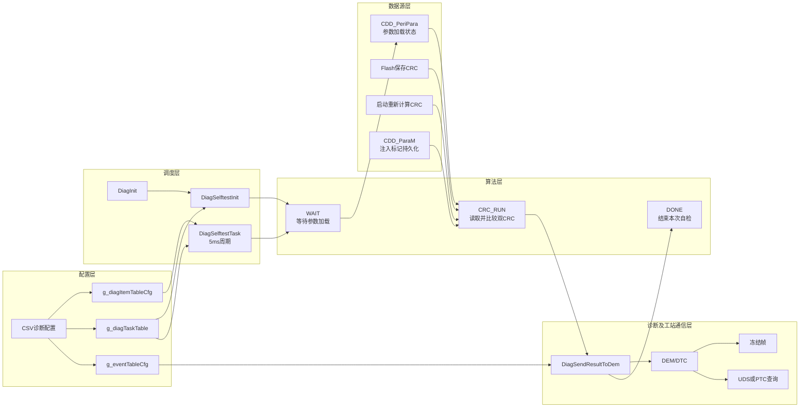

```mermaid
flowchart LR
    subgraph L1[配置层]
        A1[CSV诊断配置]
        A2[g_diagItemTableCfg]
        A3[g_diagTaskTable]
        A4[g_eventTableCfg]
    end

    subgraph L2[调度层]
        B1[DiagInit]
        B2[DiagSelftestInit]
        B3[DiagSelftestTask<br/>5ms周期]
    end

    subgraph L3[算法层]
        C1[WAIT<br/>等待参数加载]
        C2[CRC_RUN<br/>读取并比较双CRC]
        C3[DONE<br/>结束本次自检]
    end

    subgraph L4[数据源层]
        D1[CDD_PeriPara<br/>参数加载状态]
        D2[Flash保存CRC]
        D3[启动重新计算CRC]
        D4[CDD_ParaM<br/>注入标记持久化]
    end

    subgraph L5[诊断及工站通信层]
        E1[DiagSendResultToDem]
        E2[DEM/DTC]
        E3[冻结帧]
        E4[UDS或PTC查询]
    end

    A1 --> A2
    A1 --> A3
    A1 --> A4

    A2 --> B3
    A3 --> B2
    A3 --> B3

    B1 --> B2 --> C1
    B3 --> C1
    C1 --> D1
    D1 --> C2
    D2 --> C2
    D3 --> C2
    D4 --> C2

    C2 --> E1
    A4 --> E1
    E1 --> E2
    E2 --> E3
    E2 --> E4
    E1 --> C3
```