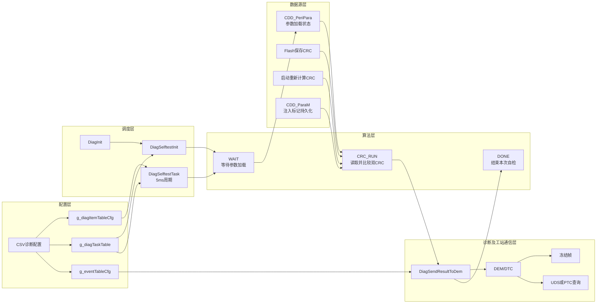
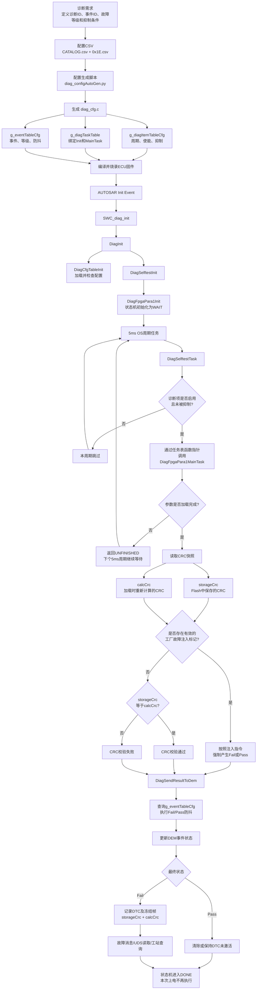
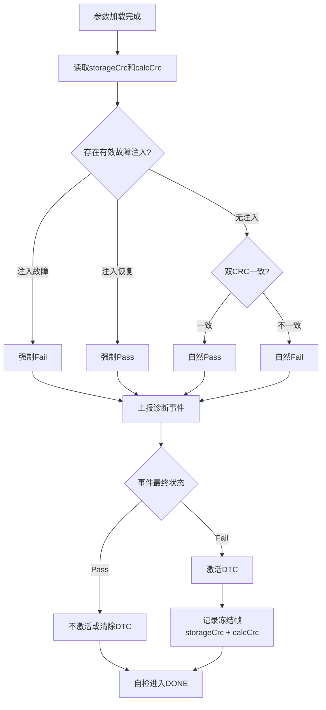
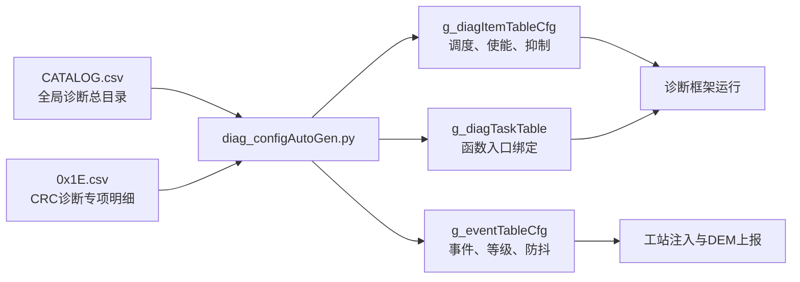

```mermaid
flowchart LR
    subgraph L1[配置层]
        A1[CSV诊断配置]
        A2[g_diagItemTableCfg]
        A3[g_diagTaskTable]
        A4[g_eventTableCfg]
    end

    subgraph L2[调度层]
        B1[DiagInit]
        B2[DiagSelftestInit]
        B3[DiagSelftestTask<br/>5ms周期]
    end

    subgraph L3[算法层]
        C1[WAIT<br/>等待参数加载]
        C2[CRC_RUN<br/>读取并比较双CRC]
        C3[DONE<br/>结束本次自检]
    end

    subgraph L4[数据源层]
        D1[CDD_PeriPara<br/>参数加载状态]
        D2[Flash保存CRC]
        D3[启动重新计算CRC]
        D4[CDD_ParaM<br/>注入标记持久化]
    end

    subgraph L5[诊断及工站通信层]
        E1[DiagSendResultToDem]
        E2[DEM/DTC]
        E3[冻结帧]
        E4[UDS或PTC查询]
    end

    A1 --> A2
    A1 --> A3
    A1 --> A4

    A2 --> B3
    A3 --> B2
    A3 --> B3

    B1 --> B2 --> C1
    B3 --> C1
    C1 --> D1
    D1 --> C2
    D2 --> C2
    D3 --> C2
    D4 --> C2

    C2 --> E1
    A4 --> E1
    E1 --> E2
    E2 --> E3
    E2 --> E4
    E1 --> C3
```

```mermaid
flowchart TD
    A[诊断需求<br/>定义诊断ID、事件ID、故障等级和抑制条件]
    B[配置CSV<br/>CATALOG.csv + 0x1E.csv]
    C[配置生成脚本<br/>diag_configAutoGen.py]
    D[生成 diag_cfg.c]
    D1[g_diagItemTableCfg<br/>周期、使能、抑制]
    D2[g_diagTaskTable<br/>绑定Init和MainTask]
    D3[g_eventTableCfg<br/>事件、等级、防抖]
    E[编译并烧录ECU固件]

    F[AUTOSAR Init Event]
    G[SWC_diag_init]
    H[DiagInit]
    I[DiagCfgTableInit<br/>加载并检查配置]
    J[DiagSelftestInit]
    K[DiagFpgaPara1Init<br/>状态机初始化为WAIT]

    L[5ms OS周期任务]
    M[DiagSelftestTask]
    N{诊断项是否启用<br/>且未被抑制?}
    O[本周期跳过]
    P[通过任务表函数指针<br/>调用DiagFpgaPara1MainTask]

    Q{参数是否加载完成?}
    R[返回UNFINISHED<br/>下个5ms周期继续等待]
    S[读取CRC快照]
    S1[storageCrc<br/>Flash中保存的CRC]
    S2[calcCrc<br/>加载时重新计算的CRC]

    T{是否存在有效的<br/>工厂故障注入标记?}
    U[按照注入指令<br/>强制产生Fail或Pass]
    V{storageCrc<br/>等于calcCrc?}
    W[CRC校验通过]
    X[CRC校验失败]

    Y[DiagSendResultToDem]
    Z[查询g_eventTableCfg<br/>执行Fail/Pass防抖]
    AA[更新DEM事件状态]
    AB{最终状态}
    AC[清除或保持DTC未激活]
    AD[记录DTC及冻结帧<br/>storageCrc + calcCrc]
    AE[故障消息/UDS读取/工站查询]
    AF[状态机进入DONE<br/>本次上电不再执行]

    A --> B --> C --> D
    D --> D1
    D --> D2
    D --> D3
    D1 --> E
    D2 --> E
    D3 --> E

    E --> F --> G --> H
    H --> I
    H --> J --> K

    K --> L --> M --> N
    N -- 否 --> O --> L
    N -- 是 --> P --> Q
    Q -- 否 --> R --> L
    Q -- 是 --> S
    S --> S1
    S --> S2
    S1 --> T
    S2 --> T

    T -- 是 --> U --> Y
    T -- 否 --> V
    V -- 是 --> W --> Y
    V -- 否 --> X --> Y

    Y --> Z --> AA --> AB
    AB -- Pass --> AC --> AF
    AB -- Fail --> AD --> AE --> AF
```

```mermaid
flowchart TD
    A[参数加载完成]
    B[读取storageCrc和calcCrc]
    C{存在有效故障注入?}

    D[强制Fail]
    E[强制Pass]
    F{双CRC一致?}

    G[自然Pass]
    H[自然Fail]

    I[上报诊断事件]
    J{事件最终状态}

    K[不激活或清除DTC]
    L[激活DTC]
    M[记录冻结帧<br/>storageCrc + calcCrc]
    N[自检进入DONE]

    A --> B --> C
    C -- 注入故障 --> D --> I
    C -- 注入恢复 --> E --> I
    C -- 无注入 --> F
    F -- 一致 --> G --> I
    F -- 不一致 --> H --> I

    I --> J
    J -- Pass --> K --> N
    J -- Fail --> L --> M --> N
```

```mermaid
flowchart LR
    A[CATALOG.csv<br/>全局诊断总目录]
    B[0x1E.csv<br/>CRC诊断专项明细]
    C[diag_configAutoGen.py]
    D[g_diagItemTableCfg<br/>调度、使能、抑制]
    E[g_eventTableCfg<br/>事件、等级、防抖]
    F[g_diagTaskTable<br/>函数入口绑定]
    G[诊断框架运行]
    H[工站注入与DEM上报]

    A --> C
    B --> C
    C --> D
    C --> E
    C --> F
    D --> G
    E --> H
    F --> G
```