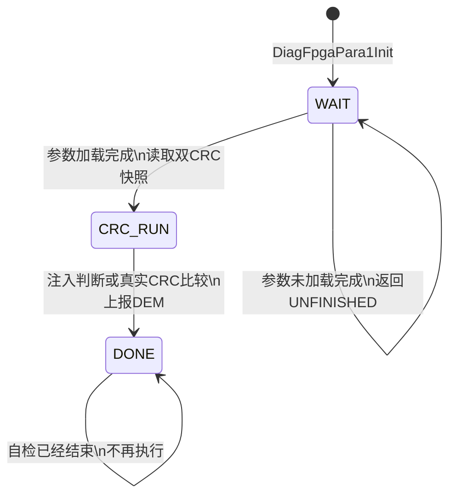
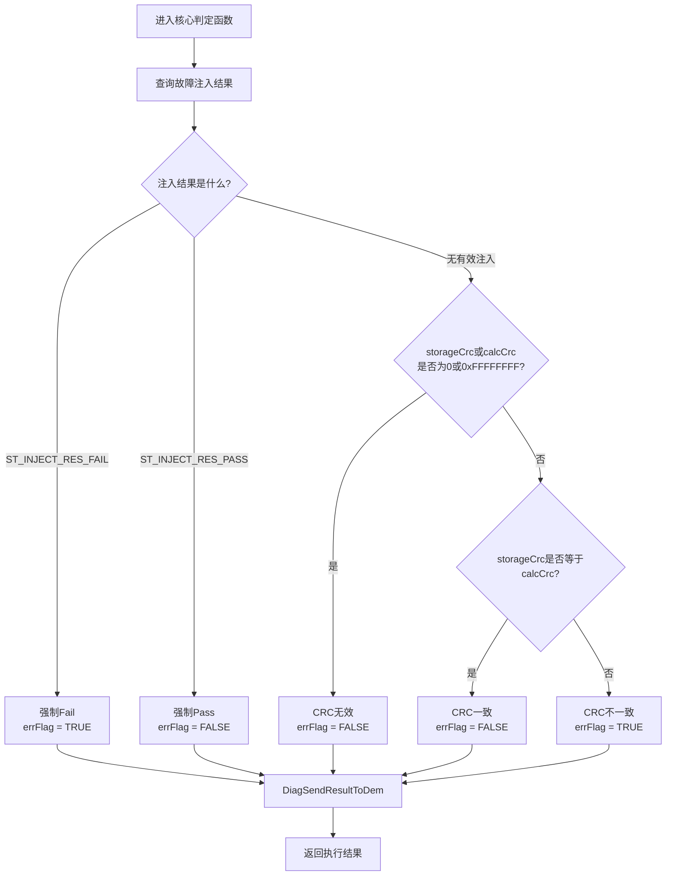
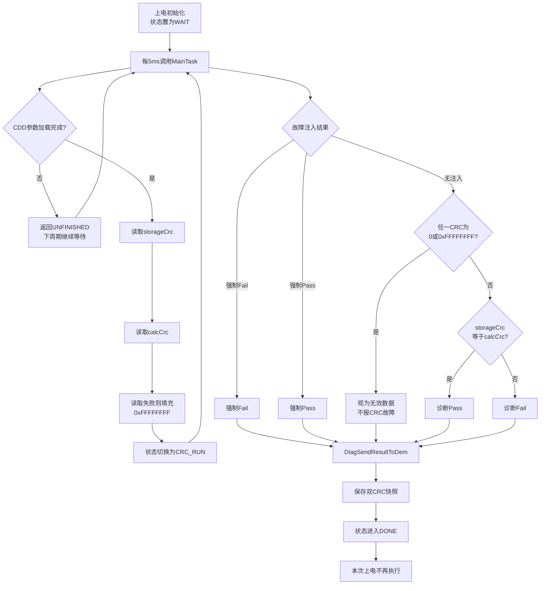
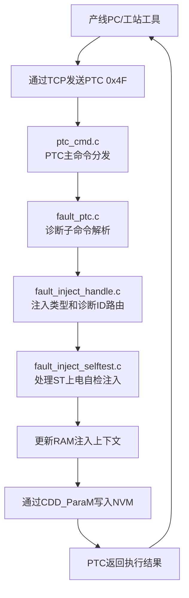
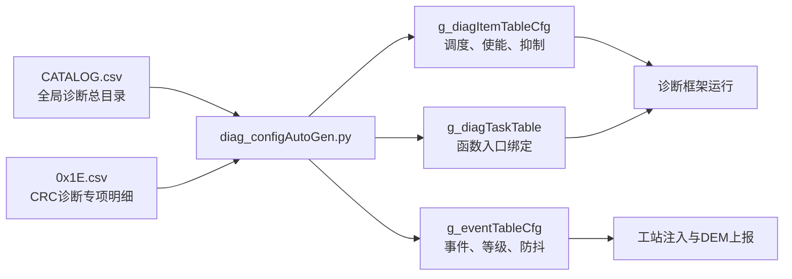
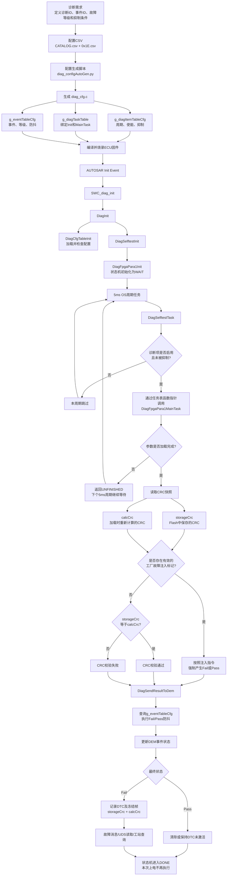
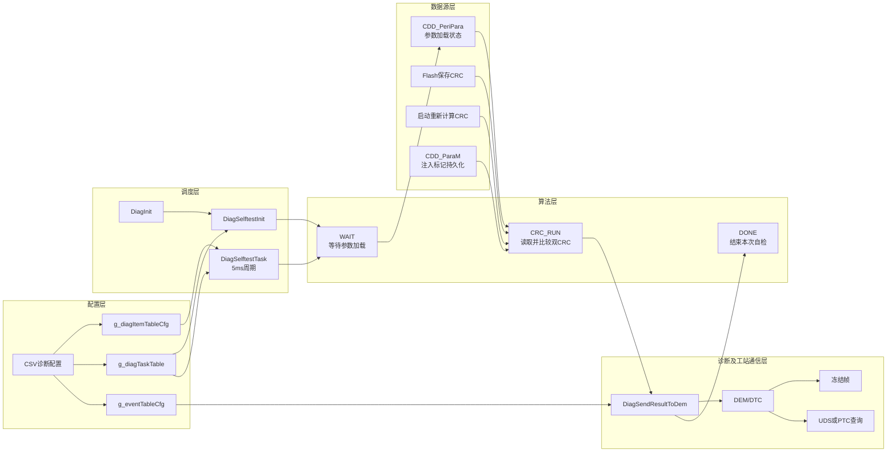
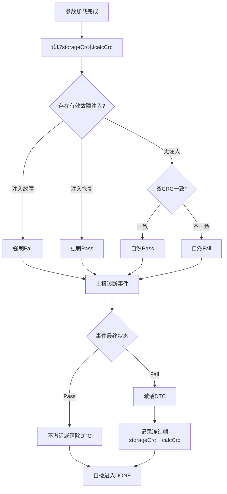

## =={pink}一、功能基础信息==

---

### 1. 功能标识

- =={yellow}**诊断项ID**==：`DIAGID_FPGA_PARA1 = 0x1E00`
- =={yellow}**故障事件ID**==：`EVTID_FPGA_PARA1_FAULT = 0x1E01-` `0x1E06`
- 功能全称：Program Parameters CRC Diagnosis（FPGA参数上电CRC完整性自检）
- =={yellow}**执行周期**==：`DIAG_PERIOD_ST`，**=={yellow}整机上电仅执行一次==**，属于上电自检类诊断
- =={yellow}**故障等级**：FTL7==（Output_Untrusted，=={yellow}点云数据不可信==）
- =={yellow}**防抖配置**：debounce=1，**单次异常直接确认故障**==

### 核心目标

=={green}外设参数（Para1）从Flash加载完成后，对比==**=={green}Flash原始存储CRC (storage Crc)==** =={green}和===={green}**加载实时计算CRC (calc Crc)**=={yellow}=={green}；二者**不一致则上报DEM故障**，标识参数被篡改/加载损坏；同时**支持产线故障注入**校验、**故障快照冻结帧输出**。==

### =={pink}整体五层软件分层架构==

| 分层 | 定位 | 核心职责 | 可裁剪性 |
| --- | --- | --- | --- |
| =={yellow}**配置层**== | **规则定义**者 | CSV配置故障ID、等级、防抖、函数绑定；自动生成`diag_cfg.c`三表 | 项目必配，不可裁剪 |
| =={yellow}**调度层**== | **平台调度**器 | 上电自检周期调度、DEM事件上报、故障生命周期管理 | 平台通用，不可裁剪 |
| =={yellow}**算法层**== | Feature**核心逻辑** | 三态状态机、CRC比对判定、故障注入旁路、KeyInfo快照输出 | 静态代码，跨项目可复用 |
| =={yellow}**数据源层**== | **数据提供**，底层CDD | Flash参数加载、实时CRC计算、双CRC读取接口、加载状态查询 | CDD基础组件，Feature强依赖 |
| =={yellow}**工站层**== | 产**验收闭环**链路 | PTC命令故障注入/整机复位/故障查询、NVM注入参数持久化 | 仅Factory量产固件，Release可裁剪 |

## =={pink}二、算法层核心代码：diag_fpgapara1.c==

### =={pink}2.1 算法层的输入与输出==

#### =={green}输入==

算法层**从CDD获取三个信息**：

1. =={yellow}参数是否加载完成；==
2. =={yellow}Flash参数**头部保存的CRC**== `storageCrc`=={yellow}；==
3. =={yellow}参数加载过程**中实时计算的CRC**== `calcCrc`=={yellow}。==

#### =={green}输出==

**算法层最终产生**：

- =={yellow}**CRC诊断Pass或Fail**；==
- =={yellow}**DEM事件**== `EVTID_FPGA_PARA1_FAULT`；
- =={yellow}**8字节故障快照**==：
  - =={yellow}前4字节==：`storageCrc`
  - =={yellow}后4字节==：`calcCrc`

### =={pink}2.2 初始化函数 DiagFpgaPara1Init==

```c
DiagRetCode DiagFpgaPara1Init(void)
{
    DiagRetCode ret = RET_DIAG_NORMAL;
    // 清空CRC快照缓存
    s_fpgaPara1CrcInfo.storageCrc = 0U;
    s_fpgaPara1CrcInfo.calcCrc = 0U;
    // 状态机复位至等待参数加载
    s_fpgaPara1CrcMainStatus = DIAG_FPGAPARA1_WAIT_PERIPARA_LOADED;
    return ret;
}
```

**=={yellow}作用==**=={yellow}：上电自检框架启动时仅调用一次，**重置缓存**与**状态机**。==

### =={pink}2.3 非阻塞主状态机任务 DiagFpgaPara1MainTask==

由`DiagSelftestTask`=={yellow}每**5ms周期调度**，**三状态流转**==逻辑：



#### =={yellow}1. WAIT：等待参数加载完成==

=={green}**上电初始化**时：==

```makefile
s_fpgaPara1CrcInfo.storageCrc = 0U;
s_fpgaPara1CrcInfo.calcCrc = 0U;
s_fpgaPara1CrcMainStatus =
    DIAG_FPGAPARA1_WAIT_PERIPARA_LOADED;
```

=={green}之后==，`DiagSelftestTask`=={green}**每5ms调用一次主函数**==。

=={green}算法层查询：==

```scss
CddPeriPara_GetStatus()
```

=={green}如果参数仍在异步加载，就返回：==

```undefined
RET_DIAG_UNFINISHED
```

=={green}**诊断框架会在下一个5ms周期继续调用**，**不阻塞OS任务**==。

=={green}如果状态已经达到== `LOADED`=={green}，就**读取双CRC快照**：==

```scss
CddPeriPara_GetParaCrcGet(..., &storageCrc);
CddPeriPara_GetParaCrcCal(..., &calcCrc);
```

=={green}然后进入== `CRC_RUN`=={green}。==

=={yellow}这里有一个时序细节：==**=={yellow}进入CRC_RUN的当次调用仍返回UNFINISHED，真正的CRC判定放在下一个5ms周期执行。==**

---

#### =={pink}2. CRC_RUN：执行核心判定==

=={green}判定分成三层优先级。==

##### =={yellow}第一优先级：注入强制故障==

```scss
if (injectRes == ST_INJECT_RES_FAIL)
{
    DiagSendResultToDem(eventId, TRUE);
}
```

=={green}如果工站配置了强制Fail，就跳过真实CRC比较，直接上报故障。==

##### =={yellow}第二优先级：注入强制正常==

```scss
if (injectRes == ST_INJECT_RES_PASS)
{
    DiagSendResultToDem(eventId, FALSE);
}
```

=={green}如果工站配置了强制Pass，也跳过真实CRC比较，直接上报正常。==

=={green}这两条分支用于**产线FHTI验收**，不代表修改实际Flash数据。==

##### =={yellow}第三优先级：真实CRC比较==

=={green}**没有注入命令时，才比较两个CRC**：==

```ini
errFlag = (storageCrc != calcCrc);
```

即：

```makefile
storageCrc == calcCrc → 参数内容完整，诊断Pass
storageCrc != calcCrc → 参数可能损坏或被篡改，诊断Fail
```

**=={pink}时序流程==**=={pink}：**上电Init** → **周期轮询等待参数** → **参数就绪刷新CRC快照** → **单次比对判定** → **永久完成不再运行**。==

---

### =={pink}2.4 CRC有效性检查==

=={yellow}在比较之前，算法先检查CRC是否有效。==

=={green}以下值被视为无效：==

```undefined
0x00000000
0xFFFFFFFF
```

其中：

- `0`通常表示尚=={green}**未初始化**或**没有获取到有效结果**==；
- `0xFFFFFFFF`是=={green}**读取失败**后主动填入的**哨兵值**==。

判断逻辑是：

```objectivec
if (storageCrc无效 || calcCrc无效)
{
    errFlag = FALSE;
}
else
{
    errFlag = (storageCrc != calcCrc);
}
```

因此=={yellow}**完整真值表**==是：

| `storageCrc` | `calcCrc` | 结果 |
| --- | --- | --- |
| **有效** | **相同且有效** | =={yellow}Pass== |
| **有效** | **不同且有效** | =={yellow}Fail== |
| **`0`或`0xFFFFFFFF`** | **任意值** | =={yellow}不报CRC故障== |
| **任意值** | **`0`或`0xFFFFFFFF`** | =={yellow}不报CRC故障== |

=={yellow}这里**要注意**==**：**

> =={green}**CRC读取失败**并不会被当成CRC不一致故障，而是**屏蔽本次故障上报**，避免**底层接口异常**被**误判成参数损坏**。==

严格来说，这种设计可能掩盖“CRC无法读取”的问题，所以成熟系统可以为数据源读取失败另外设置一个独立诊断事件；但当前项目的真实实现是**无效CRC不报该CRC故障**。

---

### =={pink}2.5 DEM上报与完成==

=={yellow}得到== `errFlag`=={yellow}后，算法调用==：

```scss
DiagSendResultToDem(
    EVTID_FPGA_PARA1_FAULT,
    errFlag
);
```

**=={yellow}算法层只提供原始Pass/Fail==**，=={yellow}后续由诊断框架负责==：

- Fail/Pass**防抖**；
- **故障等级处理**；
- **DEM**事件**状态更新**；
- **DTC记录**与清除；
- **冻结帧保存**。

=={green}本功能**防抖为1**，因此**一次有效的不一致就可以确认故障**。==

=={yellow}上报完成后，状态机进入：==

```undefined
DIAG_FPGAPARA1_DONE
```

=={yellow}此后不再重复校验==，符合“每次上电仅自检一次”的需求。

#### 判定流程图



#### =={pink}为什么注入优先于真实CRC==

=={yellow}因为故障注入的目的就是**验证完整的诊断链路**。==

=={green}假设真实CRC当前一致，但工站需要验证CRC故障能否上报。**如果先比较真实CRC，结果永远是Pass，工站就无法测试**：==

```undefined
故障触发
→ DEM确认
→ DTC记录
→ 故障查询
→ 故障恢复
```

因此注入命令必须覆盖真实判定结果。

#### 面试简答

> 核心判定函数采用“故障注入优先，真实数据判定兜底”的策略。函数先查询工站注入结果，如果是强制Fail或Pass，就直接将对应结果上报DEM并提前返回；没有注入时，再检查storageCrc和calcCrc是否有效，0和0xFFFFFFFF被视为无效值，无效时不报CRC故障。只有两个CRC都有效时才进行一致性比较，不一致上报Fail，一致上报Pass。这样既能支持产线完整诊断链路验收，也能避免CRC读取异常造成误报。

**=={yellow}判定优先级==**：故障注入FAIL > 故障注入PASS > 原生CRC一致性比对
**=={yellow}容错规则==**：CRC读取失败填充哨兵值时，强制无故障，规避误报。

---

### =={pink}2.7 KeyInfo冻结帧快照接口==

=={yellow}如果DEM需要记录关键数据，就**调用**==：

```scss
DiagFpgaPara1GetKeyInfo()
```

=={yellow}**算法层输出8字节**：==

```kotlin
Byte 0～3：storageCrc
Byte 4～7：calcCrc
```

=={yellow}这样产线或售后通过UDS读取冻结帧时，可以看到：==

```undefined
期望CRC是多少
实际计算CRC是多少
```

=={green}从而**判断**是否存在：==

- **Flash参数被篡改**；
- Flash位翻转；
- 参数加载过程损坏；
- 参数文件与当前软件版本不匹配。

**作用**：UDS读取冻结帧时输出8字节快照，4B存储CRC+4B计算CRC，售后/产线定位参数损坏根源。

### 2.8 流程图



---

### 面试简答

> CRC算法层采用WAIT、CRC_RUN和DONE三态状态机。上电后先周期轮询CDD参数加载状态，避免参数尚未准备好时误判；加载完成后读取Flash中保存的storageCrc和加载过程中实时计算的calcCrc。判定时先处理产线故障注入，注入可以强制Fail或Pass；没有注入时才比较两个CRC，两个值均有效且不一致时上报故障。如果CRC读取失败或值为0、0xFFFFFFFF，则本次不报CRC不一致故障，避免误报。最后通过统一接口把结果交给DEM，并保存两个CRC作为8字节冻结帧，状态机进入DONE，本次上电不再重复执行。

---

## 三、数据源层 CddPeriPara 接口说明

诊断算法层不自行加载Flash、不计算CRC，仅消费CDD输出数据：

1. **CddPeriPara_LoadPara**：上电异步加载Flash Para1参数块，解析头部/指令/数据段
2. **calcCrc生成**：加载过程增量调用`LibCrc_ParaCrc32`实时累加校验值
3. **storageCrc读取**：从Flash参数头部读出出厂存储CRC
4. **状态接口 **`CddPeriPara_GetStatus()`

- `CDD_PERIPARA_STATE_LOADING`：加载中
- `CDD_PERIPARA_STATE_LOADED`：加载完成（成功/损坏）
- `CDD_PERIPARA_STATE_LOADED_FAIL`：加载失败

1. 配套读取API

- `CddPeriPara_GetParaCrcGet()`：获取Flash原始CRC
- `CddPeriPara_GetParaCrcCal()`：获取加载实时CRC

## 四、工站层：产线故障注入与验收闭环

这个功能的工站层主要解决一个问题：

> CRC属于上电自检，产线想验证它能否报故障，必须先写入故障注入配置，再让整机重新上电；但电源复位会清空RAM，所以注入命令必须跨复位保存。

### 4.1 PTC配套命令

**不是从零设计了一套新的PTC协议或新的主命令**，而是复用了项目已有的PTC通信框架和通用命令：

| PTC主/子命令 | 功能 |
| --- | --- |
| 0x4F | 写入NVM故障注入配置（ST模式+期望故障码） |
| 0x10 | 整机电源复位，触发自检重新执行 |
| 0xFF sub 0x1F | 查询DEM确诊故障列表，校验0x1E01故障 |
| 0x4F read | 读取当前生效注入配置 |

针对CRC功能做的适配是：

- 在已有故障注入框架中注册 `0x1E00`诊断项和 `0x1E01`故障事件；
- 增加上电自检类故障的解析和路由；
- 让 `0x4F`能够向CRC诊断写入Fail或Pass注入结果；
- 增加NVM持久化，使注入配置能够跨电源复位保存；
- 让CRC算法层读取该注入结果并覆盖真实CRC判定；
- 通过已有故障查询命令完成产线验收闭环。

所以面试中不要说：

> 我独立设计并开发了一套新的PTC协议。

更准确的表述是：

> 我基于已有PTC协议框架，完成了CRC上电自检功能的故障注入、持久化、复位触发和结果查询适配。

### 4.2 为什么需要专门适配

普通周期诊断在设备运行时不断执行，因此工站下发注入命令后，下一周期就能触发故障。

但CRC属于 `DIAG_PERIOD_ST`上电自检：

```undefined
上电
→ 执行一次CRC校验
→ 进入DONE
→ 本次运行不再执行
```

如果工站在系统已经运行后下发注入，CRC自检早已结束，注入不会生效。因此必须：

```undefined
先写入注入配置
→ 再执行电源复位
→ 重新上电时读取注入配置
→ CRC自检执行注入分支
```

原平台如果只把注入状态保存在RAM中：

```undefined
PTC写入RAM
→ 电源复位
→ RAM清空
→ 注入配置丢失
→ CRC正常执行
→ 无法产生期望故障
```

这就是工站适配的核心问题。

---

### 4.3 最终采用的NVM持久化方案

文档中对比过两种方案：

### 方案一：RAM保留区

把注入变量放到 `.noinit`或LPIRAM中，希望软复位后保留。

问题是产线使用的是**整机电源复位**，实际掉电后RAM内容仍会丢失，因此无法稳定验收。

### 方案二：NVM Flash持久化

最终方案是把上电自检注入信息写入NVM：

```markdown
PTC 0x4F写入注入配置
        ↓
解析诊断ID、事件ID和Fail/Pass指令
        ↓
在RAM中更新自检注入状态
        ↓
通过CDD参数管理接口写入NVM
        ↓
执行0x10电源复位
        ↓
重新上电后从NVM恢复注入配置
        ↓
CRC算法读取注入结果
```

这样即使整个ECU断电重启，注入配置仍然存在。

---

### 4.4 PTC命令的软件调用链

工站下发的命令经过以下模块：



各文件职责是：

| 文件 | 职责 |
| --- | --- |
| `ptc_cmd.c` | 识别 `0x4F/0x10/0xFF`等PTC主命令并分发 |
| `fault_ptc.c` | 解析故障注入、恢复和查询相关负载 |
| `fault_inject_handle.c` | 根据诊断类型和诊断ID选择处理模块 |
| `fault_inject_selftest.c` | 管理ST上电自检注入、RAM状态和NVM持久化 |
| `mode_ctl_user.c` | 在执行电源复位前配合完成NVM写入和复位调度 |
| `diag_fpgapara1.c` | 上电CRC判定时读取注入结果 |

---

### 4.2 完整产验收流程

#### 1. 写入强制故障配置

工站通过 `0x4F write`下发：

- 诊断类型：ST上电自检；
- 诊断ID：`0x1E00`；
- 故障事件：`0x1E01`；
- 期望结果：Fail；
- FHT/FHTI相关参数。

软件解析后把配置写入NVM。

#### 2. 读取确认

可以通过 `0x4F read`读取当前配置，确认：

- 诊断ID正确；
- 注入模式为Fail；
- NVM中的配置已经生效。

#### 3. 触发电源复位

工站下发 `0x10`：

```undefined
写入NVM
→ 确认写入完成
→ 触发整机电源复位
```

必须保证NVM写操作已经结束后再复位，否则可能出现注入配置尚未落盘就断电的问题。

#### 4. 上电恢复注入配置

重新上电后：

```scss
FaultInjectSelftestInit();
```

从NVM读取注入信息并恢复到运行时上下文。

#### 5. CRC诊断读取注入结果

CRC核心判定函数调用：

```scss
FaultInjectSelftestGetCmdResult(
    DIAGID_FPGA_PARA1
);
```

如果返回：

```undefined
ST_INJECT_RES_FAIL
```

就跳过真实CRC比较，直接执行：

```scss
DiagSendResultToDem(
    EVTID_FPGA_PARA1_FAULT,
    TRUE
);
```

#### 6. 查询故障

工站重新连接后，通过：

```lua
0xFF sub 0x1F
```

查询DEM已确认故障列表。

如果返回包含 `0x1E01`，就说明以下链路全部正常：

```undefined
PTC下发
→ 命令解析
→ NVM保存
→ 电源复位
→ 上电恢复
→ CRC注入判定
→ DEM上报
→ DTC查询
```

---

#### 7. 故障恢复验证

故障触发后，还要验证恢复路径：

```markdown
0x4F写入强制Pass
        ↓
配置持久化到NVM
        ↓
0x10电源复位
        ↓
上电恢复Pass注入
        ↓
CRC算法向DEM上报正常
        ↓
0xFF查询确认0x1E01已恢复或清除
```

因此工站测试不是只验证“能报故障”，还验证：

- Fail注入；
- DTC确认；
- Pass恢复；
- DTC清除；
- 跨复位持久化；
- FHTI时间要求。

---

## =={pink}五、配置层：CSV自动生成流程==

### =={pink}5.1 配置输入文件==

=={yellow}开发者需要手动维护两个CSV表格，分别是==

- `CATALOG.csv`：全系统=={yellow}诊断功能的==**=={yellow}总目录==，包括**全局故障等级、防抖、抑制参数
- `0x1E.csv`：本=={yellow}诊断项的==**=={yellow}专项明细表==，**专属注入阈值、FHTI时长、故障码映射

### =={pink}5.2 生成工具==

`diag_configAutoGen.py`=={yellow}自动脚本==，修改CSV后执行`update_diag_config.bat`=={yellow}生成==`diag_cfg.c`=={yellow}**三张核心配置表**：==

1. `g_diagTaskTable`：**诊断任务表**，绑定=={yellow}**Init/MainTask/GetKeyInfo函数**==
2. `g_eventTableCfg`：**故障事件表**，绑定=={yellow}**故障事件ID、防抖、故障等级FTL7**==
3. `g_diagItemTableCfg`：**诊断项配置表**，绑定=={yellow}**诊断ID、上电自检周期、故障抑制条件**==

### =={pink}5.3 编译加载流程==

**=={yellow}维护CSV → 运行生成脚本 → 得到diag_cfg.c三张配置表 → 编译进固件 →== `DiagInit`=={yellow}初始化加载==**

### =={pink}5.4 三张静态配置表==

1. `g_diagItemTableCfg`：诊断项配置表
2. `g_eventTableCfg`：故障事件配置表
3. `g_diagTaskTable`：诊断任务绑定表

可以把它们理解成：**=={yellow}诊断项表决定“怎么运行”==，=={yellow}事件表决定“怎么报故障”==，=={yellow}任务表决定“运行哪段代码”==。**

#### =={pink}1. g_diagItemTableCfg===={pink}：诊断项配置表==

##### =={green}它是什么==

=={yellow}一行代表一个完整的诊断功能，例如：==

- 入口电压诊断；
- Rx Start Signal诊断；
- Flash CRC自检；
- FPGA参数CRC自检。

##### =={green}负责什么==

它**回答四个问题**：

- =={yellow}这个==**=={yellow}诊断项是否存在==**=={yellow}？==
- **=={yellow}是否启用==**=={yellow}？==
- **=={yellow}多久执行一次（上电/周期）==**=={yellow}？==
- **=={yellow}抑制条件==**=={yellow}？==

因此，它主要=={yellow}描述诊断功能的==**=={yellow}调度属性和运行条件==**。

##### =={green}谁使用==

主要由=={yellow}**诊断框架**和**抑制模块**==使用：

- `DiagCfgTableInit()`：上电检查和加载配置；
- `DiagGetDiagItemPeriod()`：查询运行周期；
- `DiagInhiGetDiagItemState()`：检查当前是否被抑制；
- `DiagPeriodTask()`：判断这一周期是否应该执行该诊断。

##### =={green}怎么用==

=={yellow}每次5 ms诊断任务运行时，框架会查表==：

```markdown
if (诊断项已启用 && 当前没有被抑制 && 配置周期等于5ms)
{
    执行对应诊断任务;
}
```

=={yellow}它相当于诊断功能的==**=={yellow}运行许可证==**=={yellow}。==

---

#### =={pink}2. g_eventTableCfg===={pink}：故障事件配置表==

##### =={green}它是什么==

=={yellow}一行代表一个**可以向DEM上报的故障事件**。==

=={yellow}一个诊断项可以包含一个或多个故障事件==。例如，某个电压诊断项下面可能同时包含：

- 欠压事件；
- 过压事件；
- 信号无效事件。

典型字段包括：

```cpp
{
    EVTID_RX_START_SIGNAL_FAULT, // 故障事件ID
    DIAGID_RX_START_SIGNAL,      // 归属的诊断项
    FTL_LEVEL,                   // 故障等级
    FAIL_DEBOUNCE_COUNT,         // Fail防抖
    PASS_DEBOUNCE_COUNT          // Pass防抖
}
```

##### =={green}负责什么==

它回答：

- 这个=={yellow}故障事件属于哪个诊断项==？
- =={yellow}故障严重程度==是多少？
- =={yellow}**连续失败多少次**才**确认**故障==？
- =={yellow}**连续通过多少次**才**恢复**==？
- =={yellow}故障**确认后如何交给DEM处理**？==

它描述的是=={yellow}诊断结果的==**=={yellow}故障管理规则==**=={yellow}。==

##### =={green}谁使用==

主要由**诊断事件处理模块和DEM接口**使用：

- `DiagCfgTableInit()`：初始化事件运行状态；
- `DiagSendResultToDem()`：根据事件ID查配置；
- debounce模块：进行Fail/Pass防抖；
- DEM：存储DTC状态、冻结帧和故障记录；
- UDP故障外发、UDS读DTC等模块：读取最终故障状态。

##### =={green}怎么用==

=={yellow}**业务代码**一般**只负责给出一个原始判断**：==

```scss
DiagSendResultToDem(
    EVTID_RX_START_SIGNAL_FAULT,
    isFailed
);
```

之后=={yellow}**框架根据 g_eventTableCfg**== =={yellow}自动完成==：

```markdown
原始Pass/Fail
    ↓
查故障事件配置
    ↓
执行防抖/恢复
    ↓
更新事件状态
    ↓
上报DEM
    ↓
生成DTC、冻结帧或故障消息
```

因此业务模块不需要自己重复实现故障等级、防抖和DEM管理。

---

#### =={pink}3. g_diagTaskTable===={pink}：诊断任务绑定表==

##### =={green}它是什么==

这张表把一个抽象的=={yellow}**诊断ID与实际C函数绑定**==起来。

例如：

```markdown
{
    DIAGID_RX_START_SIGNAL,
    DiagRxStartSignalInit,
    DiagRxStartSignalMainTask,
    DiagRxStartSignalGetKeyInfo
}
```

**通常包含**：

- =={yellow}**诊断项ID**；==
- =={yellow}**初始化 Init 函数**；==
- =={yellow}**周期主任务 MainTask 函数**；==
- =={yellow}关键数据或**冻结帧获取 GetKeyInfo 函数**。==

##### =={green}负责什么==

它回答：

- 这个诊断功能=={yellow}初始化时调用哪个函数==？
- =={yellow}周期执行时调用哪个函数==？
- =={yellow}出现故障时从哪里获取关键数据==？

它相当于**诊断框架与具体业务代码**之间的**=={yellow}函数路由表==**。

##### =={green}谁使用==

主要由=={yellow}**调度框架使用**==：

- `DiagSelftestInit()`：调用上电自检类诊断的Init函数；
- `DiagSelftestTask()`：调用上电自检主任务；
- `DiagPeriodTask()`：调用周期诊断主任务；
- 故障记录模块：调用 `GetKeyInfo()` 获取冻结帧或关键数据。

##### =={green}怎么用==

**=={yellow}框架遍历任务表，通过函数指针调用业务代码==**：

```scss
for (i = 0; i < g_diagTaskNum; i++)
{
    if (周期匹配 && 诊断项未被抑制)
    {
        g_diagTaskTable[i].taskFunc();
    }
}
```

这样新增诊断功能时，只需要增加配置和实现函数，不必在统一调度框架里写大量：

```scss
if (diagId == ...)
{
    ...
}
else if (...)
{
    ...
}
```

---

#### 三张表怎么关联



#### 面试简答口径

> 配置层主要有三张表。第一张是诊断项表，配置诊断ID、执行周期、使能状态和抑制条件，决定一个诊断什么时候能运行；第二张是故障事件表，配置事件归属、故障等级和Fail/Pass防抖，决定诊断结果如何转换成DEM事件；第三张是任务绑定表，通过函数指针把诊断ID与Init、MainTask和GetKeyInfo函数绑定，决定框架实际调用哪段业务代码。三张表由CSV经过脚本自动生成到 `diag_cfg.c`，上电时由诊断框架初始化，运行时由调度、抑制和DEM模块共同查表使用。

---

## **六、关键时序与流程图说明**

### 6.1 CRC校验功能全链路流程图

1. `DiagInit`调用`DiagFpgaPara1Init`重置状态机至WAIT
2. 每5ms `DiagSelftestTask`调度`DiagFpgaPara1MainTask`
3. 状态WAIT：轮询CDD加载状态，未就绪返回UNFINISHED
4. 参数LOADED：调用接口读取双CRC快照，切换至CRC_RUN
5. CRC_RUN：执行注入判定+原生CRC比对，上报DEM故障
6. 状态切换DONE，清除自检标志，后续周期不再执行



### 6.2 按五层架构理解全链路



这里五层的职责分别是：

- **配置层**：定义这个诊断如何运行、调用哪个函数以及如何管理故障；
- **调度层**：在上电阶段和5ms周期中推进自检；
- **算法层**：维护WAIT、CRC_RUN、DONE三态状态机；
- **数据源层**：提供参数加载状态、保存CRC、计算CRC和注入标记；
- **诊断通信层**：处理防抖、DEM/DTC、冻结帧及工站查询。

### 6.3 正常、异常和注入三条支路



1. 配置层：CSV定义0x1E00/0x1E01基础规则
2. 工站层：PTC下发注入、NVM存储、整机复位
3. 调度层：上电自检周期调度、DEM故障防抖确认
4. 算法层：三态机、CRC比对、注入旁路、KeyInfo快照
5. 数据源层：CDD Flash加载、双CRC输出

## 七、核心设计要点总结

1. **单次上电自检**：DONE状态永久锁定，整机运行期间不再重复校验，匹配上电参数完整性自检需求
2. **异步依赖等待**：CDD参数加载为异步流程，采用周期轮询不阻塞主任务
3. **无效CRC容错**：读取失败填充0xFFFFFFFF哨兵值，直接屏蔽故障上报，降低误报概率
4. **故障注入高优先级**：产线FHTI校验时可强制模拟故障/正常，独立于硬件真实CRC
5. **8字节故障快照**：故障冻结帧携带双CRC原始值，快速定位参数篡改/加载损坏
6. 与ModeCtrl联动：模式切换`STEP_ID_WAIT_FPGA_PARA_READY`等待参数加载完成，保证CRC校验在参数下发前执行

## 八、配套测试校验链路


1. 配置校验：PTC 0x1E00查询功能是否启用、故障参数配置正确性
2. 运行校验：上电后查询系统故障码，确认无原生CRC故障（Happy Path）
3. 注入校验：下发故障注入指令复位整机，校验0x1E01故障可正常触发上报
